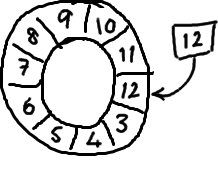

# Disruptor 主题分享

## Disruptor 是什么？

Disruptor 是用于线程间通讯的高效、低延迟的消息组件，简单来说就是一个基于内存的高性能消息队列。

## Disruptor 优劣势（trade-off）

优势：基于内存，有无锁设计，速度快，延迟低。

劣势：基于内存，没有持久化机制，比较适用于单体应用。

## 为什么 Disruptor  那么快？

原因：

- RingBuffer 环形数据结构
  - 为了避免垃圾回收，采用数组而非链表，数组重复使用。同时，数组对处理器的缓存机制更加友好。
  - 元素位置定位：数组长度2^n，通过位运算，加快定位的速度。下标采取递增的形式。不用担心 index 溢出的问题。index 是long类型，即使100万QPS的处理速度，也需要30万年才能用完。
  - 无锁设计
    - 锁的缺点：
      - 传统的阻塞队列通过使用锁来实现，比如 Java 中的有界阻塞队列 BlockingQueue。
      - 锁通过操作系统内核的上下文切换实现，会暂停线程去等待锁直到释放。执行这样的上下文切换，会丢失之前保存的数据和指令。
    - 每个生产者或者消费者线程，会先申请可以操作的元素在数组中的位置，申请到之后，直接在该位置写入或者读取数据。
- 解决了伪共享

### RingBuffer 的特殊设计

#### 环形数据结构

我们来看 `RingBuffer` 的初始化流程：

```java
public static void main(final String[] args) throws Exception {
	Disruptor<LongEvent> disruptor = new Disruptor<>(LongEvent::new, bufferSize, DaemonThreadFactory.INSTANCE,
                ProducerType.SINGLE, new BlockingWaitStrategy());
}

public class Disruptor<T>
{
    public Disruptor(
            final EventFactory<T> eventFactory,
            final int ringBufferSize,
            final ThreadFactory threadFactory,
            final ProducerType producerType,
            final WaitStrategy waitStrategy)
    {
        this(
            RingBuffer.create(producerType, eventFactory, ringBufferSize, waitStrategy),
            new BasicExecutor(threadFactory));
    }
}

public final class RingBuffer<E> extends RingBufferFields<E> implements Cursored, EventSequencer<E>, EventSink<E>
{
    RingBuffer(
        EventFactory<E> eventFactory,
        Sequencer sequencer)
    {
        // RingBuffer的初始化流程主要在父类中进行
        super(eventFactory, sequencer);
    }    
    
    public static <E> RingBuffer<E> create(
        ProducerType producerType,
        EventFactory<E> factory,
        int bufferSize,
        WaitStrategy waitStrategy)
    {
        switch (producerType)
        {
            case SINGLE:
                return createSingleProducer(factory, bufferSize, waitStrategy);
            case MULTI:
                return createMultiProducer(factory, bufferSize, waitStrategy);
            default:
                throw new IllegalStateException(producerType.toString());
        }
    }

    public static <E> RingBuffer<E> createSingleProducer(
        EventFactory<E> factory,
        int bufferSize,
        WaitStrategy waitStrategy)
    {
        SingleProducerSequencer sequencer = new SingleProducerSequencer(bufferSize, waitStrategy);

        return new RingBuffer<E>(factory, sequencer);
    }
}
```

可以看出，RingBuffer 的初始化流程主要发生在其父类 `RingBufferFields` 上：

```java
abstract class RingBufferFields<E> extends RingBufferPad
{
    // 用来预留填充的单侧slot个数，加速计算
    private static final int BUFFER_PAD;
     // RingBuffer中首个slot的偏移位置
    private static final long REF_ARRAY_BASE;
    // log2(scale),该值与BUFFER_PAD作用相似，主要用来加速计算
    private static final int REF_ELEMENT_SHIFT;
    // 反射拿到UNSAFE对象
    private static final Unsafe UNSAFE = Util.getUnsafe();
    
    static
    {
        // UNSAFE.arrayIndexScale() 获取数组的转换因子，也就是数组中元素的增量地址，即数组元素的大小
        // UNSAFE.arrayBaseOffset() 获取数组第一个元素的偏移地址
        // 两者通常配合使用，用于确定数值中每个元素的内存地址。
        // 返回Object数组中一个元素指针占用的内存大小
        final int scale = UNSAFE.arrayIndexScale(Object[].class);
        // 32位系统中，对象占4字节
        if (4 == scale)
        {
            REF_ELEMENT_SHIFT = 2;
        }
        // 64位系统中，对象占8字节
        else if (8 == scale)
        {
            REF_ELEMENT_SHIFT = 3;
        }
        else
        {
            throw new IllegalStateException("Unknown pointer size");
        }
        // scale 通常为 16/32
        BUFFER_PAD = 128 / scale;
        // Including the buffer pad in the array base offset
        // 计算数组首元素的偏移大小，往后偏移了128个字节
        REF_ARRAY_BASE = UNSAFE.arrayBaseOffset(Object[].class) + (BUFFER_PAD << REF_ELEMENT_SHIFT);
    }
	
    // 数组的最大下标，即bufferSize - 1
    private final long indexMask;
    // 对象数组，RingBuffer中实际数据载体
    private final Object[] entries;
    // RingBuffer的长度
    protected final int bufferSize;
    // 序列器，分为单生产者和多生产者，用来在生产者和消费者之间传递数据
    protected final Sequencer sequencer;    

    RingBufferFields(
        EventFactory<E> eventFactory,
        Sequencer sequencer)
    {
        this.sequencer = sequencer;
        this.bufferSize = sequencer.getBufferSize();

        if (bufferSize < 1)
        {
            throw new IllegalArgumentException("bufferSize must not be less than 1");
        }
        // bufferSize必须为2^N，否则进行报错
        if (Integer.bitCount(bufferSize) != 1)
        {
            throw new IllegalArgumentException("bufferSize must be a power of 2");
        }
        this.indexMask = bufferSize - 1;
        // 预留32/64个空槽位
        this.entries = new Object[sequencer.getBufferSize() + 2 * BUFFER_PAD];
        /**
         * 一次性填充满整个数组，从BUFFER_PAD的下一位开始；
         */
        fill(eventFactory);
    }    

    private void fill(EventFactory<E> eventFactory)
    {
        for (int i = 0; i < bufferSize; i++)
        {	
            // 预留BUFFER_PAD个空slot
            entries[BUFFER_PAD + i] = eventFactory.newInstance();
        }
    }

    @SuppressWarnings("unchecked")
    protected final E elementAt(long sequence)
    {
        // 元素内存偏移量 = base + index * scale 
        // REF_ARRAY_BASE= UNSAFE.arrayBaseOffset(Object[].class) + 128;
        // 因为 RingBuffer 的长度为 2^N ，所以 (sequence & indexMask) = sequence % bufferSize = index ps: HashMap 也是这样干的。
        // index << REF_ELEMENT_SHIFT = index << (2 ^ (log2(scale))) = index * scale        
        return (E) UNSAFE.getObject(entries, REF_ARRAY_BASE + ((sequence & indexMask) << REF_ELEMENT_SHIFT));
    }    
}
```

上述代码分析中，有几处关键点如下：

- 所谓的环形缓冲区实质上就是一个连续数组，只是包装出来了环形的概念；

  - 环形数组概念图：

    

- RingBuffer预分配内存时在数组的左右俩侧各预留了 BUFFER_PAD 个 slot；

- 内存预分配时从 BUFFER_PAD 处开始，在64位 JDK 中，假设开启指针压缩，则相当于左侧预留32个 slot，右侧预留32个 slot；

  - 开启指针压缩后，引用类型占4字节、不开启则占8字节。

- 在 RingBuffer 长度为 2^N 时，通过 ` sequence & (bufferSize - 1) ` 加速定位元素实际下标索引，通过结合 << 操作实现乘法；

- 首个元素的内存偏移位置是固定的，即128位，因为 BUFFER_PAD * scale = 128；


##### 为什么要预留solt？

>  CPU一次load的L1缓存行大小是固定的，如果两个不同的元素被load到同一缓存行中，那么任何一个元素的修改都会导致另一元素在其它CPU核对应的缓存失效。(伪共享)
>
> 对于entries对象，左右两侧各预留了128 bytes，这就保证了缓存行在<=128bytes时，entries对象一定不会和其它对象共享缓存行。


### 伪共享

#### 什么是共享？

了解什么是伪共享之前，先了解这里的共享指的是什么。

在CPU缓存架构中，存在L1（一级缓存）、L2（二级缓存）、L3（三级缓存），主存（arm），越靠近CPU的缓存，速度越快，容量也越小。

L1缓存很小但很快，并且紧靠着在使用它的CPU内核；L2大一些，也慢一些，并且仍然只能被一个单独的CPU核使用；L3更大、更慢，并且被单个插槽上的所有CPU核共享；最后是主存，由全部插槽上的所有CPU核共享。


当CPU执行运算的时候，它先去L1查找所需的数据、再去L2、然后是L3，如果最后这些缓存中都没有，所需的数据就要去主内存拿。

术语介绍：

- L1 Cache，分为数据缓存和指令缓存，逻辑核独占
- L2 Cache，物理核独占，逻辑核共享
- L3 Cache，所有物理核共享

什么是物理核、逻辑核呢？

可以参看这篇文章：[《了解 CPU 之物理核、逻辑核、超线程 | Bottom Up》](https://davex.pw/2020/09/18/cpu-physical-and-logical-cores-and-hyper-threding/)

级别越小的缓存，越接近CPU， 意味着速度越快且容量越少。

- 存储器存储空间大小：内存>L3>L2>L1>寄存器；
- 存储器速度快慢排序：寄存器>L1>L2>L3>内存；

下面是从CPU访问不同层级数据的时间概念：

| **从CPU到** | **大约需要的 CPU 周期** | **大约需要的时间** |
| ----------- | ----------------------- | ------------------ |
| 主存                                      |                         | 约60-80纳秒        |
| QPI 总线传输 (between sockets, not drawn) |                         | 约20ns             |
| L3 cache                                  | 约40-45 cycles,         | 约15ns             |
| L2 cache                                  | 约10 cycles,            | 约3ns              |
| L1 cache                                  | 约3-4 cycles,           | 约1ns              |
| 寄存器                                    | 1 cycle                 |


#### 什么是MESI协议？

> **MESI协议**是一个基于失效的[缓存一致性](https://zh.wikipedia.org/wiki/缓存一致性)协议，是支持回写（write-back）缓存的最常用协议。也称作**伊利诺伊协议** (Illinois protocol，因为是在[伊利诺伊大学厄巴纳-香槟分校](https://zh.wikipedia.org/wiki/伊利诺伊大学厄巴纳-香槟分校)被发明的[[1\]](https://zh.wikipedia.org/wiki/MESI协议#cite_note-1))。与写通过（write through）缓存相比，回写缓冲能节约大量带宽。总是有“脏”（dirty）状态表示缓存中的数据与主存中不同。MESI协议要求在缓存不命中（miss）且数据块在另一个缓存时，允许缓存到缓存的数据复制。与[MSI协议](https://zh.wikipedia.org/wiki/MSI协议)相比，MESI协议减少了主存的事务数量。这极大改善了性能。[[2\]](https://zh.wikipedia.org/wiki/MESI协议#cite_note-2)
>
> 缓存行有4种不同的状态:
>
> - 已修改Modified (M)
>
>   缓存行是脏的（*dirty*），与主存的值不同。如果别的CPU内核要读主存这块数据，该缓存行必须回写到主存，状态变为共享(S).
>
> - 独占Exclusive (E)
>
>   缓存行只在当前缓存中，但是干净的（clean）--缓存数据同于主存数据。当别的缓存读取它时，状态变为共享；当前写数据时，变为已修改状态。
>
> - 共享Shared (S)
>
>   缓存行也存在于其它缓存中且是干净的。缓存行可以在任意时刻抛弃。
>
> - 无效Invalid (I)
>
>   缓存行是无效的
>
> 引自：https://zh.wikipedia.org/wiki/MESI协议
>
> 
>
> MESI 协议，是一种叫作写失效（Write Invalidate）的协议。在写失效协议里，只有一个 CPU 核心负责写入数据，其他的核心，只是同步读取到这个写入。在这个 CPU 核心写入 Cache 之后，它会去广播一个“失效”请求告诉所有其他的 CPU 核心。其他的 CPU 核心，只是去判断自己是否也有一个“失效”版本的 Cache Block，然后把这个也标记成失效的就好了

##### MESI协议解决了什么问题？

由于现在的 CPU 大多是多核 CPU， 存在多级高速缓存，所以导致各个处理器可能对一个变量在各自的高速缓存上有自己的副本，这样一个处理器修改了该变量的值，其余处理器是无法感知的，会导致数据不一致，为了解决这个问题，引入了缓存一致性协议（MESI协议）。


MESI状态机流转图：


MESI协议演示地址：https://www.scss.tcd.ie/~jones/vivio/caches/MESI.htm


#### 缓存行（cache line）

> 数据在缓存中不是以独立的项来存储的，如不是一个单独的变量，也不是一个单独的指针。缓存是由缓存行组成的，通常是64字节（译注：这篇文章发表时常用处理器的缓存行是64字节的，比较旧的处理器缓存行是32字节），并且它有效地引用主内存中的一块地址。一个 Java 的 long 类型是8字节，因此在一个缓存行中可以存8个 long 类型的变量。
>
> CPU每次从主存中拉取数据时，会把相邻的数据也存入同一个 cache line。
>
> 在访问一个 long 数组的时候，如果数组中的一个值被加载到缓存中，它会自动加载另外7个。因此你能非常快的遍历这个数组。事实上，你可以非常快速的遍历在连续内存块中分配的任意数据结构。

> 缓存行是缓存中可以分配的最小存储单位。处理器填写缓存行时会加载整个缓存行，需要使用多个主内存读周期。


#### 什么是伪共享？

> 当多线程修改互相独立的变量时，如果这些变量共享同一个缓存行，就会无意中影响彼此的性能，这就是伪共享。

我们看一张经典的图：


假设在 cpu core 1 上的线程1要更新  X，在 cpu  core 2 上的线程2要更新 Y，但因为 X，Y 在同一 cache line 上，所以两线程需要去竞争缓存行的所有权来更新变量，再加上因为高速缓存一致性协议（MESI），当线程1获取到所有权，cpu core 2 所对应的缓存行都要失效，当线程2获取到所有权时，cpu core 1 所对应的缓存行会失效，操作来回经过L3，根据上面的 CPU 访问耗时可知，这是一件很影响性能的事。

这时，你可能就会问了，那么为什么必须以整个缓存行作为单位来处理呢？

因为这是由CPU的具体实现来决定的。


#### 如何解决伪共享？

缓存行填充，通过追加字节的方式，来避免一个缓存行中存在其他数据。也就是说，不满64字节，那我就追加字节，直至满足64字节。

Disruptor 就是通过缓存行填充来确保ring buffer的序列号不会和其他东西同时存在于一个缓存行中：

```java
public final class RingBuffer<E> extends RingBufferFields<E> implements Cursored, EventSequencer<E>, EventSink<E>
{
    public static final long INITIAL_CURSOR_VALUE = Sequence.INITIAL_VALUE;
    // 缓存行填充
    protected long p1, p2, p3, p4, p5, p6, p7;
	....
}
```


**为什么追加64字节能够提高并发编程的效率呢**？

> 因为对于英特尔酷睿i7，酷睿， Atom和NetBurst， Core Solo和Pentium M处理器的L1，L2或L3缓存的高速缓存行是64个字节宽，不支持部分填充缓存行，这意味着如果队列的头节点和尾节点都不足64字节的话，处理器会将它们都读到同一个高速缓存行中，在多处理器下每个处理器都会缓存同样的头尾节点，当一个处理器试图修改头接点时会将整个缓存行锁定，那么在缓存一致性机制的作用下，会导致其他处理器不能访问自己高速缓存中的尾节点，而队列的入队和出队操作是需要不停修改头接点和尾节点，所以在多处理器的情况下将会严重影响到队列的入队和出队效率。

这里举的是队列的例子，换成上图也是一样的。


缓存行填充与伪共享下的比较代码：

```java
public final class FalseSharing
    implements Runnable
{
    public final static int NUM_THREADS = 4; // change
    public final static long ITERATIONS = 500L * 1000L * 1000L;
    private final int arrayIndex;

    private static VolatileLong[] longs = new VolatileLong[NUM_THREADS];
    static
    {
        for (int i = 0; i < longs.length; i++)
        {
            longs[i] = new VolatileLong();
        }
    }

    public FalseSharing(final int arrayIndex)
    {
        this.arrayIndex = arrayIndex;
    }

    public static void main(final String[] args) throws Exception
    {
        final long start = System.nanoTime();
        runTest();
        System.out.println("duration = " + (System.nanoTime() - start));
    }

    private static void runTest() throws InterruptedException
    {
        Thread[] threads = new Thread[NUM_THREADS];

        for (int i = 0; i < threads.length; i++)
        {
            threads[i] = new Thread(new FalseSharing(i));
        }

        for (Thread t : threads)
        {
            t.start();
        }

        for (Thread t : threads)
        {
            t.join();
        }
    }

    public void run()
    {
        long i = ITERATIONS + 1;
        while (0 != --i)
        {
            longs[arrayIndex].value = i;
        }
    }

    public final static class VolatileLong
    {
        public volatile long value = 0L;
        public long p1, p2, p3, p4, p5, p6; // comment out
    }
}
```

结果比较图：


