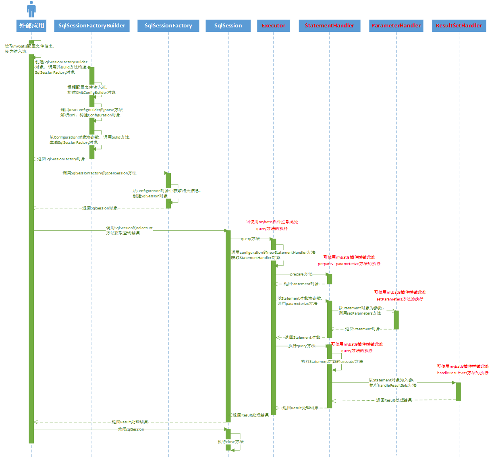
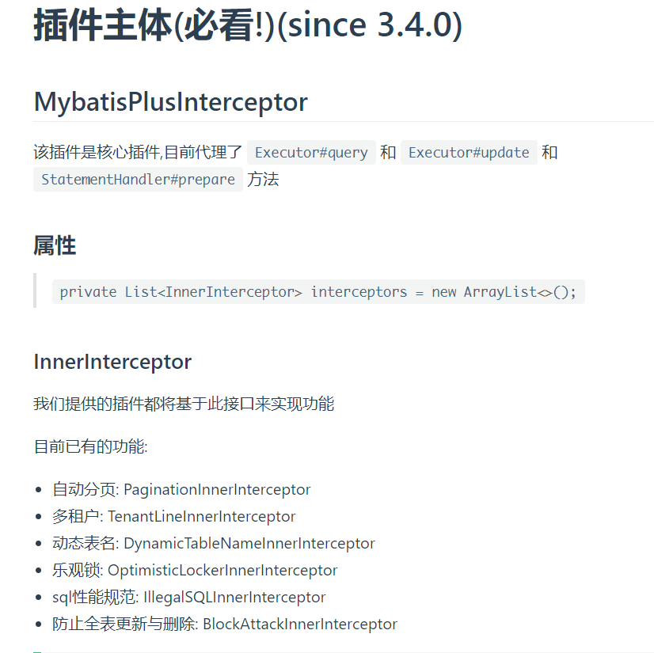

# MyBatis插件如何开发？

## 背景

新接手的项目中有使用到MyBatis的插件，通过该插件来对数据库中的一些敏感信息进行加解密，正好之前对MyBatis插件的认知仅停留在使用过这一层面，乘此次研究，好好巩固下MyBatis插件开发这方面的知识。

本文的目的：基于自定义注解+MyBatis插件实现敏感信息加解密。

注：网络上对于如何开发MyBatis插件的文章，已经有很多的文章了，有些写的很好，所以这篇文章更多还是算作是笔者的学习记录吧。

## 环境

Spring Boot 2.4.2 + Mybatis Plus 3.4.2 + MyBatis 3.5.6 + MySQL 8.0.16

## MyBatis插件介绍

首先，先简单介绍下MyBatis：

> MyBatis 是一款优秀的持久层框架，它支持自定义 SQL、存储过程以及高级映射。MyBatis 免除了几乎所有的 JDBC 代码以及设置参数和获取结果集的工作。MyBatis 可以通过简单的 XML 或注解来配置和映射原始类型、接口和 Java POJO（Plain Old Java Objects，普通老式 Java 对象）为数据库中的记录。

如果想快速了解并上手一门技术的话，那么官方文档一定是首选途径，更何况MyBatis官方文档有中文版。

以下内容摘自MyBatis官方文档的[插件(plugins)](https://mybatis.org/mybatis-3/zh/configuration.html#plugins)这一小节：

> MyBatis 允许你在映射语句执行过程中的某一点进行拦截调用。默认情况下，MyBatis 允许使用插件来拦截的方法调用包括：
>
> - Executor (update, query, flushStatements, commit, rollback, getTransaction, close, isClosed)
> - ParameterHandler (getParameterObject, setParameters)
> - ResultSetHandler (handleResultSets, handleOutputParameters)
> - StatementHandler (prepare, parameterize, batch, update, query)

我们可以从中提取主干信息：`MyBatis 允许你在映射语句执行过程中的某一点进行拦截调用。默认情况下，MyBatis 允许使用插件来拦截的方法调用...`，从中我们就可以了解到MyBatis插件实际上就是一个拦截器，在方法级别上进行拦截。

## MyBatis插件的实现原理

我们来思考这几个问题，上述类的方法都是在什么阶段被拦截的呢？又是怎么被拦截的呢？自定义的插件又是如何加入到MyBatis生命周期中呢？

先看一段代码，代码片段来自MyBatis源码中的SqlSessionTest.java：

```java
public class SqlSessionTest extends BaseDataTest {
  private static SqlSessionFactory sqlMapper;
    
  @BeforeClass
  public static void setup() throws Exception {
    createBlogDataSource();
    final String resource = "org/apache/ibatis/builder/MapperConfig.xml";
    final Reader reader = Resources.getResourceAsReader(resource);
    sqlMapper = new SqlSessionFactoryBuilder().build(reader);
  }  
    
  @Test
  public void shouldSelectAllAuthors() throws Exception {
    SqlSession session = sqlMapper.openSession(TransactionIsolationLevel.SERIALIZABLE);
    try {
      List<Author> authors = session.selectList("org.apache.ibatis.domain.blog.mappers.AuthorMapper.selectAllAuthors");
      assertEquals(2, authors.size());
    } finally {
      session.close();
    }
  }    
}
```

以上代码主要完成：

- 通过createBlogDataSource方法初始化Derby数据库；

- 读取MapperConfig.xml 配置；
- 根据配置，通过SqlSessionFactoryBuilder.build() 创建一个SqlSessionFactory对象；
- 通过SqlSessionFactory对象创建一个SqlSession对象；
- 通过SqlSession对象执行selectList方法，获取查询结果；
- 关闭SqlSession。

让我们深入源码，一步一步揭开真相：

`new SqlSessionFactoryBuilder().build(reader)`：

```java
public class SqlSessionFactoryBuilder {
  public SqlSessionFactory build(Reader reader) {
    return build(reader, null, null);
  }
  
  public SqlSessionFactory build(Reader reader, String environment, Properties properties) {
    try {
      //委托XMLConfigBuilder来解析xml文件，并构建
      ...
      return build(parser.parse());
    } catch (Exception e) {
      ...
    } finally {
      ...
    }
  } 

  //最后一个build方法使用了一个Configuration作为参数,并返回DefaultSqlSessionFactory
  public SqlSessionFactory build(Configuration config) {
    return new DefaultSqlSessionFactory(config);
  }    
}
```

由以上的代码，可知，返回的是DefaultSqlSessionFactory对象，即sqlMapper 是DefaultSqlSessionFactory类型的对象。

`sqlMapper.openSession(TransactionIsolationLevel.SERIALIZABLE)`：

```java
public class DefaultSqlSessionFactory implements SqlSessionFactory {
  @Override
  public SqlSession openSession(TransactionIsolationLevel level) {
    return openSessionFromDataSource(configuration.getDefaultExecutorType(), level, false);
  }
  
  private SqlSession openSessionFromDataSource(ExecutorType execType, TransactionIsolationLevel level, boolean autoCommit) {
    Transaction tx = null;
    try {
      ...
      //生成一个执行器(事务包含在执行器里)
      final Executor executor = configuration.newExecutor(tx, execType);
      //然后产生一个DefaultSqlSession    
      return new DefaultSqlSession(configuration, executor, autoCommit);
    } catch (Exception e) {
      ...
    } finally {
      ...
    }
  }    
}
```

这里我们需要重点关注：

- 通过`configuration.newExecutor(tx, execType)`生成了Executor执行器，这里就不详细分析了，生成的是SimpleExecutor

- 返回的是DefaultSqlSession。

`session.selectList("xxx")`：

```java
public class DefaultSqlSession implements SqlSession {

  private Executor executor;

  //核心selectList
  @Override
  public <E> List<E> selectList(String statement, Object parameter, RowBounds rowBounds) {
    try {
      ...	
      return executor.query(ms, wrapCollection(parameter), rowBounds, Executor.NO_RESULT_HANDLER);
    } catch (Exception e) {
      throw ExceptionFactory.wrapException("Error querying database.  Cause: " + e, e);
    } finally {
      ErrorContext.instance().reset();
    }
  }    
}
```

```java
public abstract class BaseExecutor implements Executor {
  //SqlSession.selectList会调用此方法
  @Override
  public <E> List<E> query(MappedStatement ms, Object parameter, RowBounds rowBounds, ResultHandler resultHandler) throws SQLException {
    ...
    //查询
    return query(ms, parameter, rowBounds, resultHandler, key, boundSql);
 }

  @Override
  public <E> List<E> query(MappedStatement ms, Object parameter, RowBounds rowBounds, ResultHandler resultHandler, CacheKey key, BoundSql boundSql) throws SQLException {
    ...
    try {
      ...
      if (list != null) {
        ...
      } else {
        //从数据库查
        list = queryFromDatabase(ms, parameter, rowBounds, resultHandler, key, boundSql);
      }
    } finally {
      ...
    }
    ...
    return list;
  }

  //从数据库查
  private <E> List<E> queryFromDatabase(MappedStatement ms, Object parameter, RowBounds rowBounds, ResultHandler resultHandler, CacheKey key, BoundSql boundSql) throws SQLException {
    ...
    try {
      list = doQuery(ms, parameter, rowBounds, resultHandler, boundSql);
    } finally {
      ...
    }
    //加入缓存
    ...
    return list;
  }

  // 抽象方法，这里我们只关注SimpleExecutor#doQuery
  protected abstract <E> List<E> doQuery(MappedStatement ms, Object parameter, RowBounds rowBounds, ResultHandler resultHandler, BoundSql boundSql)
      throws SQLException;    
}

public class SimpleExecutor extends BaseExecutor {
  //select
  @Override
  public <E> List<E> doQuery(MappedStatement ms, Object parameter, RowBounds rowBounds, ResultHandler resultHandler, BoundSql boundSql) throws SQLException {
    Statement stmt = null;
    try {
      ...
      StatementHandler handler = configuration.newStatementHandler(wrapper, ms, parameter, rowBounds, resultHandler, boundSql);
      //准备语句
      stmt = prepareStatement(handler, ms.getStatementLog());
      //StatementHandler.query
      return handler.<E>query(stmt, resultHandler);
    } finally {
      closeStatement(stmt);
    }
  } 
  
  public StatementHandler newStatementHandler(Executor executor, MappedStatement mappedStatement, Object parameterObject, RowBounds rowBounds, ResultHandler resultHandler, BoundSql boundSql) {
    //创建路由选择语句处理器
    StatementHandler statementHandler = new RoutingStatementHandler(executor, mappedStatement, parameterObject, rowBounds, resultHandler, boundSql);
    ...
    return statementHandler;
  }    
}

public class RoutingStatementHandler implements StatementHandler {

  private final StatementHandler delegate;

  public RoutingStatementHandler(Executor executor, MappedStatement ms, Object parameter, RowBounds rowBounds, ResultHandler resultHandler, BoundSql boundSql) {

    //根据语句类型，委派到不同的语句处理器(STATEMENT|PREPARED|CALLABLE)
    switch (ms.getStatementType()) {
      case STATEMENT:
        delegate = new SimpleStatementHandler(executor, ms, parameter, rowBounds, resultHandler, boundSql);
        break;
      case PREPARED:
        delegate = new PreparedStatementHandler(executor, ms, parameter, rowBounds, resultHandler, boundSql);
        break;
      case CALLABLE:
        delegate = new CallableStatementHandler(executor, ms, parameter, rowBounds, resultHandler, boundSql);
        break;
      default:
        throw new ExecutorException("Unknown statement type: " + ms.getStatementType());
    }

  }
}
```

这里，我们核心关注：

- 通过configuration.newStatementHandler(xxx)生成StatementHandler，这里是RoutingStatementHandler，里面使用了代理模式，这里使用的是PreparedStatementHandler
- 通过


以上代码的时序图如下，图片取自[深入理解Mybatis插件开发](https://www.cnblogs.com/chenpi/p/10498921.html)：




## 基于MyBatis Plus来做敏感信息加解密插件开发

当然官方文档给出的例子非常简单，并不能满足我们的需求，那么这个时候该怎么办呢？我们可以从优秀的开源项目上借鉴嘛，对，就是借鉴，什么，你说是窃，咳咳，读书人怎么可以说是窃呢。

哈哈，不开玩笑了，借鉴优秀的开源项目确实能学到很多知识，由于项目中使用的是MyBatis Plus，我们可以从官方文档上找找有没有对应的插件实现，学习下别人是如何实现的。

简单介绍下MyBatis Plus：

> [MyBatis-Plus (opens new window)](https://github.com/baomidou/mybatis-plus)（简称 MP）是一个 [MyBatis (opens new window)](http://www.mybatis.org/mybatis-3/)的增强工具，在 MyBatis 的基础上只做增强不做改变，为简化开发、提高效率而生。

[插件](https://baomidou.com/guide/interceptor.html#mybatisplusinterceptor)章节的内容：

