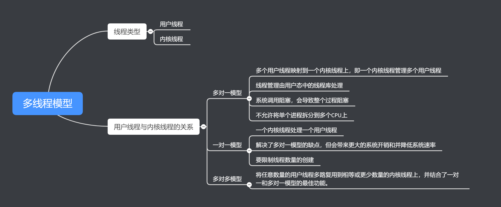

# JUC系列的源码解读 - Thread的设计与实现

## 什么是进程？什么是线程？

线程是CPU使用率的基本单位，由程序计数器、堆栈和一组寄存器（以及线程ID）组成。

进程是指操作系统对正在运行的程序的抽象，同一程序可产生多个进程（一对多关系），以允许同时有多位用户运行同一程序，却不会相冲突。

## 进程与线程的区别？

进程是计算机管理运行程序的一种方式，一个进程下可包含一个或者多个线程。线程可以理解为子进程。

## 谈一谈多线程模型



## 线程库有哪些？

三种主流的线程库

- POSIX Pthreads：可以作为用户库或内核库提供，也可以作为POSIX标准的扩展提供。
- Win32 Pthreads：在Windows系统上作为内核级库提供
- Java threads：由于Java通常在Java虚拟机上运行，因此线程的实现取决于JVM在其上运行的任何操作系统和硬件。即取决于系统的Pthreads or Win32 threads 


## 谈一下对Java中Thread的理解？

Java 中的 Thread，本质上是一个对象，是任务的载体，任务是交由CPU执行的。


## Java Thread 是如何对接到JVM中的 pthread？深入到JVM层面去聊

```java
public class Thread implements Runnable {
    ...
    /* What will be run. */
    private Runnable target;	

    public Thread(Runnable target) {
        this(null, target, "Thread-" + nextThreadNum(), 0);
    }
    
    public Thread(ThreadGroup group, Runnable target, String name,
                  long stackSize) {
        this(group, target, name, stackSize, null, true);
    }
    
    private Thread(ThreadGroup g, Runnable target, String name,
                   long stackSize, AccessControlContext acc,
                   boolean inheritThreadLocals) {
        ...
        this.target = target;
        ...
    }    
    
    @Override
    public void run() {
        if (target != null) {
            target.run();
        }
    }    
}
```

由以上Thread 源码，我们可以知道，直接 thread.run()，实际执行的是 target.run()，即主线程下直接执行run()方法，是同步的，而不是异步执行。

那么thread的run()是如何异步执行的呢？众所周知，thread的启动，要调用start()方法：

```java
    public synchronized void start() {
        ...
        try {
            // 核心
            start0();
            started = true;
        } finally {
            try {
                if (!started) {
                    group.threadStartFailed(this);
                }
            } catch (Throwable ignore) {
                /* do nothing. If start0 threw a Throwable then
                  it will be passed up the call stack */
            }
        }
    }
	// 本地方法，调用JVM的方法
    private native void start0();
```

由上可知，核心在于start0()方法，接下来，让我们深入JVM的源码，来一探究竟。

JVM的源码采用的是 openjdk 11。

查看 jvm.cpp文件

```c++
JVM_ENTRY(void, JVM_StartThread(JNIEnv* env, jobject jthread))
  JVMWrapper("JVM_StartThread");
  JavaThread *native_thread = NULL;

  // We cannot hold the Threads_lock when we throw an exception,
  // due to rank ordering issues. Example:  we might need to grab the
  // Heap_lock while we construct the exception.
  bool throw_illegal_thread_state = false;

  // We must release the Threads_lock before we can post a jvmti event
  // in Thread::start.
  {
    // Ensure that the C++ Thread and OSThread structures aren't freed before
    // we operate.
    MutexLocker mu(Threads_lock);

    // Since JDK 5 the java.lang.Thread threadStatus is used to prevent
    // re-starting an already started thread, so we should usually find
    // that the JavaThread is null. However for a JNI attached thread
    // there is a small window between the Thread object being created
    // (with its JavaThread set) and the update to its threadStatus, so we
    // have to check for this
    if (java_lang_Thread::thread(JNIHandles::resolve_non_null(jthread)) != NULL) {
      throw_illegal_thread_state = true;
    } else {
      // We could also check the stillborn flag to see if this thread was already stopped, but
      // for historical reasons we let the thread detect that itself when it starts running

      jlong size =
             java_lang_Thread::stackSize(JNIHandles::resolve_non_null(jthread));
      // Allocate the C++ Thread structure and create the native thread.  The
      // stack size retrieved from java is 64-bit signed, but the constructor takes
      // size_t (an unsigned type), which may be 32 or 64-bit depending on the platform.
      //  - Avoid truncating on 32-bit platforms if size is greater than UINT_MAX.
      //  - Avoid passing negative values which would result in really large stacks.
      NOT_LP64(if (size > SIZE_MAX) size = SIZE_MAX;)
      size_t sz = size > 0 ? (size_t) size : 0;
      native_thread = new JavaThread(&thread_entry, sz);// 【1】 创建JavaThread

      // At this point it may be possible that no osthread was created for the
      // JavaThread due to lack of memory. Check for this situation and throw
      // an exception if necessary. Eventually we may want to change this so
      // that we only grab the lock if the thread was created successfully -
      // then we can also do this check and throw the exception in the
      // JavaThread constructor.
      if (native_thread->osthread() != NULL) {
        // Note: the current thread is not being used within "prepare".
        native_thread->prepare(jthread); // 【2】
      }
    }
  }

  if (throw_illegal_thread_state) {
    THROW(vmSymbols::java_lang_IllegalThreadStateException());
  }

  assert(native_thread != NULL, "Starting null thread?");

  if (native_thread->osthread() == NULL) {
    // No one should hold a reference to the 'native_thread'.
    native_thread->smr_delete();
    if (JvmtiExport::should_post_resource_exhausted()) {
      JvmtiExport::post_resource_exhausted(
        JVMTI_RESOURCE_EXHAUSTED_OOM_ERROR | JVMTI_RESOURCE_EXHAUSTED_THREADS,
        os::native_thread_creation_failed_msg());
    }
    THROW_MSG(vmSymbols::java_lang_OutOfMemoryError(),
              os::native_thread_creation_failed_msg());
  }

  Thread::start(native_thread);// 【3】

JVM_END
```


由`JVM_ENTRY`的【1】可知，创建了一个JavaTread类：

```c++
JavaThread::JavaThread(ThreadFunction entry_point, size_t stack_sz) :
                       Thread() {
  initialize();
  _jni_attach_state = _not_attaching_via_jni;
  set_entry_point(entry_point);
  // Create the native thread itself.
  // %note runtime_23
  os::ThreadType thr_type = os::java_thread;
  thr_type = entry_point == &compiler_thread_entry ? os::compiler_thread :
                                                     os::java_thread;
  os::create_thread(this, thr_type, stack_sz); // 【1】
  // The _osthread may be NULL here because we ran out of memory (too many threads active).
  // We need to throw and OutOfMemoryError - however we cannot do this here because the caller
  // may hold a lock and all locks must be unlocked before throwing the exception (throwing
  // the exception consists of creating the exception object & initializing it, initialization
  // will leave the VM via a JavaCall and then all locks must be unlocked).
  //
  // The thread is still suspended when we reach here. Thread must be explicit started
  // by creator! Furthermore, the thread must also explicitly be added to the Threads list
  // by calling Threads:add. The reason why this is not done here, is because the thread
  // object must be fully initialized (take a look at JVM_Start)
}
```

由`JavaThread`【1】可知：

```c++
bool os::create_thread(Thread* thread, ThreadType thr_type,
                       size_t req_stack_size) {
  assert(thread->osthread() == NULL, "caller responsible");

  // Allocate the OSThread object
  OSThread* osthread = new OSThread(NULL, NULL);
  if (osthread == NULL) {
    return false;
  }

  // set the correct thread state
  osthread->set_thread_type(thr_type);

  // Initial state is ALLOCATED but not INITIALIZED
  osthread->set_state(ALLOCATED);
  // 将 OSThread 与 JavaThread 绑定在一起	
  thread->set_osthread(osthread); // 【1】

  // init thread attributes
  pthread_attr_t attr;
  pthread_attr_init(&attr);
  pthread_attr_setdetachstate(&attr, PTHREAD_CREATE_DETACHED);

  // Calculate stack size if it's not specified by caller.
  size_t stack_size = os::Posix::get_initial_stack_size(thr_type, req_stack_size);
  // In the Linux NPTL pthread implementation the guard size mechanism
  // is not implemented properly. The posix standard requires adding
  // the size of the guard pages to the stack size, instead Linux
  // takes the space out of 'stacksize'. Thus we adapt the requested
  // stack_size by the size of the guard pages to mimick proper
  // behaviour. However, be careful not to end up with a size
  // of zero due to overflow. Don't add the guard page in that case.
  size_t guard_size = os::Linux::default_guard_size(thr_type);
  if (stack_size <= SIZE_MAX - guard_size) {
    stack_size += guard_size;
  }
  assert(is_aligned(stack_size, os::vm_page_size()), "stack_size not aligned");

  int status = pthread_attr_setstacksize(&attr, stack_size);
  assert_status(status == 0, status, "pthread_attr_setstacksize");

  // Configure glibc guard page.
  pthread_attr_setguardsize(&attr, os::Linux::default_guard_size(thr_type));

  ThreadState state;

  {
    pthread_t tid;
    int ret = pthread_create(&tid, &attr, (void* (*)(void*)) thread_native_entry, thread); // 【2】

    char buf[64];
    if (ret == 0) {
      log_info(os, thread)("Thread started (pthread id: " UINTX_FORMAT ", attributes: %s). ",
        (uintx) tid, os::Posix::describe_pthread_attr(buf, sizeof(buf), &attr));
    } else {
      log_warning(os, thread)("Failed to start thread - pthread_create failed (%s) for attributes: %s.",
        os::errno_name(ret), os::Posix::describe_pthread_attr(buf, sizeof(buf), &attr));
    }

    pthread_attr_destroy(&attr);

    if (ret != 0) {
      // Need to clean up stuff we've allocated so far
      thread->set_osthread(NULL);
      delete osthread;
      return false;
    }

    // Store pthread info into the OSThread
    osthread->set_pthread_id(tid);

    // Wait until child thread is either initialized or aborted
    {
      Monitor* sync_with_child = osthread->startThread_lock();
      MutexLockerEx ml(sync_with_child, Mutex::_no_safepoint_check_flag);
      while ((state = osthread->get_state()) == ALLOCATED) {
        sync_with_child->wait(Mutex::_no_safepoint_check_flag);
      }
    }
  }

  // Aborted due to thread limit being reached
  if (state == ZOMBIE) {
    thread->set_osthread(NULL);
    delete osthread;
    return false;
  }

  // The thread is returned suspended (in state INITIALIZED),
  // and is started higher up in the call chain
  assert(state == INITIALIZED, "race condition");
  return true;
}
```

`create_thread`的【2】是核心方法：这个方法用于创建pthread。

` pthread_create(&tid, &attr, (void* (*)(void*)) thread_native_entry, thread);`

由[4_Threads](https://www.cs.uic.edu/~jbell/CourseNotes/OperatingSystems/4_Threads.html)中的4.4.1章节示例可知，`thread_native_entry`相当于要执行的方法，threads则为JavaThread。

```c++
// Thread start routine for all newly created threads
static void *thread_native_entry(Thread *thread) {
  // Try to randomize the cache line index of hot stack frames.
  // This helps when threads of the same stack traces evict each other's
  // cache lines. The threads can be either from the same JVM instance, or
  // from different JVM instances. The benefit is especially true for
  // processors with hyperthreading technology.
  static int counter = 0;
  int pid = os::current_process_id();
  alloca(((pid ^ counter++) & 7) * 128);

  thread->initialize_thread_current();

  OSThread* osthread = thread->osthread(); // 获取OSThread
  Monitor* sync = osthread->startThread_lock();

  osthread->set_thread_id(os::current_thread_id());

  log_info(os, thread)("Thread is alive (tid: " UINTX_FORMAT ", pthread id: " UINTX_FORMAT ").",
    os::current_thread_id(), (uintx) pthread_self());

  if (UseNUMA) {
    int lgrp_id = os::numa_get_group_id();
    if (lgrp_id != -1) {
      thread->set_lgrp_id(lgrp_id);
    }
  }
  // initialize signal mask for this thread
  os::Linux::hotspot_sigmask(thread);

  // initialize floating point control register
  os::Linux::init_thread_fpu_state();

  // handshaking with parent thread
  {
    MutexLockerEx ml(sync, Mutex::_no_safepoint_check_flag);

    // notify parent thread
    osthread->set_state(INITIALIZED); // 【1】 设置INITIALIZED状态
    sync->notify_all();

    // wait until os::start_thread()
    while (osthread->get_state() == INITIALIZED) {
      sync->wait(Mutex::_no_safepoint_check_flag); // 【2】 锁等待，这时看`JVM_ENTRY`的【3】
    }
  }

  // call one more level start routine
  thread->run(); // 【3】 最底层就是执行java.lang.Thread 中的run方法

  log_info(os, thread)("Thread finished (tid: " UINTX_FORMAT ", pthread id: " UINTX_FORMAT ").",
    os::current_thread_id(), (uintx) pthread_self());

  // If a thread has not deleted itself ("delete this") as part of its
  // termination sequence, we have to ensure thread-local-storage is
  // cleared before we actually terminate. No threads should ever be
  // deleted asynchronously with respect to their termination.
  if (Thread::current_or_null_safe() != NULL) {
    assert(Thread::current_or_null_safe() == thread, "current thread is wrong");
    thread->clear_thread_current();
  }

  return 0;
}
```

`JVM_ENTRY`的【3】：`Thread::start(native_thread);`

thread.cpp

```c++
void Thread::start(Thread* thread) {
  // Start is different from resume in that its safety is guaranteed by context or
  // being called from a Java method synchronized on the Thread object.
  if (!DisableStartThread) {
    if (thread->is_Java_thread()) {
      // Initialize the thread state to RUNNABLE before starting this thread.
      // Can not set it after the thread started because we do not know the
      // exact thread state at that time. It could be in MONITOR_WAIT or
      // in SLEEPING or some other state.
      java_lang_Thread::set_thread_status(((JavaThread*)thread)->threadObj(),
                                          java_lang_Thread::RUNNABLE);
    }
    os::start_thread(thread);
  }
}
```

os.cpp：

```c++
void os::start_thread(Thread* thread) {
  // guard suspend/resume
  MutexLockerEx ml(thread->SR_lock(), Mutex::_no_safepoint_check_flag);
  OSThread* osthread = thread->osthread();
  osthread->set_state(RUNNABLE); // 改变状态 
  pd_start_thread(thread);
}
```

os_linux.cpp：

```c++
void os::pd_start_thread(Thread* thread) {
  OSThread * osthread = thread->osthread();
  assert(osthread->get_state() != INITIALIZED, "just checking");
  Monitor* sync_with_child = osthread->startThread_lock();
  MutexLockerEx ml(sync_with_child, Mutex::_no_safepoint_check_flag);
  sync_with_child->notify(); // 目光转回 os_linux.cpp中`thread_native_entry`方法的【3】
}
```

到此，java.lang.Thread的 start()调用 到 run() 执行，从Thread源码到JVM中pthread，就贯通好了。 


## 参考资料

https://www.cs.uic.edu/~jbell/CourseNotes/OperatingSystems/4_Threads.html

https://github.com/openjdk/jdk11u