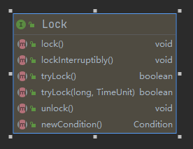
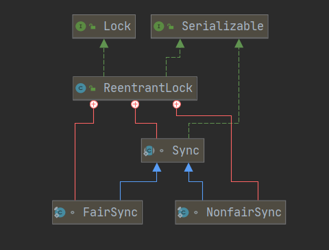
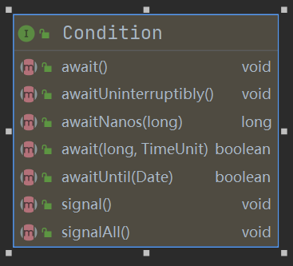

# JUC系列的源码解读 - 关于Lock的设计简谈

## Lock接口的设计




## ReentrantLock的详解

ReentrantLock：可重入锁，顾名思义，同个线程可以多次持有这个锁，内部维持一个计数器，当计数器清零时，其他线程才能进行争抢。

- 公平锁：FairSync
- 非公平锁：NonfairSync

1. 公平锁该如何实现？

   借助队列去实现顺序，讲究先来后到，最后通过CAS进行锁竞争。

2. 非公平锁怎么实现？

   通过CAS进行锁竞争

ReentrantLock 的类图：



java.util.concurrent.locks.ReentrantLock：

```java
/**
 * A reentrant mutual exclusion {@link Lock} with the same basic
 * behavior and semantics as the implicit monitor lock accessed using
 * {@code synchronized} methods and statements, but with extended
 * ... 
 * capabilities.
 * @since 1.5
 * @author Doug Lea
 */
```

根据英文注释，我们大致能知道，ReentrantLock 是一个可重入的互斥锁，那如何实现可重入呢？

这里就涉及到了AQS，下面会进行详细讲解

```java
public abstract class AbstractQueuedSynchronizer
    extends AbstractOwnableSynchronizer
    implements java.io.Serializable {
    ...
    /**
     * The synchronization state.
     */
    private volatile int state;
    ...
}

public abstract class AbstractOwnableSynchronizer
    implements java.io.Serializable {
    /**
     * The current owner of exclusive mode synchronization.
     */
    private transient Thread exclusiveOwnerThread;	
}
```


ReentrantLock 内部有一个 Sync 对象

```java
public class ReentrantLock implements Lock, java.io.Serializable {
    /** Synchronizer providing all implementation mechanics */
    private final Sync sync;
}
```

加锁和解锁过程，都是借助java.util.concurrent.locks.ReentrantLock.Sync对象来实现，如下代码所示：

```java
public class ReentrantLock implements Lock, java.io.Serializable {
    /** Synchronizer providing all implementation mechanics */
    private final Sync sync;
    
    public void lock() {
        sync.acquire(1);
    }

    public boolean tryLock() {
        return sync.nonfairTryAcquire(1);
    }    
    
    public void unlock() {
        sync.release(1);
    }    
}
```

java.util.concurrent.locks.ReentrantLock.Sync 是个抽象类，派生出java.util.concurrent.locks.ReentrantLock.FairSync（公平锁）、java.util.concurrent.locks.ReentrantLock.NonfairSync（非公平锁）。

### 加锁过程

`sync.acquire(1);`：

```java
public abstract class AbstractQueuedSynchronizer
    extends AbstractOwnableSynchronizer
    implements java.io.Serializable {
    ...
    public final void acquire(int arg) {
        // 先尝试抢🔒，抢不到就加入等待队列（addWaiter(Node.EXCLUSIVE)）。
        if (!tryAcquire(arg) &&
            acquireQueued(addWaiter(Node.EXCLUSIVE), arg))
            selfInterrupt();
    }

    private Node addWaiter(Node mode) {
        Node node = new Node(mode);
		
        for (;;) {
            Node oldTail = tail;
            if (oldTail != null) {
                node.setPrevRelaxed(oldTail);
                if (compareAndSetTail(oldTail, node)) {
                    oldTail.next = node;
                    return node;
                }
            } else {
                initializeSyncQueue();
            }
        }
    }    
    
    final boolean acquireQueued(final Node node, int arg) {
        boolean interrupted = false;
        try {
            for (;;) {
                // 获取node节点的前驱节点
                final Node p = node.predecessor();
                // 如果前驱节点时head头，那么node节点就再争抢下锁。
                // tryAcquire(arg) 重点看公平锁（FairSync）的实现（用到了“CLH”等待队列），非公平锁（NonfairSync）的实现很简单，就单纯的CAS操作 
                if (p == head && tryAcquire(arg)) {
                    setHead(node);
                    p.next = null; // help GC
                    return interrupted;
                }
                // 没抢到🔒的线程，要挂起
                if (shouldParkAfterFailedAcquire(p, node))
                    interrupted |= parkAndCheckInterrupt();
            }
        } catch (Throwable t) {
            cancelAcquire(node);
            if (interrupted)
                selfInterrupt();
            throw t;
        }
    }
    
    /**
     * Checks and updates status for a node that failed to acquire.
     * Returns true if thread should block. This is the main signal
     * control in all acquire loops.  Requires that pred == node.prev.
     *
     * @param pred node's predecessor holding status
     * @param node the node
     * @return {@code true} if thread should block
     */
    private static boolean shouldParkAfterFailedAcquire(Node pred, Node node) {
        int ws = pred.waitStatus;
        // 判断新加节点的前置节点的状态
        if (ws == Node.SIGNAL)
            /*
             * This node has already set status asking a release
             * to signal it, so it can safely park.
             */
            return true;
        if (ws > 0) {
            /*
             * Predecessor was cancelled. Skip over predecessors and
             * indicate retry.
             */
            do {
                // 如果node的前置节点pred处于CANCLED状态，应抛弃此前置节点，往上找前置节点，直至前置节点的状态不为CANCLED
                node.prev = pred = pred.prev;
            } while (pred.waitStatus > 0);
            pred.next = node;
        } else {
            /*
             * waitStatus must be 0 or PROPAGATE.  Indicate that we
             * need a signal, but don't park yet.  Caller will need to
             * retry to make sure it cannot acquire before parking.
             */
            pred.compareAndSetWaitStatus(ws, Node.SIGNAL);
        }
        return false;
    }    

    /**
     * Convenience method to park and then check if interrupted.
     *
     * @return {@code true} if interrupted
     */
    private final boolean parkAndCheckInterrupt() {
        LockSupport.park(this);
        return Thread.interrupted();
    }     
}

public class LockSupport {
    private static void setBlocker(Thread t, Object arg) {
        // Even though volatile, hotspot doesn't need a write barrier here.
        U.putObject(t, PARKBLOCKER, arg);
    }
    
    public static void park(Object blocker) {
        Thread t = Thread.currentThread();
        // 假设blocker是ReentrantLock.FairSync，那么setBlocker的作用就是将blocker与当前线程绑定起来。
        setBlocker(t, blocker);
        U.park(false, 0L);
        setBlocker(t, null);
    }
    private static final long PARKBLOCKER = U.objectFieldOffset
            (Thread.class, "parkBlocker");    
}

public class Thread implements Runnable { {
    ...
    /**
     * The argument supplied to the current call to
     * java.util.concurrent.locks.LockSupport.park.
     * Set by (private) java.util.concurrent.locks.LockSupport.setBlocker
     * Accessed using java.util.concurrent.locks.LockSupport.getBlocker
     */
    // @see LockSupport#PARKBLOCKER    
    volatile Object parkBlocker;        
    ...
}

public abstract class AbstractQueuedSynchronizer
    extends AbstractOwnableSynchronizer
    implements java.io.Serializable {
    
    public final boolean hasQueuedPredecessors() {
        Node h, s;
        if ((h = head) != null) {
            // head的后继节点为空 或者 head的后继节点处于CANCELLED状态
            // (s = h.next) == null  这个判断条件存在的意义？
            if ((s = h.next) == null || s.waitStatus > 0) {
                s = null; // traverse in case of concurrent cancellation
                // 目的：从tail节点往前遍历，找到离head节点最近的状态为非CANCELLED的节点
                for (Node p = tail; p != h && p != null; p = p.prev) {
                    if (p.waitStatus <= 0)
                        s = p;
                }
            }
            // head节点不为 null 且 node的绑定的线程是当前线程，返回false
            if (s != null && s.thread != Thread.currentThread())
                return true;
        }
        return false;
    }
}
```


FairSync（公平锁），顾名思义，锁争抢是公平的，讲究先来后到，所以在ReentrantLock内部要维护一个队列，来保持线程之间的先后顺序。

```java
    /**
     * Sync object for fair locks
     */
    static final class FairSync extends Sync {
        private static final long serialVersionUID = -3000897897090466540L;
        /**
         * Fair version of tryAcquire.  Don't grant access unless
         * recursive call or no waiters or is first.
         */
        @ReservedStackAccess
        protected final boolean tryAcquire(int acquires) {
            final Thread current = Thread.currentThread();
            int c = getState();
            if (c == 0) {
                // hasQueuedPredecessors 判断等待队列是否有节点，无则进行锁争抢（CAS）
                if (!hasQueuedPredecessors() &&
                    compareAndSetState(0, acquires)) {
                    setExclusiveOwnerThread(current);
                    return true;
                }
            }
            else if (current == getExclusiveOwnerThread()) {
                int nextc = c + acquires;
                if (nextc < 0)
                    throw new Error("Maximum lock count exceeded");
                // 计数递增
                setState(nextc);
                return true;
            }
            return false;
        }
    }

    public final boolean hasQueuedPredecessors() {
        Node h, s;
        if ((h = head) != null) {
            if ((s = h.next) == null || s.waitStatus > 0) {
                s = null; // traverse in case of concurrent cancellation
                // 从尾部遍历，找到状态不处于CANCELLED，且离head节点最近的那个Node节点
                for (Node p = tail; p != h && p != null; p = p.prev) {
                    if (p.waitStatus <= 0)
                        s = p;
                }
            }
            if (s != null && s.thread != Thread.currentThread())
                return true;
        }
        return false;
    }

    abstract static class Sync extends AbstractQueuedSynchronizer {
        /**
         * Performs non-fair tryLock.  tryAcquire is implemented in
         * subclasses, but both need nonfair try for trylock method.
         */
        @ReservedStackAccess
        final boolean nonfairTryAcquire(int acquires) {
            final Thread current = Thread.currentThread();
            // 获取当前线程持有锁的次数
            int c = getState();
            // 为0，证明当前还没有线程持有锁
            if (c == 0) {
                // 线程间进行CAS，争抢锁
                if (compareAndSetState(0, acquires)) {
                    // 争抢锁成功，将当前线程设置为独占线程
                    setExclusiveOwnerThread(current);
                    return true;
                }
            }
            else if (current == getExclusiveOwnerThread()) {
                // 如果当前线程是独占线程
                int nextc = c + acquires;
                if (nextc < 0) // overflow
                    throw new Error("Maximum lock count exceeded");
                // 计数递增
                setState(nextc);
                return true;
            }
            return false;
        }    
    }
```


NonfairSync（非公平锁）的实现思路就简单多了，如源码所示：

```java
    /**
     * Sync object for non-fair locks
     */
    static final class NonfairSync extends Sync {
        private static final long serialVersionUID = 7316153563782823691L;
        protected final boolean tryAcquire(int acquires) {
            return nonfairTryAcquire(acquires);
        }
    }

    abstract static class Sync extends AbstractQueuedSynchronizer {
        /**
         * Performs non-fair tryLock.  tryAcquire is implemented in
         * subclasses, but both need nonfair try for trylock method.
         */
        @ReservedStackAccess
        final boolean nonfairTryAcquire(int acquires) {
            final Thread current = Thread.currentThread();
            // 获取当前线程持有锁的次数
            int c = getState();
            // 为0，证明当前还没有线程持有锁
            if (c == 0) {
                // 线程间进行CAS，争抢锁
                if (compareAndSetState(0, acquires)) {
                    // 争抢锁成功，将当前线程设置为独占线程
                    setExclusiveOwnerThread(current);
                    return true;
                }
            }
            else if (current == getExclusiveOwnerThread()) {
                // 如果当前线程是独占线程
                int nextc = c + acquires;
                if (nextc < 0) // overflow
                    throw new Error("Maximum lock count exceeded");
                // 计数递增
                setState(nextc);
                return true;
            }
            return false;
        }    
    }
```

### AbstractQueuedSynchronizer（AQS）解读

java.util.concurrent.locks.AbstractQueuedSynchronizer

作为上层抽象，内部维护一个“CLH”等待队列，所以只需持有head和tail的Node节点即可。

```java
public abstract class AbstractQueuedSynchronizer
    extends AbstractOwnableSynchronizer
    implements java.io.Serializable {
    ...
    /**
     * Head of the wait queue, lazily initialized.  Except for
     * initialization, it is modified only via method setHead.  Note:
     * If head exists, its waitStatus is guaranteed not to be
     * CANCELLED.
     */
    private transient volatile Node head;

    /**
     * Tail of the wait queue, lazily initialized.  Modified only via
     * method enq to add new wait node.
     */
    private transient volatile Node tail;

    /**
     * The synchronization state.
     */
    private volatile int state;
    ...
    // VarHandle mechanics
    // 与 Unsafe 的用途一致
    private static final VarHandle STATE;
    private static final VarHandle HEAD;
    private static final VarHandle TAIL;

    static {
        try {
            // volatile 修饰的属性，基于内存进行CAS操作
            MethodHandles.Lookup l = MethodHandles.lookup();
            STATE = l.findVarHandle(AbstractQueuedSynchronizer.class, "state", int.class);
            HEAD = l.findVarHandle(AbstractQueuedSynchronizer.class, "head", Node.class);
            TAIL = l.findVarHandle(AbstractQueuedSynchronizer.class, "tail", Node.class);
        } catch (ReflectiveOperationException e) {
            throw new ExceptionInInitializerError(e);
        }

        // Reduce the risk of rare disastrous classloading in first call to
        // LockSupport.park: https://bugs.openjdk.java.net/browse/JDK-8074773
        Class<?> ensureLoaded = LockSupport.class;
    }
    
    protected final boolean compareAndSetState(int expect, int update) {
        return STATE.compareAndSet(this, expect, update);
    }
    
    /**
     * Initializes head and tail fields on first contention.
     */
    private final void initializeSyncQueue() {
        Node h;
        if (HEAD.compareAndSet(this, null, (h = new Node())))
            tail = h;
    }

    /**
     * CASes tail field.
     */
    private final boolean compareAndSetTail(Node expect, Node update) {
        return TAIL.compareAndSet(this, expect, update);
    }    
}
```

### Node的设计解读

java.util.concurrent.locks.AbstractQueuedSynchronizer.Node

本质上来讲，Node是对Thread的增强，由于要形成一个队列，所以要“顾后”，有一个指向下一个节点的对象引用。那为什么要“知前”呢？（即拥有指向上一个引用的对象）。因为Thread是可以被cancle掉的，所以要有一个指向上一个节点的对象引用，这样才方便将cancle掉的Node节点对象，移除队列。

```java
    static final class Node {
        
        /** Marker to indicate a node is waiting in shared mode */
        static final Node SHARED = new Node();
        /** Marker to indicate a node is waiting in exclusive mode */
        static final Node EXCLUSIVE = null;

        /** waitStatus value to indicate thread has cancelled. */
        static final int CANCELLED =  1;
        /** waitStatus value to indicate successor's thread needs unparking. */
        static final int SIGNAL    = -1;
        /** waitStatus value to indicate thread is waiting on condition. */
        static final int CONDITION = -2;
        /**
         * waitStatus value to indicate the next acquireShared should
         * unconditionally propagate.
         */
        static final int PROPAGATE = -3;
            
         /**
         * Status field, taking on only the values:
         *   SIGNAL:     The successor of this node is (or will soon be)
         *               blocked (via park), so the current node must
         *               unpark its successor when it releases or
         *               cancels. To avoid races, acquire methods must
         *               first indicate they need a signal,
         *               then retry the atomic acquire, and then,
         *               on failure, block.
         *   CANCELLED:  This node is cancelled due to timeout or interrupt.
         *               Nodes never leave this state. In particular,
         *               a thread with cancelled node never again blocks.
         *   CONDITION:  This node is currently on a condition queue.
         *               It will not be used as a sync queue node
         *               until transferred, at which time the status
         *               will be set to 0. (Use of this value here has
         *               nothing to do with the other uses of the
         *               field, but simplifies mechanics.)
         *   PROPAGATE:  A releaseShared should be propagated to other
         *               nodes. This is set (for head node only) in
         *               doReleaseShared to ensure propagation
         *               continues, even if other operations have
         *               since intervened.
         *   0:          None of the above
         *
         * The values are arranged numerically to simplify use.
         * Non-negative values mean that a node doesn't need to
         * signal. So, most code doesn't need to check for particular
         * values, just for sign.
         *
         * The field is initialized to 0 for normal sync nodes, and
         * CONDITION for condition nodes.  It is modified using CAS
         * (or when possible, unconditional volatile writes).
         */
        volatile int waitStatus;           
            
            
        /**
         * Link to predecessor node that current node/thread relies on
         * for checking waitStatus. Assigned during enqueuing, and nulled
         * out (for sake of GC) only upon dequeuing.  Also, upon
         * cancellation of a predecessor, we short-circuit while
         * finding a non-cancelled one, which will always exist
         * because the head node is never cancelled: A node becomes
         * head only as a result of successful acquire. A
         * cancelled thread never succeeds in acquiring, and a thread only
         * cancels itself, not any other node.
         */
        volatile Node prev;
            
        /**
         * Link to the successor node that the current node/thread
         * unparks upon release. Assigned during enqueuing, adjusted
         * when bypassing cancelled predecessors, and nulled out (for
         * sake of GC) when dequeued.  The enq operation does not
         * assign next field of a predecessor until after attachment,
         * so seeing a null next field does not necessarily mean that
         * node is at end of queue. However, if a next field appears
         * to be null, we can scan prev's from the tail to
         * double-check.  The next field of cancelled nodes is set to
         * point to the node itself instead of null, to make life
         * easier for isOnSyncQueue.
         */
        volatile Node next;            
            
        /**
         * The thread that enqueued this node.  Initialized on
         * construction and nulled out after use.
         */
        volatile Thread thread;    	
    }
```

### 解锁过程

```java
public void unlock() {
    sync.release(1);
}
```

```java
public abstract class AbstractQueuedSynchronizer
    extends AbstractOwnableSynchronizer
    implements java.io.Serializable {
    
    public final boolean release(int arg) {
        if (tryRelease(arg)) {
            Node h = head;
            if (h != null && h.waitStatus != 0)
                unparkSuccessor(h);
            return true;
        }
        return false;
    }
    
    private void unparkSuccessor(Node node) {
        /*
         * If status is negative (i.e., possibly needing signal) try
         * to clear in anticipation of signalling.  It is OK if this
         * fails or if status is changed by waiting thread.
         */
        int ws = node.waitStatus;
        if (ws < 0)
            node.compareAndSetWaitStatus(ws, 0);

        /*
         * Thread to unpark is held in successor, which is normally
         * just the next node.  But if cancelled or apparently null,
         * traverse backwards from tail to find the actual
         * non-cancelled successor.
         */
        Node s = node.next;
        if (s == null || s.waitStatus > 0) {
            s = null;
            // 从tail往head遍历，直至找到离head节点最近的，状态不为CANCELLED和0的Node节点
            for (Node p = tail; p != node && p != null; p = p.prev)
                if (p.waitStatus <= 0)
                    s = p;
        }
        if (s != null)
            // uppark，唤醒节点绑定的Thread，开始争抢
            LockSupport.unpark(s.thread);
    }    
}

public class ReentrantLock implements Lock, java.io.Serializable {
    abstract static class Sync extends AbstractQueuedSynchronizer {
        @ReservedStackAccess
        protected final boolean tryRelease(int releases) {
            int c = getState() - releases;
            if (Thread.currentThread() != getExclusiveOwnerThread())
                throw new IllegalMonitorStateException();
            boolean free = false;
            if (c == 0) {
                free = true;
                setExclusiveOwnerThread(null);
            }
            setState(c);
            return free;
        }    	
    }
}
```

### Condition 锁

java.util.concurrent.locks.Condition的方法列表：



java.util.concurrent.locks.Condition的模型：


可以通过以下例子来进一步理解condition的用法：

```java
class BoundedBuffer<E> {
  final Lock lock = new ReentrantLock();
  final Condition notFull  = <b>lock.newCondition(); 
  final Condition notEmpty = <b>lock.newCondition(); 
  final Object[] items = new Object[100];
  int putptr, takeptr, count;
  public void put(E x) throws InterruptedException {
   lock.lock();
    try {
      while (count == items.length)
        <b>notFull.await();
      items[putptr] = x;
      if (++putptr == items.length) putptr = 0;
      ++count;
      notEmpty.signal();
    } finally {
      lock.unlock();
    }
  }
    
  public E take() throws InterruptedException {
    lock.lock();
    try {
      while (count == 0)
        <b>notEmpty.await();
      E x = (E) items[takeptr];
      if (++takeptr == items.length) takeptr = 0;
      --count;
      notFull.signal();
      return x;
    } finally {
      lock.unlock();
    }
  }
}
```

核心点在于理解：

`Condition#await`与`Condition#signal`之间的联系

AQS内部维持一个“CLH”锁队列，是一个双向队列。

Condition内部则维护一个等待队列，是一个单向队列。

#### `Condition#await()`：

```java
public abstract class AbstractQueuedSynchronizer
    extends AbstractOwnableSynchronizer
    implements java.io.Serializable {
    
    public class ConditionObject implements Condition, java.io.Serializable {
 
        /** First node of condition queue. */
        private transient Node firstWaiter;
        /** Last node of condition queue. */
        private transient Node lastWaiter;        
        
        public final void await() throws InterruptedException {
            if (Thread.interrupted())
                throw new InterruptedException();
            // 往等待队列尾部添加Node节点
            Node node = addConditionWaiter();
            // 释放AQS的独占锁，并唤醒离head节点最近的状态不为CANCELLED的Node节点（这里的唤醒是重点，与Condiction#signal()密切相关）
            int savedState = fullyRelease(node);
            int interruptMode = 0;
            // 判断当前node节点在不在等待队列中
            while (!isOnSyncQueue(node)) {
                // park 当前 thread
                LockSupport.park(this);
                // 检查Node节点关联的thread是否被中断
                if ((interruptMode = checkInterruptWhileWaiting(node)) != 0)
                    break;
            }
            // 对于signal来说就是最先进入Condition等待队列的thread，开始尝试争抢锁，如果是signalAll，则是所有等待队列中thread开始争抢锁
            if (acquireQueued(node, savedState) && interruptMode != THROW_IE)
                interruptMode = REINTERRUPT;
            if (node.nextWaiter != null) // clean up if cancelled
                unlinkCancelledWaiters();
            if (interruptMode != 0)
                reportInterruptAfterWait(interruptMode);
        }
        
        /**
         * Adds a new waiter to wait queue.
         * @return its new wait node
         */
        private Node addConditionWaiter() {
            if (!isHeldExclusively())
                throw new IllegalMonitorStateException();
            Node t = lastWaiter;
            // If lastWaiter is cancelled, clean out.
            if (t != null && t.waitStatus != Node.CONDITION) {
                // 移除等待队列中状态不为CONDITION的Node节点
                unlinkCancelledWaiters();
                t = lastWaiter;
            }

            Node node = new Node(Node.CONDITION);

            if (t == null)
                firstWaiter = node;
            else
                t.nextWaiter = node;
            lastWaiter = node;
            return node;
        }        

        /**
         * Unlinks cancelled waiter nodes from condition queue.
         * Called only while holding lock. This is called when
         * cancellation occurred during condition wait, and upon
         * insertion of a new waiter when lastWaiter is seen to have
         * been cancelled. This method is needed to avoid garbage
         * retention in the absence of signals. So even though it may
         * require a full traversal, it comes into play only when
         * timeouts or cancellations occur in the absence of
         * signals. It traverses all nodes rather than stopping at a
         * particular target to unlink all pointers to garbage nodes
         * without requiring many re-traversals during cancellation
         * storms.
         */
        // 假设： a->b->c->d，b、c为CANCELLED状态的节点，要移除CANCELLED状态的节点，只需代入这种场景即可理解下面的代码了
        private void unlinkCancelledWaiters() {
            Node t = firstWaiter;
            Node trail = null;
            while (t != null) {
                Node next = t.nextWaiter;
                if (t.waitStatus != Node.CONDITION) {
                    t.nextWaiter = null;
                    if (trail == null)
                        firstWaiter = next;
                    else
                        trail.nextWaiter = next;
                    if (next == null)
                        lastWaiter = trail;
                }
                else
                    trail = t;
                t = next;
            }
        }
    }
}
```

java.util.concurrent.locks.AbstractQueuedSynchronizer#fullyRelease

```java
/**
 * Invokes release with current state value; returns saved state.
 * Cancels node and throws exception on failure.
 * @param node the condition node for this wait
 * @return previous sync state
 */
final int fullyRelease(Node node) {
    try {
        int savedState = getState();
        if (release(savedState))
            return savedState;
        throw new IllegalMonitorStateException();
    } catch (Throwable t) {
        node.waitStatus = Node.CANCELLED;
        throw t;
    }
}

/**
 * Releases in exclusive mode.  Implemented by unblocking one or
 * more threads if {@link #tryRelease} returns true.
 * This method can be used to implement method {@link Lock#unlock}.
 *
 * @param arg the release argument.  This value is conveyed to
 *        {@link #tryRelease} but is otherwise uninterpreted and
 *        can represent anything you like.
 * @return the value returned from {@link #tryRelease}
 */
public final boolean release(int arg) {
    if (tryRelease(arg)) {
        Node h = head;
        if (h != null && h.waitStatus != 0)
            unparkSuccessor(h);
        return true;
    }
    return false;
}

/**
 * Wakes up node's successor, if one exists.
 *
 * @param node the node
 */
private void unparkSuccessor(Node node) {
    /*
     * If status is negative (i.e., possibly needing signal) try
     * to clear in anticipation of signalling.  It is OK if this
     * fails or if status is changed by waiting thread.
     */
    int ws = node.waitStatus;
    if (ws < 0)
        node.compareAndSetWaitStatus(ws, 0);
    /*
     * Thread to unpark is held in successor, which is normally
     * just the next node.  But if cancelled or apparently null,
     * traverse backwards from tail to find the actual
     * non-cancelled successor.
     */
    Node s = node.next;
    if (s == null || s.waitStatus > 0) {
        s = null;
        for (Node p = tail; p != node && p != null; p = p.prev)
            if (p.waitStatus <= 0)
                s = p;
    }
    if (s != null)
        // 唤醒离head节点最近的状态不为CANCELLED的Node节点
        LockSupport.unpark(s.thread);
}
```

java.util.concurrent.locks.AbstractQueuedSynchronizer#isOnSyncQueue

```java
/**
 * Returns true if a node, always one that was initially placed on
 * a condition queue, is now waiting to reacquire on sync queue.
 * @param node the node
 * @return true if is reacquiring
 */
// sync queue 指的是CLH锁队列
final boolean isOnSyncQueue(Node node) {
    // node.prev == null 证明node节点不在CLH锁队列上
    if (node.waitStatus == Node.CONDITION || node.prev == null)
        return false;
    if (node.next != null) // If has successor, it must be on queue
        return true;
    /*
     * node.prev can be non-null, but not yet on queue because
     * the CAS to place it on queue can fail. So we have to
     * traverse from tail to make sure it actually made it.  It
     * will always be near the tail in calls to this method, and
     * unless the CAS failed (which is unlikely), it will be
     * there, so we hardly ever traverse much.
     */
    return findNodeFromTail(node);
}

/**
 * Returns true if node is on sync queue by searching backwards from tail.
 * Called only when needed by isOnSyncQueue.
 * @return true if present
 */
private boolean findNodeFromTail(Node node) {
    // We check for node first, since it's likely to be at or near tail.
    // tail is known to be non-null, so we could re-order to "save"
    // one null check, but we leave it this way to help the VM.
    for (Node p = tail;;) {
        if (p == node)
            return true;
        if (p == null)
            return false;
        p = p.prev;
    }
}
```


#### `Condition#signal()`

java.util.concurrent.locks.AbstractQueuedSynchronizer.ConditionObject#signal

```java
/**
 * Moves the longest-waiting thread, if one exists, from the
 * wait queue for this condition to the wait queue for the
 * owning lock.
 *
 * @throws IllegalMonitorStateException if {@link #isHeldExclusively}
 *         returns {@code false}
 */
public final void signal() {
    if (!isHeldExclusively())
        throw new IllegalMonitorStateException();
    Node first = firstWaiter;
    if (first != null)
        doSignal(first);
}

/**
 * Removes and transfers nodes until hit non-cancelled one or
 * null. Split out from signal in part to encourage compilers
 * to inline the case of no waiters.
 * @param first (non-null) the first node on condition queue
 */
private void doSignal(Node first) {
    do {
        if ( (firstWaiter = first.nextWaiter) == null)
            lastWaiter = null;
        first.nextWaiter = null;
    } while (!transferForSignal(first) &&
             (first = firstWaiter) != null);
}

/**
 * Transfers a node from a condition queue onto sync queue.
 * Returns true if successful.
 * @param node the node
 * @return true if successfully transferred (else the node was
 * cancelled before signal)
 */
final boolean transferForSignal(Node node) {
    /*
     * If cannot change waitStatus, the node has been cancelled.
     */
    if (!node.compareAndSetWaitStatus(Node.CONDITION, 0))
        return false;
    /*
     * Splice onto queue and try to set waitStatus of predecessor to
     * indicate that thread is (probably) waiting. If cancelled or
     * attempt to set waitStatus fails, wake up to resync (in which
     * case the waitStatus can be transiently and harmlessly wrong).
     */
    // 将等待队列中node节点，移至同步队列CLH中。
    Node p = enq(node);
    int ws = p.waitStatus;
    if (ws > 0 || !p.compareAndSetWaitStatus(ws, Node.SIGNAL))
        // 这里的unpark是针对node节点的prev节点被cancel的情况
        LockSupport.unpark(node.thread);
    return true;
}

/**
 * Inserts node into queue, initializing if necessary. See picture above.
 * @param node the node to insert
 * @return node's predecessor
 */
private Node enq(Node node) {
    for (;;) {
        Node oldTail = tail;
        if (oldTail != null) {
            node.setPrevRelaxed(oldTail);
            if (compareAndSetTail(oldTail, node)) {
                oldTail.next = node;
                return oldTail;
            }
        } else {
            initializeSyncQueue();
        }
    }
}

/**
 * Initializes head and tail fields on first contention.
 */
private final void initializeSyncQueue() {
    Node h;
    if (HEAD.compareAndSet(this, null, (h = new Node())))
        tail = h;
}
```

`Condition#signalAll`方法实现跟`Condition#signal`方法类似，区别只在于`signal`只将等待队列中第一节点移至同步队列CLH中，而`signalAll`则是将等待队列中所有节点移至同步队列CLH中。

TODO：

1. 未讨论线程中断的情况。