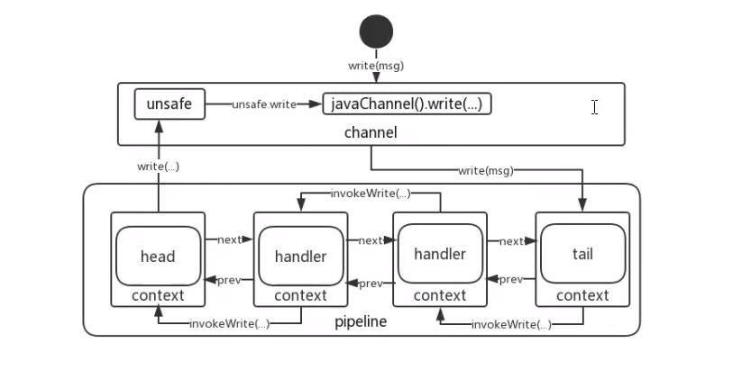

# Java编程方法论-Netty篇

## 01 - 02 netty 源码解读之源码框架思路

1. eventloop 是针对于 selector的，相当于eventloop => selector
2. 将NIO的操作类比到Netty中，可以更好的理解

2. ServerBootStrap 核心是 bind()
   1. 初始化Channel（对应NIO初始化SocketChannel的操作）

## 03 通过netty来解读future的玩法


## 06 - 07 从jdk函数式到netty的上下文设计编程实战解读

从 jdk11 的函数接口 `Function ` 说起，以默认的方法实现：`default <V> Function<V, R> compose(Function<? super V, ? extends T> before)` 和 `default <V> Function<T, V> andThen(Function<? super R, ? extends V> after)`为例，展开描述 ChannelHandlerContext 在 Reactor-Netty 中的优化点，重点在于上下文的信息传递，Reactor-Netty 以类似 `Function` 的做法，以函数式替换了 Netty 中 `ChannelHandlerContext(AbstractChannelHandlerContext)`的链表结构。

`ChannelHandlerContext`以链表的形式进行上下文衔接。

既然是链表结构，必然有`next`和`prev`，然后在展开讲 `ChannelPipeline` 与 `Channel`、`ChannelHandlerContext`和`ChannelHandler`之间是如何进行关联的。

自定义的`ChannelHandler`，在添加时，会同时生成对应的`ChannelHandlerContext`，

```java
# DefaultChannelPipeline#addLast0
private void addLast0(AbstractChannelHandlerContext newCtx) {
    AbstractChannelHandlerContext prev = tail.prev;
    newCtx.prev = prev;
    newCtx.next = tail;
    prev.next = newCtx;
    tail.prev = newCtx;
}
```

然后会被添加到`DefaultChannelPipeline`中，以链表的形式进行维护，每个独立的`DefaultChannelPipeline`各自维护着`HeadContext head`和`TailContext tail`。

以`ChannelInboundHandler#channelRead`为例， 对于接口`ChannelInboundHandler`的实现类，是从`head`开始，往下遍历，直至 call `TailContext#channelRead` 结束，自定义的接口`ChannelInboundHandler`的实现类，覆盖的`channelRead`方法，也会在遍历期间被 call。

以`ChannelOutboundHandler#channelActive`为例，对于接口`ChannelOutboundHandler`的实现类，是从`tail`开始，往上遍历，直至 call `HeadContext#channelActive`结束，自定义的接口`ChannelOutboundHandler`的实现类，覆盖的`channelActive`方法，也会在遍历期间被 call。

## 08 - 10 netty 对于 eventloop的设计实现思路的解读

从 接口`EventLoop`的设计出发，解读与`OrderedEventExecutor` 和 `EventLoopGroup` 之间的关系

`EventLoop`更注重事件，`EventExecutor` 是执行者，`EventLoopGroup`是管理者。

结合 `nio-example` 之前的NIO demo 去理解 `EventLoopGroup`

`MultithreadEventExecutorGroup#EventExecutorChooserFactory.EventExecutorChooser chooser` 可以类比  `nio-example` 中的 `Listener#getReader()`负载均衡算法。

`Listener` 中的 `Reader[] readers` 就可以看做是一个`EventExecutorGroup`

从`NioEventLoop` 扩展至 `SingleThreadEventLoop`，主要了解其中的任务队列。

`SingleThreadEventExecutor#execute()`

要能理解 `EventLoop` 和 `EventLoopGroup` 的 `next` 方法。

`EventLoop#next` 返回的是本身，目的是避免线程间切换。

`EventExecutorGroup#next`  分配 `EventLoop`

重点了解 `NioEventLoop`、`NioEventLoopGroup`、`SingleThreadEventExecutor`、`MultithreadEventLoopGroup`、`DefaultThreadFactory`

## 11 - 12 netty的Channel初始化到handler的执行进行综合总结

`Class.this.method()`：这种写法，起到强调语义的作用，（能一眼看出调用的是哪个方法）.

例如`SingleThreadEventExecutor.this.run()`，改变`run()`方法是实现接口`Runnable`的固有印象。

## 13 对netty中的bind与accept逻辑穿针引线

结合`nio-example`，对比Netty中是如何实现`bind`与`accept`之间的串连的。


## 14 - 16 Netty中channel的wirteAndFlush解读

pipleline中，消息的进出，都需要经过`DefaultChannelPipeline#HeadContext`，所以`HeadContext`需要实现接口`ChannelOutboundHandler`和`ChannelInboundHandler`。

`ChannelHandler`之间的连接处理，进行抽象，则形成`ChannelHandlerContext`，使`ChannelHandler`更专注于业务逻辑处理。

理解`ChannelPipeline`、`ChannelHandlerContext`和`ChannelHandler`这三者之间的关系。

从`wirte`和`wirteAndFlush`方法出发，理解wirte和wirteAndFlush的整个流程。



## 17 Reactor-Netty 与 Spring WebFlux 中对于channel的读写相关实现解读


## 18 executor.inEventLoop解读以及相关代码借鉴

Netty 中的executor.inEventLoop：

```java
public class FixedChannelPool extends SimpleChannelPool {
    ...
    private final EventExecutor executor;
    
    @Override
    public Future<Channel> acquire(final Promise<Channel> promise) {
        try {
            if (executor.inEventLoop()) {
                acquire0(promise);
            } else {
                executor.execute(new Runnable() {
                    @Override
                    public void run() {
                        acquire0(promise);
                    }
                });
            }
        } catch (Throwable cause) {
            promise.setFailure(cause);
        }
        return promise;
    }    
}


```

```java
# io.netty.util.concurrent.AbstractEventExecutor#inEventLoop
@Override
public boolean inEventLoop() {
    return inEventLoop(Thread.currentThread());
}
```

~~~java
# io.netty.util.concurrent.SingleThreadEventExecutor#inEventLoop
@Override
public boolean inEventLoop(Thread thread) {
    return thread == this.thread;
}
~~~

```java
public abstract class SingleThreadEventExecutor extends AbstractScheduledEventExecutor implements OrderedEventExecutor {
	....
	private volatile Thread thread;
	....
        
    @Override
    public void execute(Runnable task) {
        if (task == null) {
            throw new NullPointerException("task");
        }

        boolean inEventLoop = inEventLoop();
        addTask(task);
        if (!inEventLoop) {
            startThread();
            if (isShutdown() && removeTask(task)) {
                reject();
            }
        }

        if (!addTaskWakesUp && wakesUpForTask(task)) {
            wakeup(inEventLoop);
        }
    }

    private void startThread() {
        if (state == ST_NOT_STARTED) {
            if (STATE_UPDATER.compareAndSet(this, ST_NOT_STARTED, ST_STARTED)) {
                try {
                    doStartThread();
                } catch (Throwable cause) {
                    STATE_UPDATER.set(this, ST_NOT_STARTED);
                    PlatformDependent.throwException(cause);
                }
            }
        }
    }
    
    private void doStartThread() {
        assert thread == null;
        executor.execute(new Runnable() {
            @Override
            public void run() {
                // 这里进行thread的赋值
                thread = Thread.currentThread();
                if (interrupted) {
                    thread.interrupt();
                }

                boolean success = false;
                updateLastExecutionTime();
                try {
                    SingleThreadEventExecutor.this.run();
                    success = true;
                } catch (Throwable t) {
                    logger.warn("Unexpected exception from an event executor: ", t);
                } finally {
                    for (;;) {
                        int oldState = state;
                        if (oldState >= ST_SHUTTING_DOWN || STATE_UPDATER.compareAndSet(
                                SingleThreadEventExecutor.this, oldState, ST_SHUTTING_DOWN)) {
                            break;
                        }
                    }

                    // Check if confirmShutdown() was called at the end of the loop.
                    if (success && gracefulShutdownStartTime == 0) {
                        logger.error("Buggy " + EventExecutor.class.getSimpleName() + " implementation; " +
                                SingleThreadEventExecutor.class.getSimpleName() + ".confirmShutdown() must be called " +
                                "before run() implementation terminates.");
                    }

                    try {
                        // Run all remaining tasks and shutdown hooks.
                        for (;;) {
                            if (confirmShutdown()) {
                                break;
                            }
                        }
                    } finally {
                        try {
                            cleanup();
                        } finally {
                            STATE_UPDATER.set(SingleThreadEventExecutor.this, ST_TERMINATED);
                            threadLock.release();
                            if (!taskQueue.isEmpty()) {
                                logger.warn(
                                        "An event executor terminated with " +
                                                "non-empty task queue (" + taskQueue.size() + ')');
                            }

                            terminationFuture.setSuccess(null);
                        }
                    }
                }
            }
        });
    }    
    
}
```

Netty 中有许多地方都用到了`executor.inEventLoop`，其作用与`ReentrantLock.Sync.nonfairTryAcquire`方法中的`current == getExclusiveOwnerThread()`是一致的。

在JDK的`ReentrantLock.Sync.nonfairTryAcquire`中，如果执行器是当前线程的拥有者，则直接执行，否则就`return fasle`。

在Netty中，如果执行器是当前线程的拥有者，则执行，否则提交任务。

```java
#java.util.concurrent.locks.ReentrantLock.Sync#nonfairTryAcquire()
@ReservedStackAccess
final boolean nonfairTryAcquire(int acquires) {
    final Thread current = Thread.currentThread();
    int c = getState();
    if (c == 0) {
        if (compareAndSetState(0, acquires)) {
            setExclusiveOwnerThread(current);
            return true;
        }
    }
    else if (current == getExclusiveOwnerThread()) {
        int nextc = c + acquires;
        if (nextc < 0) // overflow
            throw new Error("Maximum lock count exceeded");
        setState(nextc);
        return true;
    }
    return false;
}
```

