# Spring Reactor 全新解读系列 2019-2020 全集 

## 01 响应式标准接口从无到有设计


## 02 响应式背压来源与设计及Flux的Create浅析

响应式的背压机制，可以类比为大坝，具有“蓄洪”的作用。

即可以理解为：“可以存储，元素有顺序” =》 队列，大坝有可能会决堤，所以这个队列是有界的，那么对应也有无界模式。

背压设计位置在上游，即Publisher处。

拿 reactor.core.publisher.FluxCreate 来举例

```java
final class FluxCreate<T> extends Flux<T> implements SourceProducer<T> {
	@Override
	public void subscribe(CoreSubscriber<? super T> actual) {
		BaseSink<T> sink = createSink(actual, backpressure);

		actual.onSubscribe(sink);
		try {
            // 1、
			source.accept(
					createMode == CreateMode.PUSH_PULL ? new SerializedSink<>(sink) :
							sink);
		}
		catch (Throwable ex) {
			Exceptions.throwIfFatal(ex);
			sink.error(Operators.onOperatorError(ex, actual.currentContext()));
		}
	}
}    
```

可以拿饭馆的场景进行类比，饭馆厨师是Publisher，顾客是Subscriber，那么顾客点的单则是Subscription（单纯只是类比），拿以上代码来看的话，BaseSink 是Subscription，另一方面也充当着服务员的职责，负责上菜。

步骤1，则可以看做是厨师做饭的过程，SerializedSink 则可以看成是服务员plus。

reactor.core.publisher.FluxCreate.SerializedSink：

```java
	static final class SerializedSink<T> implements FluxSink<T>, Scannable {
		final BaseSink<T> sink;
        ...
		@Override
		public FluxSink<T> next(T t) {
			Objects.requireNonNull(t, "t is null in sink.next(t)");
			if (sink.isTerminated() || done) {
				Operators.onNextDropped(t, sink.currentContext());
				return this;
			}
			if (WIP.get(this) == 0 && WIP.compareAndSet(this, 0, 1)) {
				try {
					sink.next(t);
				}
				catch (Throwable ex) {
					Operators.onOperatorError(sink, ex, t, sink.currentContext());
				}
				if (WIP.decrementAndGet(this) == 0) {
					return this;
				}
			}
			else {
				this.mpscQueue.offer(t);
				if (WIP.getAndIncrement(this) != 0) {
					return this;
				}
			}
			drainLoop();
			return this;
		}

		void drainLoop() {
			Context ctx = sink.currentContext();
			BaseSink<T> e = sink;
			Queue<T> q = mpscQueue;
			for (; ; ) {

				for (; ; ) {
					if (e.isCancelled()) {
						Operators.onDiscardQueueWithClear(q, ctx, null);
						if (WIP.decrementAndGet(this) == 0) {
							return;
						}
						else {
							continue;
						}
					}

					if (ERROR.get(this) != null) {
						Operators.onDiscardQueueWithClear(q, ctx, null);
						//noinspection ConstantConditions
						e.error(Exceptions.terminate(ERROR, this));
						return;
					}

					boolean d = done;
					T v = q.poll();

					boolean empty = v == null;

					if (d && empty) {
						e.complete();
						return;
					}

					if (empty) {
						break;
					}

					try {
                        // 对接到BaseSink
						e.next(v);
					}
					catch (Throwable ex) {
						Operators.onOperatorError(sink, ex, v, sink.currentContext());
					}
				}

				if (WIP.decrementAndGet(this) == 0) {
					break;
				}
			}
		}        
    }
```

以 reactor.core.publisher.FluxCreate.BufferAsyncSink 为例：

```java
	static final class BufferAsyncSink<T> extends BaseSink<T> {
		// 背压机制的容器
        final Queue<T> queue;
   		....
		@Override
		public FluxSink<T> next(T t) {
			queue.offer(t);
			drain();
			return this;
		}        
		//impl note: don't use isTerminated() in the drain loop,
		//it needs to first check the `done` status before setting `disposable` to TERMINATED
		//otherwise it would either loose the ability to drain or the ability to invoke the
		//handler at the right time.
		void drain() {
			if (WIP.getAndIncrement(this) != 0) {
				return;
			}

			final Subscriber<? super T> a = actual;
			final Queue<T> q = queue;

			for (; ; ) {
				long r = requested;
				long e = 0L;

				while (e != r) {
					if (isCancelled()) {
						Operators.onDiscardQueueWithClear(q, ctx, null);
						if (WIP.decrementAndGet(this) != 0) {
							continue;
						}
						else {
							return;
						}
					}

					boolean d = done;

					T o = q.poll();

					boolean empty = o == null;

					if (d && empty) {
						Throwable ex = error;
						if (ex != null) {
							super.error(ex);
						}
						else {
							super.complete();
						}
						return;
					}

					if (empty) {
						break;
					}
					// 连接到了下游 Subscriber.onNext
					a.onNext(o);

					e++;
				}

				if (e == r) {
					if (isCancelled()) {
						Operators.onDiscardQueueWithClear(q, ctx, null);
						if (WIP.decrementAndGet(this) != 0) {
							continue;
						}
						else {
							return;
						}
					}

					boolean d = done;

					boolean empty = q.isEmpty();

					if (d && empty) {
						Throwable ex = error;
						if (ex != null) {
							super.error(ex);
						}
						else {
							super.complete();
						}
						return;
					}
				}

				if (e != 0) {
					Operators.produced(REQUESTED, this, e);
				}

				if (WIP.decrementAndGet(this) == 0) {
					break;
				}
			}
		}
	}
```

## 03 函数编程的入门与思维方式


## 04 - 06 Reactor中前后一体化套路实现演进

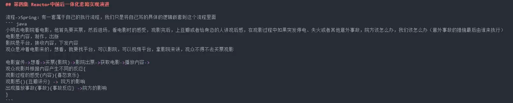

- 电影类比 Publisher
- 观众类比 Subscriber
- 影院类比 Subscription
- 影院工作人员类比 Sink

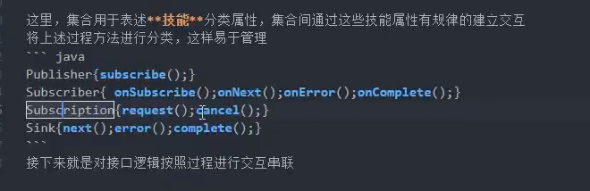

通过反射去调用方法与new 对象后在调用方法的区别

- new 会分配内存
- JVM加载class字节文件后，会在每个对应的class字节文件的内存中维护一个方法表，通过反射，根据XXX.class，即可直接从方法表中获取方法，无需分配内存。


比较契合以上套路实现演进的类：reactor.core.publisher.FluxArray

```java
final class FluxArray<T> extends Flux<T> implements Fuseable, SourceProducer<T> {
	// 类比电影
    final T[] array;
    ....
	@SuppressWarnings("unchecked")
	public static <T> void subscribe(CoreSubscriber<? super T> s, T[] array) {
		if (array.length == 0) {
			Operators.complete(s);
			return;
		}
		if (s instanceof ConditionalSubscriber) {
			s.onSubscribe(new ArrayConditionalSubscription<>((ConditionalSubscriber<? super T>) s, array));
		}
		else {
            // 类比顾客前往影院
			s.onSubscribe(new ArraySubscription<>(s, array));
		}
	}

	@Override
	public void subscribe(CoreSubscriber<? super T> actual) {
		subscribe(actual, array);
	}        
}
```

reactor.core.publisher.LambdaMonoSubscriber

```java
final class LambdaMonoSubscriber<T> implements InnerConsumer<T>, Disposable {
	@Override
	public final void onSubscribe(Subscription s) {
		if (Operators.validate(subscription, s)) {
			this.subscription = s;

			if (subscriptionConsumer != null) {
				try {
                    // 类比挑选影院
					subscriptionConsumer.accept(s);
				}
				catch (Throwable t) {
					Exceptions.throwIfFatal(t);
					s.cancel();
					onError(t);
				}
			}
			else {
                // 类比电影院出票
				s.request(Long.MAX_VALUE);
			}

		}
	}    
}
```

reactor.core.publisher.FluxArray.ArraySubscription：

```java
	static final class ArraySubscription<T>
			implements InnerProducer<T>, SynchronousSubscription<T> {
		@Override
		public void request(long n) {
            // 类比出票逻辑
			if (Operators.validate(n)) {
				if (Operators.addCap(REQUESTED, this, n) == 0) {
					if (n == Long.MAX_VALUE) {
						fastPath();
					}
					else {
						slowPath(n);
					}
				}
			}
		}	
    }
```


## 07 设计模式相关理解

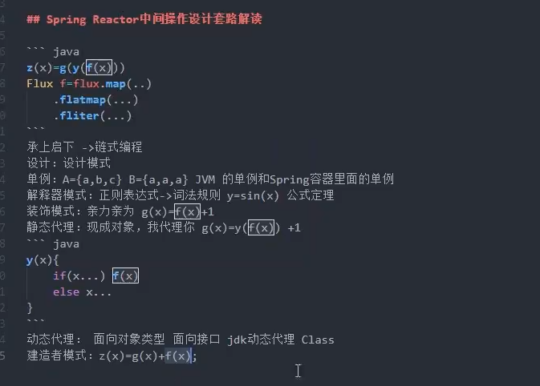


## 08 Spring Reactor 中间操作设计套路解读

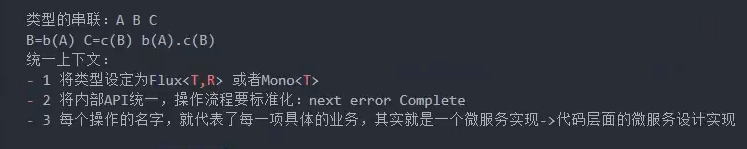

套娃设计

```java
Flux f = flux.map(...)
			 .flatmap(...)
			 .fliter(...)
```

详细设计参考：reactor.core.publisher.InternalFluxOperator

搞懂上述代码的套娃设计是怎么实现的


## 10 链式编程 + 设计模式编程

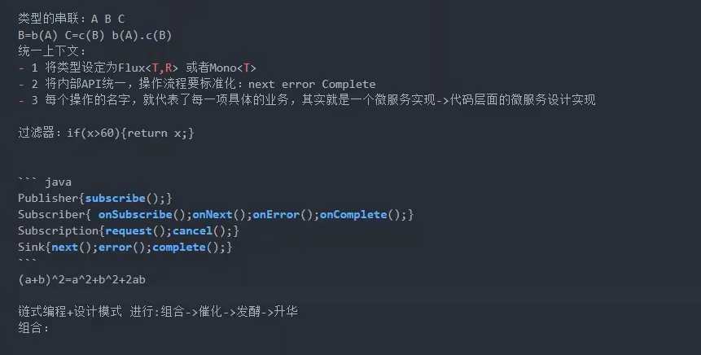


## 11 响应式编程过程逻辑调用梳理总结

Publisher => 工厂

Subscriber => 消费者

Subscription => 产品（可能没有十分准确）

Sink => 经销商

工厂直接对接消费者：Subscriber.onNext()

工厂对接经销商，经销商对接消费者：Sink.next()

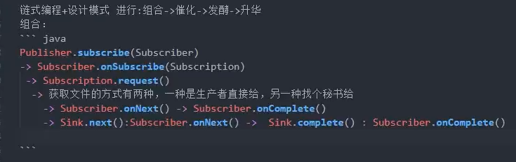

## 12 数理思维结合场景设计实现 Flux.Create

工厂直接对接消费者：

```java
g(x){
    ...
    subscriber.onNext();
    ...
    subscriber.onComplete();    
    ...    
}
```

简单案例：

```java
public abstract class Flux<T> implements CorePublisher<T> {
	public static <T> Flux<T> just(T data) {
		return onAssembly(new FluxJust<>(data));
	}    
}

final class FluxJust<T> extends Flux<T>
		implements Fuseable.ScalarCallable<T>, Fuseable,
		           SourceProducer<T> {
	final T value;

	FluxJust(T value) {
		this.value = Objects.requireNonNull(value, "value");
	}

	@Override
	public void subscribe(final CoreSubscriber<? super T> actual) {
		actual.onSubscribe(new WeakScalarSubscription<>(value, actual));
	}

	static final class WeakScalarSubscription<T> implements QueueSubscription<T>,
	                                                        InnerProducer<T>{
		boolean terminado;
		final T                     value;
		final CoreSubscriber<? super T> actual;

		WeakScalarSubscription(@Nullable T value, CoreSubscriber<? super T> actual) {
			this.value = value;
			this.actual = actual;
		}

		@Override
		public void request(long elements) {
			if (terminado) {
				return;
			}

			terminado = true;
			if (value != null) {
                // Subscriber.onNext
				actual.onNext(value);
			}
			actual.onComplete();
		}                                                                
    }
}

```

复杂案例：reactor.core.publisher.FluxArray

```java
public abstract class Flux<T> implements CorePublisher<T> {
	public static <T> Flux<T> fromArray(T[] array) {
		if (array.length == 0) {
			return empty();
		}
		if (array.length == 1) {
			return just(array[0]);
		}
		return onAssembly(new FluxArray<>(array));
	} 
}

final class FluxArray<T> extends Flux<T> implements Fuseable, SourceProducer<T> {

	final T[] array;

	@SafeVarargs
	public FluxArray(T... array) {
		this.array = Objects.requireNonNull(array, "array");
	}

	@SuppressWarnings("unchecked")
	public static <T> void subscribe(CoreSubscriber<? super T> s, T[] array) {
		...
		if (s instanceof ConditionalSubscriber) {
			s.onSubscribe(new ArrayConditionalSubscription<>((ConditionalSubscriber<? super T>) s, array));
		}
		else {
			s.onSubscribe(new ArraySubscription<>(s, array));
		}
	}

	static final class ArrayConditionalSubscription<T>
			implements InnerProducer<T>, SynchronousSubscription<T> {
		final ConditionalSubscriber<? super T> actual;

		final T[] array;

		int index;

		ArrayConditionalSubscription(ConditionalSubscriber<? super T> actual, T[] array) {
			this.actual = actual;
			this.array = array;
		}

		@Override
		public CoreSubscriber<? super T> actual() {
			return actual;
		}

		@Override
		public void request(long n) {
			if (Operators.validate(n)) {
				if (Operators.addCap(REQUESTED, this, n) == 0) {
					if (n == Long.MAX_VALUE) {
						fastPath();
					}
					else {
						slowPath(n);
					}
				}
			}
		}
        
		void slowPath(long n) {
			final T[] a = array;
			final int len = a.length;
			final ConditionalSubscriber<? super T> s = actual;

			int i = index;
			int e = 0;

			for (; ; ) {
				...
				while (i != len && e != n) {
					T t = a[i];
					...
					// Subscriber.onNext
					boolean b = s.tryOnNext(t);
					...
				}

				if (i == len) {
					s.onComplete();
					return;
				}
				...
			}
		}
        
		void fastPath() {
			final T[] a = array;
			final int len = a.length;
			final Subscriber<? super T> s = actual;

			for (int i = index; i != len; i++) {
				...
				// Subscriber.onNext
				s.onNext(t);
			}
			...
			s.onComplete();
		}    
    }    
}
```

工厂 =》 经销商 =》 消费者：

什么时候使用Sink？或者说为什么会有Sink出现？

因为不同消费者对产品的需求是不一样的。比如个体消费者和企业（集体）消费者，个体对产品的需求数量较少，消费频率较低，由此我们可以发现，不同的消费者，需要有不同的应对策略，而这个应对策略就放在经销商上。

那么工厂就不需要根据消费者具体需求进行定制化了，实现解耦。消费者与经销商进行绑定，各自实现自己的需求（比如个人消费者到商店买到商品，企业消费者到批发经销商处购买商品）

```
g(x){
	...
	sink.next(x){
		... // 控制策略，控制下发速度，数量等等
		Subscriber.onNext()	
	}
	...
	sink.complete(x){
		...
		Subscriber.onComplete()
	}
}
g(x) = g(f(x))
f(x) => Sink
x => Subscriber
```

实际案例：

```java
public abstract class Flux<T> implements CorePublisher<T> {
    
    public static <T> Flux<T> create(Consumer<? super FluxSink<T>> emitter) {
	    return create(emitter, OverflowStrategy.BUFFER);
    }	
    
    public static <T> Flux<T> create(Consumer<? super FluxSink<T>> emitter, OverflowStrategy backpressure) {
		return onAssembly(new FluxCreate<>(emitter, backpressure, FluxCreate.CreateMode.PUSH_PULL));
	}
}

final class FluxCreate<T> extends Flux<T> implements SourceProducer<T> {
    
	@Override
	public void subscribe(CoreSubscriber<? super T> actual) {
		BaseSink<T> sink = createSink(actual, backpressure);

		actual.onSubscribe(sink);
		try {
			source.accept(
                	// SerializedSink 防止不同线程间对数组的并发操作（CAS）
					createMode == CreateMode.PUSH_PULL ? new SerializedSink<>(sink) :
							sink);
		}
		catch (Throwable ex) {
			Exceptions.throwIfFatal(ex);
			sink.error(Operators.onOperatorError(ex, actual.currentContext()));
		}
	}
}
```


## 13 Spring Reactor可以带给我们什么？

统一API设计，实现各种语言的大一统，类似抽象语法树AST。

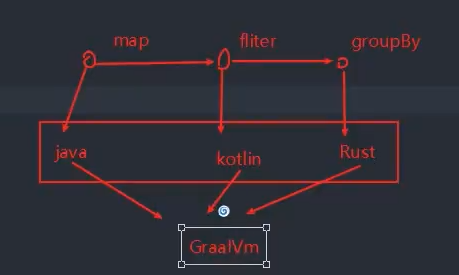


## 14 RxJava 与 Reactor 中 create 设计上的区别与总结


## 15 - 16 Spring Reactor 中间操作思路推导实现

中间操作的设计思路图：

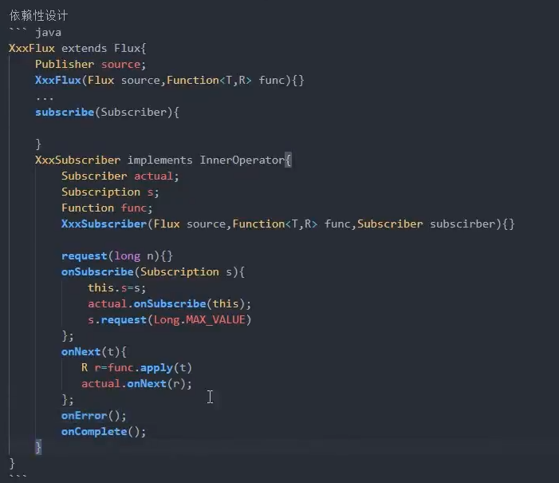


中间操作实例类：

reactor.core.publisher.Operators.MonoSubscriber

```java
public abstract class Operators {
	public static class MonoSubscriber<I, O>
			implements InnerOperator<I, O>,
			           Fuseable, //for constants only
			           QueueSubscription<O> {
    	...                   
    }       
}

interface InnerOperator<I, O>
		extends InnerConsumer<I>, InnerProducer<O> {
	@Override
	default Context currentContext() {
		return actual().currentContext();
	}
}

interface InnerConsumer<I>
		extends CoreSubscriber<I>, Scannable {
}

interface InnerProducer<O>
		extends Scannable, Subscription {
}
```

reactor.core.publisher.MonoCount

```java
final class MonoCount<T> extends MonoFromFluxOperator<T, Long> implements Fuseable {
	static final class CountSubscriber<T> extends Operators.MonoSubscriber<T, Long> {
		long counter;

		Subscription s;

		CountSubscriber(CoreSubscriber<? super Long> actual) {
			super(actual);
		}    	
    }
}
```


中间操作示意图：

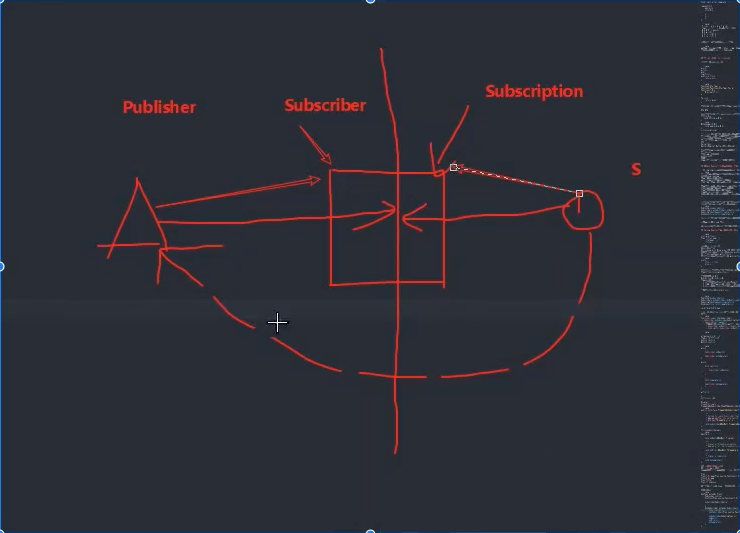

上中下游之间的转换：

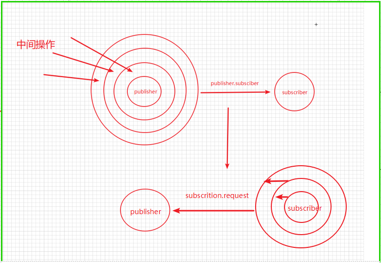

以reactor.core.publisher.Flux#map 为例：

```java
Flux.fromArray(xxx)
    .map(Function<? super T, ? extends V> mapper)
    .filter(Predicate<? super T> p)
    .sbuscriber(CoreSubscriber<? super T> actual)
```

Flux.fromArray(xxx).map(xxx).filter(xxx) 相当于上图层层封装的publisher

```java
public abstract class Flux<T> implements CorePublisher<T> {
	public final <V> Flux<V> map(Function<? super T, ? extends V> mapper) {
		if (this instanceof Fuseable) {
			return onAssembly(new FluxMapFuseable<>(this, mapper));
		}
		return onAssembly(new FluxMap<>(this, mapper));
	}
    
	@Override
	@SuppressWarnings("unchecked")
	public final void subscribe(Subscriber<? super T> actual) {
		CorePublisher publisher = Operators.onLastAssembly(this);
		CoreSubscriber subscriber = Operators.toCoreSubscriber(actual);

		try {
            // 如果是中间操作类
			if (publisher instanceof OptimizableOperator) {
				OptimizableOperator operator = (OptimizableOperator) publisher;
				while (true) {
                    // 层层封装最下游的subscriber，相当于上图层层封装的subscriber
					subscriber = operator.subscribeOrReturn(subscriber);
					if (subscriber == null) {
						// null means "I will subscribe myself", returning...
						return;
					}
					OptimizableOperator newSource = operator.nextOptimizableSource();
					if (newSource == null) {
						publisher = operator.source();
						break;
					}
					operator = newSource;
				}
			}
			publisher.subscribe(subscriber);
		}
		catch (Throwable e) {
			Operators.reportThrowInSubscribe(subscriber, e);
			return;
		}
	}    
}

final class FluxArray<T> extends Flux<T> implements Fuseable, SourceProducer<T> {
	@SuppressWarnings("unchecked")
	public static <T> void subscribe(CoreSubscriber<? super T> s, T[] array) {
		if (array.length == 0) {
			Operators.complete(s);
			return;
		}
        
		if (s instanceof ConditionalSubscriber) {
			s.onSubscribe(new ArrayConditionalSubscription<>((ConditionalSubscriber<? super T>) s, array));
		}
		else {
			s.onSubscribe(new ArraySubscription<>(s, array));
		}
	}

	static final class ArrayConditionalSubscription<T>
			implements InnerProducer<T>, SynchronousSubscription<T> {
		@Override
		public void request(long n) {
			if (Operators.validate(n)) {
				if (Operators.addCap(REQUESTED, this, n) == 0) {
					if (n == Long.MAX_VALUE) {
						fastPath();
					}
					else {
						slowPath(n);
					}
				}
			}
		}    	
    }
}


final class FluxMap<T, R> extends InternalFluxOperator<T, R> {
	final Function<? super T, ? extends R> mapper;

	/**
	 * Constructs a FluxMap instance with the given source and mapper.
	 *
	 * @param source the source Publisher instance
	 * @param mapper the mapper function
	 *
	 * @throws NullPointerException if either {@code source} or {@code mapper} is null.
	 */
	FluxMap(Flux<? extends T> source,
			Function<? super T, ? extends R> mapper) {
		super(source);
		this.mapper = Objects.requireNonNull(mapper, "mapper");
	}

	@Override
	@SuppressWarnings("unchecked")
	public CoreSubscriber<? super T> subscribeOrReturn(CoreSubscriber<? super R> actual) {
		if (actual instanceof Fuseable.ConditionalSubscriber) {
			Fuseable.ConditionalSubscriber<? super R> cs =
					(Fuseable.ConditionalSubscriber<? super R>) actual;
			return new MapConditionalSubscriber<>(cs, mapper);
		}
		return new MapSubscriber<>(actual, mapper);
	}
    
	static final class MapSubscriber<T, R>
			implements InnerOperator<T, R> {
        
		final CoreSubscriber<? super R>        actual;
		final Function<? super T, ? extends R> mapper;

		Subscription s;        
        
		@Override
		public void onSubscribe(Subscription s) {
			if (Operators.validate(this.s, s)) {
				this.s = s;

				actual.onSubscribe(this);
			}
		}
        
		@Override
		public void request(long n) {
			s.request(n);
		}        
    }
}

abstract class InternalFluxOperator<I, O> extends FluxOperator<I, O> implements Scannable,
                                                                                OptimizableOperator<O, I> {
	@Nullable
	final OptimizableOperator<?, I> optimizableOperator;

	/**
	 * Build a {@link InternalFluxOperator} wrapper around the passed parent {@link Publisher}
	 *
	 * @param source the {@link Publisher} to decorate
	 */
	protected InternalFluxOperator(Flux<? extends I> source) {
		super(source);
		if (source instanceof OptimizableOperator) {
			@SuppressWarnings("unchecked")
			OptimizableOperator<?, I> optimSource = (OptimizableOperator<?, I>) source;
			this.optimizableOperator = optimSource;
		}
		else {
			this.optimizableOperator = null;
		}
	}

	@Override
	@SuppressWarnings("unchecked")
	public final void subscribe(CoreSubscriber<? super O> subscriber) {
		OptimizableOperator operator = this;
		try {
			while (true) {
				subscriber = operator.subscribeOrReturn(subscriber);
				if (subscriber == null) {
					// null means "I will subscribe myself", returning...
					return;
				}
				OptimizableOperator newSource = operator.nextOptimizableSource();
				if (newSource == null) {
					operator.source().subscribe(subscriber);
					return;
				}
				operator = newSource;
			}
		}
		catch (Throwable e) {
			Operators.reportThrowInSubscribe(subscriber, e);
			return;
		}
	}                                                                                    
}
```


## 17 Spring Reactor 业务逻辑上中游一体化的最后一步 - 大融合

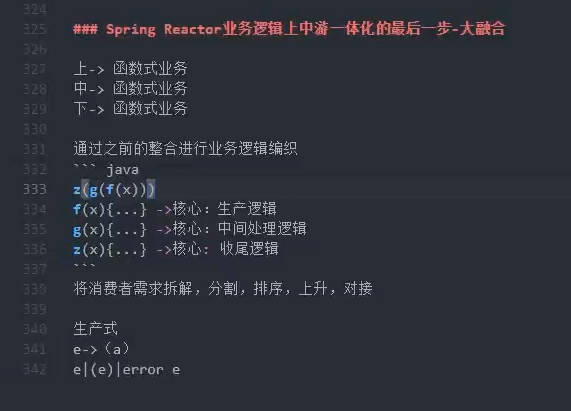


## 18 结合Reactor-Netty 与 Spring WebFlux来讲述函数式SPI设计的理念

从`reactor.netty.http.server.HttpServer#handle`出发，讲解函数式SPI的设计理念：

```java
public final HttpServer handle(BiFunction<? super HttpServerRequest, ? super
		HttpServerResponse, ? extends Publisher<Void>> handler) {
	return new HttpServerHandle(this, handler);
}
```

```java
final class HttpServerHandle extends HttpServerOperator implements ConnectionObserver,
                                                                   Function<ServerBootstrap, ServerBootstrap> {
	// 这个接受 org.springframework.http.server.reactive.ReactorHttpHandlerAdapter
	final BiFunction<? super HttpServerRequest, ? super
			HttpServerResponse, ? extends Publisher<Void>> handler;

	HttpServerHandle(HttpServer server,
			BiFunction<? super HttpServerRequest, ? super
					HttpServerResponse, ? extends Publisher<Void>> handler) {
		super(server);
		this.handler = Objects.requireNonNull(handler, "handler");
	}

	@Override
	@SuppressWarnings("FutureReturnValueIgnored")
	public void onStateChange(Connection connection, State newState) {
		if (newState == HttpServerState.REQUEST_RECEIVED) {
			try {
				if (log.isDebugEnabled()) {
					log.debug(format(connection.channel(), "Handler is being applied: {}"), handler);
				}
				HttpServerOperations ops = (HttpServerOperations) connection;
                // handler.apply(ops, ops) => handler.apply(HttpServerRequest, HttpServerResponse)
				Mono.fromDirect(handler.apply(ops, ops))
				    .subscribe(ops.disposeSubscriber());
			}
			catch (Throwable t) {
				log.error(format(connection.channel(), ""), t);
				//"FutureReturnValueIgnored" this is deliberate
				connection.channel()
				          .close();
			}
		}
	}                                                                       
}

class HttpServerOperations extends HttpOperations<HttpServerRequest, HttpServerResponse>
		implements HttpServerRequest, HttpServerResponse {
	final HttpResponse nettyResponse;
	final HttpHeaders  responseHeaders;
	final Cookies     cookieHolder;
	final HttpRequest nettyRequest;
	final String path;
	final ConnectionInfo connectionInfo;
	final ServerCookieEncoder cookieEncoder;
	final ServerCookieDecoder cookieDecoder;
    ...
}
```


Reactor-Netty 与 Spring WebFlux 的Handler对接，一般来说对接，要么就是Spring向下适配，要么就是Reactor-Netty向上适配，所以要有一个适配类：

`org.springframework.http.server.reactive.ReactorHttpHandlerAdapter`

```java
import reactor.netty.http.server.HttpServerRequest;
import reactor.netty.http.server.HttpServerResponse;
public class ReactorHttpHandlerAdapter implements BiFunction<HttpServerRequest, HttpServerResponse, Mono<Void>> {
	private final HttpHandler httpHandler;
    
	@Override
	public Mono<Void> apply(HttpServerRequest reactorRequest, HttpServerResponse reactorResponse) {
		NettyDataBufferFactory bufferFactory = new NettyDataBufferFactory(reactorResponse.alloc());
		try {
            // 封装Reactor-Netty的HttpServerRequest和HttpServerResponse
			ReactorServerHttpRequest request = new ReactorServerHttpRequest(reactorRequest, bufferFactory);
			ServerHttpResponse response = new ReactorServerHttpResponse(reactorResponse, bufferFactory);

			if (request.getMethod() == HttpMethod.HEAD) {
				response = new HttpHeadResponseDecorator(response);
			}
			// 这里就与Spring的HttpHandle关联起来了
			return this.httpHandler.handle(request, response)
					.doOnError(ex -> logger.trace(request.getLogPrefix() + "Failed to complete: " + ex.getMessage()))
					.doOnSuccess(aVoid -> logger.trace(request.getLogPrefix() + "Handling completed"));
		}
		catch (URISyntaxException ex) {
			if (logger.isDebugEnabled()) {
				logger.debug("Failed to get request URI: " + ex.getMessage());
			}
			reactorResponse.status(HttpResponseStatus.BAD_REQUEST);
			return Mono.empty();
		}
	}    
}
```

如代码所示：ReactorHttpHandlerAdapter 实现了 ` BiFunction<HttpServerRequest, HttpServerResponse, Mono<Void>>`，相当于“内胜”。


## 19 - 20 AtomicXxxFieldUpdate 的技法应用（见JUC系列）