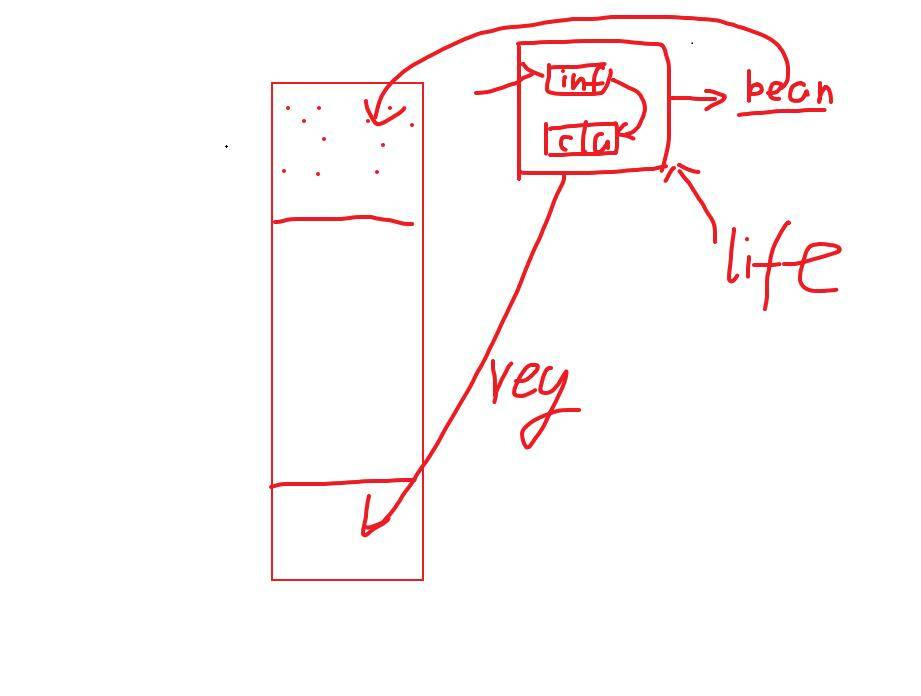

# Java编程方法论系列——Spring Framework 5.2 源码解读

## Spring 源码解读的前置知识

### 什么是元数据？

配置就是元数据，具体的件，就是实例bean，是配置清单。

## 01 - 02 Spring 基础框架的设计引入 



由图可以推导出 `org.springframework.context.ApplicationContext`应具有 `getBean` 以及 `registerBean` 的能力

以及可以推导出 `org.springframework.beans.factory.config.BeanDefinition`

Bean 的创建，可以推导出 `BeanFactory`，用于管理Bean

Bean 的初始化，先获取 `BeanDefinition`，然后注册`BeanDefinition`（通过`BeanFactory`），紧接着 refresh。

ps：`BeanFactory` 不是特指接口 `BeanFactory`。

ApplicationContext 中有关 bean 的操作，都是通过委派（委托） BeanFactory 来实现的。

org.springframework.context.support.GenericApplicationContext#refreshBeanFactory

```java
public class GenericApplicationContext extends AbstractApplicationContext implements BeanDefinitionRegistry {
	/**
	 * Do nothing: We hold a single internal BeanFactory and rely on callers
	 * to register beans through our public methods (or the BeanFactory's).
	 * @see #registerBeanDefinition
	 */
	@Override
	protected final void refreshBeanFactory() throws IllegalStateException {
		if (!this.refreshed.compareAndSet(false, true)) {
			throw new IllegalStateException(
					"GenericApplicationContext does not support multiple refresh attempts: just call 'refresh' once");
		}
		this.beanFactory.setSerializationId(getId());
	}
}
```


获取 `BeanDefinition`，通过`BeanDefinitionReader`

- 注解形式的通过`org.springframework.context.annotation.ConfigurationClassBeanDefinitionReader`

- xml：`org.springframework.beans.factory.xml.XmlBeanDefinitionReader`
- Groovy：`org.springframework.beans.factory.groovy.GroovyBeanDefinitionReader`


org.springframework.context.support.AbstractApplicationContext#refresh

```java
@Override
public void refresh() throws BeansException, IllegalStateException {
	synchronized (this.startupShutdownMonitor) {
		// Prepare this context for refreshing.
		prepareRefresh();
		// Tell the subclass to refresh the internal bean factory.
		ConfigurableListableBeanFactory beanFactory = obtainFreshBeanFactory();
		// Prepare the bean factory for use in this context.
		prepareBeanFactory(beanFactory);
		try {
			// Allows post-processing of the bean factory in context subclasses
			postProcessBeanFactory(beanFactory);
			// Invoke factory processors registered as beans in the context.
			invokeBeanFactoryPostProcessors(beanFactory);
			// Register bean processors that intercept bean creation.
			registerBeanPostProcessors(beanFactory);
			// Initialize message source for this context.
			initMessageSource();
			// Initialize event multicaster for this context.
			initApplicationEventMulticaster();
			// Initialize other special beans in specific context subclasses.
			onRefresh();
			// Check for listener beans and register them.
			registerListeners();
			// Instantiate all remaining (non-lazy-init) singletons.
			finishBeanFactoryInitialization(beanFactory);
			// Last step: publish corresponding event.
			finishRefresh();
		}
		catch (BeansException ex) {
			if (logger.isWarnEnabled()) {
				logger.warn("Exception encountered during context initializatio
						"cancelling refresh attempt: " + ex);
			}
			// Destroy already created singletons to avoid dangling resources.
			destroyBeans();
			// Reset 'active' flag.
			cancelRefresh(ex);
			// Propagate exception to caller.
			throw ex;
		}
		finally {
			// Reset common introspection caches in Spring's core, since we
			// might not ever need metadata for singleton beans anymore...
			resetCommonCaches();
		}
	}
}
```


## 03 - 05 生命周期下的BeanDefinition的注册过程梳理

生命周期下，BeanDefinition 是如何注册的？

SpringApplicaion.run => 获取 context => 获取 config（06 - 09 ）  =>  context.refresh（核心） =>  prepareRefresh() => obtainFreshBeanFactory() => prepareBeanFactory(beanFactory) => postProcessBeanFactory(beanFactory) => invokeBeanFactoryPostProcessors(beanFactory){ parse =>  selector  => reader}

SpringApplicaion.run => org.springframework.boot.SpringApplication#run(java.lang.String...)

```java
/**
 * Run the Spring application, creating and refreshing a new
 * {@link ApplicationContext}.
 * @param args the application arguments (usually passed from a Java main method)
 * @return a running {@link ApplicationContext}
 */
public ConfigurableApplicationContext run(String... args) {
	...
		context = createApplicationContext();
		exceptionReporters = getSpringFactoriesInstances(SpringBootExceptionReporter.class,
				new Class[] { ConfigurableApplicationContext.class }, context);
		prepareContext(context, environment, listeners, applicationArguments, printedBanner);
		refreshContext(context);
		afterRefresh(context, applicationArguments);
		stopWatch.stop();
		if (this.logStartupInfo) {
			new StartupInfoLogger(this.mainApplicationClass).logStarted(getApplicationLog(), stopWatch);
		}
		listeners.started(context);
		callRunners(context, applicationArguments);
	...
}


/**
 * Strategy method used to create the {@link ApplicationContext}. By default this
 * method will respect any explicitly set application context or application context
 * class before falling back to a suitable default.
 * @return the application context (not yet refreshed)
 * @see #setApplicationContextClass(Class)
 */
protected ConfigurableApplicationContext createApplicationContext() {
	Class<?> contextClass = this.applicationContextClass;
	if (contextClass == null) {
		try {
			switch (this.webApplicationType) {
			case SERVLET:
				contextClass = Class.forName(DEFAULT_SERVLET_WEB_CONTEXT_CLASS);
				break;
			case REACTIVE:
				contextClass = Class.forName(DEFAULT_REACTIVE_WEB_CONTEXT_CLASS);
				break;
			default:
				contextClass = Class.forName(DEFAULT_CONTEXT_CLASS);
			}
		}
		catch (ClassNotFoundException ex) {
			throw new IllegalStateException(
					"Unable create a default ApplicationContext, please specify an ApplicationContextClass", ex
		}
	}
	return (ConfigurableApplicationContext) BeanUtils.instantiateClass(contextClass);
}

private void refreshContext(ConfigurableApplicationContext context) {
	refresh(context);
	if (this.registerShutdownHook) {
		try {
			context.registerShutdownHook();
		}
		catch (AccessControlException ex) {
			// Not allowed in some environments.
		}
	}
}
                
/**
 * Refresh the underlying {@link ApplicationContext}.
 * @param applicationContext the application context to refresh
 */
protected void refresh(ApplicationContext applicationContext) {
	Assert.isInstanceOf(AbstractApplicationContext.class, applicationContext);
	((AbstractApplicationContext) applicationContext).refresh();
}                
```

**invokeBeanFactoryPostProcessors(beanFactory){ parse =>  selector  => reader}**

主要以 `@EnableAutoConfiguration` 为目标去讲，springboot如何实现自动化配置，即如何加载 @Configuration 下的 @Bean，将其解析为 BeanDefinition，并注册

org.springframework.context.support.PostProcessorRegistrationDelegate#invokeBeanFactoryPostProcessors(ConfigurableListableBeanFactory beanFactory, List<BeanFactoryPostProcessor> beanFactoryPostProcessors)

org.springframework.context.support.PostProcessorRegistrationDelegate#invokeBeanFactoryPostProcessors(org.springframework.beans.factory.config.ConfigurableListableBeanFactory, java.util.List<org.springframework.beans.factory.config.BeanFactoryPostProcessor>)


org.springframework.context.annotation.ConfigurationClassPostProcessor#postProcessBeanDefinitionRegistry

org.springframework.context.annotation.ConfigurationClassPostProcessor#postProcessBeanFactory

org.springframework.context.annotation.ConfigurationClassPostProcessor#processConfigBeanDefinitions

- parser（以ConfigurationClassParser为例子）

  - org.springframework.context.annotation.ConfigurationClassParser#processConfigurationClass

    - ```java
      	/**
        	 * Apply processing and build a complete {@link ConfigurationClass} by reading the
        	 * annotations, members and methods from the source class. This method can be called
        	 * multiple times as relevant sources are discovered.
        	 * @param configClass the configuration class being build
        	 * @param sourceClass a source class
        	 * @return the superclass, or {@code null} if none found or previously processed
        	 */
        	@Nullable
        	protected final SourceClass doProcessConfigurationClass(ConfigurationClass configClass, SourceClass sourceClass)
        			throws IOException {
        		...
        
        		// Process any @Import annotations
        		processImports(configClass, sourceClass, getImports(sourceClass), true);
        
        		// Process any @ImportResource annotations
        		AnnotationAttributes importResource =
        				AnnotationConfigUtils.attributesFor(sourceClass.getMetadata(), ImportResource.class);
        		if (importResource != null) {
        			String[] resources = importResource.getStringArray("locations");
        			Class<? extends BeanDefinitionReader> readerClass = importResource.getClass("reader");
        			for (String resource : resources) {
        				String resolvedResource = this.environment.resolveRequiredPlaceholders(resource);
        				configClass.addImportedResource(resolvedResource, readerClass);
        			}
        		}
        
        		// Process individual @Bean methods
        		Set<MethodMetadata> beanMethods = retrieveBeanMethodMetadata(sourceClass);
        		for (MethodMetadata methodMetadata : beanMethods) {
        			configClass.addBeanMethod(new BeanMethod(methodMetadata, configClass));
        		}
        
        		// Process default methods on interfaces
        		processInterfaces(configClass, sourceClass);
        
        		// Process superclass, if any
        		if (sourceClass.getMetadata().hasSuperClass()) {
        			String superclass = sourceClass.getMetadata().getSuperClassName();
        			if (superclass != null && !superclass.startsWith("java") &&
        					!this.knownSuperclasses.containsKey(superclass)) {
        				this.knownSuperclasses.put(superclass, configClass);
        				// Superclass found, return its annotation metadata and recurse
        				return sourceClass.getSuperClass();
        			}
        		}
        
        		// No superclass -> processing is complete
        		return null;
        	}
        
      private void processImports(ConfigurationClass configClass, SourceClass currentSourceClass,
      			Collection<SourceClass> importCandidates, boolean checkForCircularImports) {
          ...
      	String[] importClassNames = selector.selectImports(currentSourceClass.getMetadata());
          ...
      }
      
      public class AutoConfigurationImportSelector implements DeferredImportSelector, BeanClassLoaderAware,
      		ResourceLoaderAware, BeanFactoryAware, EnvironmentAware, Ordered {
      		@Override
      	public String[] selectImports(AnnotationMetadata annotationMetadata) {
      		if (!isEnabled(annotationMetadata)) {
      			return NO_IMPORTS;
      		}
      		AutoConfigurationMetadata autoConfigurationMetadata = AutoConfigurationMetadataLoader
      				.loadMetadata(this.beanClassLoader);
      		AutoConfigurationEntry autoConfigurationEntry = getAutoConfigurationEntry(autoConfigurationMetadata,
      				annotationMetadata);
      		return StringUtils.toStringArray(autoConfigurationEntry.getConfigurations());
      	}            
      }
      
      final class AutoConfigurationMetadataLoader {
      
      	protected static final String PATH = "META-INF/spring-autoconfigure-metadata.properties";
      
      	private AutoConfigurationMetadataLoader() {
      	}
      
      	static AutoConfigurationMetadata loadMetadata(ClassLoader classLoader) {
      		return loadMetadata(classLoader, PATH);
      	}
      
      	static AutoConfigurationMetadata loadMetadata(ClassLoader classLoader, String path) {
      		try {
      			Enumeration<URL> urls = (classLoader != null) ? classLoader.getResources(path)
      					: ClassLoader.getSystemResources(path);
      			Properties properties = new Properties();
      			while (urls.hasMoreElements()) {
      				properties.putAll(PropertiesLoaderUtils.loadProperties(new UrlResource(urls.nextElement())));
      			}
      			return loadMetadata(properties);
      		}
      		catch (IOException ex) {
      			throw new IllegalArgumentException("Unable to load @ConditionalOnClass location [" + path + "]", ex);
      		}
      	}
      }
      ```

      - spring-autoconfigure-metadata.properties
      - spring.factories

- reader（以ConfigurationClassBeanDefinitionReader为例子）

  - org.springframework.context.annotation.ConfigurationClassBeanDefinitionReader

## 06 AutoConfigurationImportSelector对于自动化配置加载过程的梳理解读

```java
public class AutoConfigurationImportSelector implements DeferredImportSelector, BeanClassLoaderAware,
		ResourceLoaderAware, BeanFactoryAware, EnvironmentAware, Ordered {
	
    @Override
	public String[] selectImports(AnnotationMetadata annotationMetadata) {
		if (!isEnabled(annotationMetadata)) {
			return NO_IMPORTS;
		}
		AutoConfigurationMetadata autoConfigurationMetadata = AutoConfigurationMetadataLoader
				.loadMetadata(this.beanClassLoader);
		AutoConfigurationEntry autoConfigurationEntry = getAutoConfigurationEntry(autoConfigurationMetadata,
				annotationMetadata);
		return StringUtils.toStringArray(autoConfigurationEntry.getConfigurations());
	}

	/**
	 * Return the {@link AutoConfigurationEntry} based on the {@link AnnotationMetadata}
	 * of the importing {@link Configuration @Configuration} class.
	 * @param autoConfigurationMetadata the auto-configuration metadata
	 * @param annotationMetadata the annotation metadata of the configuration class
	 * @return the auto-configurations that should be imported
	 */
	protected AutoConfigurationEntry getAutoConfigurationEntry(AutoConfigurationMetadata autoConfigurationMetadata,
			AnnotationMetadata annotationMetadata) {
		if (!isEnabled(annotationMetadata)) {
			return EMPTY_ENTRY;
		}
		AnnotationAttributes attributes = getAttributes(annotationMetadata);
		List<String> configurations = getCandidateConfigurations(annotationMetadata, attributes);
		configurations = removeDuplicates(configurations);
		Set<String> exclusions = getExclusions(annotationMetadata, attributes);
		checkExcludedClasses(configurations, exclusions);
		configurations.removeAll(exclusions);
		configurations = filter(configurations, autoConfigurationMetadata);
		fireAutoConfigurationImportEvents(configurations, exclusions);
		return new AutoConfigurationEntry(configurations, exclusions);
	}            
}            
```

org.springframework.core.io.support.SpringFactoriesLoader：

```java
	/**
	 * Load the fully qualified class names of factory implementations of the
	 * given type from {@value #FACTORIES_RESOURCE_LOCATION}, using the given
	 * class loader.
	 * @param factoryType the interface or abstract class representing the factory
	 * @param classLoader the ClassLoader to use for loading resources; can be
	 * {@code null} to use the default
	 * @throws IllegalArgumentException if an error occurs while loading factory names
	 * @see #loadFactories
	 */
	public static List<String> loadFactoryNames(Class<?> factoryType, @Nullable ClassLoader classLoader) {
		String factoryTypeName = factoryType.getName();
		return loadSpringFactories(classLoader).getOrDefault(factoryTypeName, Collections.emptyList());
	}

	private static Map<String, List<String>> loadSpringFactories(@Nullable ClassLoader classLoader) {
		MultiValueMap<String, String> result = cache.get(classLoader);
		if (result != null) {
			return result;
		}

		try {
			Enumeration<URL> urls = (classLoader != null ?
					classLoader.getResources(FACTORIES_RESOURCE_LOCATION) :
					ClassLoader.getSystemResources(FACTORIES_RESOURCE_LOCATION));
			result = new LinkedMultiValueMap<>();
			while (urls.hasMoreElements()) {
				URL url = urls.nextElement();
				UrlResource resource = new UrlResource(url);
				Properties properties = PropertiesLoaderUtils.loadProperties(resource);
				for (Map.Entry<?, ?> entry : properties.entrySet()) {
					String factoryTypeName = ((String) entry.getKey()).trim();
					for (String factoryImplementationName : StringUtils.commaDelimitedListToStringArray((String) entry.getValue())) {
						result.add(factoryTypeName, factoryImplementationName.trim());
					}
				}
			}
			cache.put(classLoader, result);
			return result;
		}
		catch (IOException ex) {
			throw new IllegalArgumentException("Unable to load factories from location [" +
					FACTORIES_RESOURCE_LOCATION + "]", ex);
		}
	}
```


## 07 XML下BeanDefinition的注册过程梳理

```java
public class SpringApplication {
	private Set<Class<?>> primarySources;

	private Set<String> sources = new LinkedHashSet<>();

    
	private void prepareContext(ConfigurableApplicationContext context, ConfigurableEnvironment environment,
			SpringApplicationRunListeners listeners, ApplicationArguments applicationArguments, Banner printedBanner) {
		....
		load(context, sources.toArray(new Object[0]));
		listeners.contextLoaded(context);
	}

	/**
	 * Load beans into the application context.
	 * @param context the context to load beans into
	 * @param sources the sources to load
	 */
	protected void load(ApplicationContext context, Object[] sources) {
		if (logger.isDebugEnabled()) {
			logger.debug("Loading source " + StringUtils.arrayToCommaDelimitedString(sources));
		}
		BeanDefinitionLoader loader = createBeanDefinitionLoader(getBeanDefinitionRegistry(context), sources);
		if (this.beanNameGenerator != null) {
			loader.setBeanNameGenerator(this.beanNameGenerator);
		}
		if (this.resourceLoader != null) {
			loader.setResourceLoader(this.resourceLoader);
		}
		if (this.environment != null) {
			loader.setEnvironment(this.environment);
		}
		loader.load();
	}
    
	/**
	 * Load the sources into the reader.
	 * @return the number of loaded beans
	 */
	int load() {
		int count = 0;
		for (Object source : this.sources) {
			count += load(source);
		}
		return count;
	}

	private int load(Object source) {
		Assert.notNull(source, "Source must not be null");
		if (source instanceof Class<?>) {
			return load((Class<?>) source);
		}
		if (source instanceof Resource) {
			return load((Resource) source);
		}
		if (source instanceof Package) {
			return load((Package) source);
		}
		if (source instanceof CharSequence) {
			return load((CharSequence) source);
		}
		throw new IllegalArgumentException("Invalid source type " + source.getClass());
	}    
}
```

SpringApplicaion#mian -》SpringApplication#run


```java
public class DefaultBeanDefinitionDocumentReader implements BeanDefinitionDocumentReader {
	/**
	 * Process the given bean element, parsing the bean definition
	 * and registering it with the registry.
	 */
	protected void processBeanDefinition(Element ele, BeanDefinitionParserDelegate delegate) {
		BeanDefinitionHolder bdHolder = delegate.parseBeanDefinitionElement(ele);
		if (bdHolder != null) {
			bdHolder = delegate.decorateBeanDefinitionIfRequired(ele, bdHolder);
			try {
				// Register the final decorated instance.
				BeanDefinitionReaderUtils.registerBeanDefinition(bdHolder, getReaderContext().getRegistry());
			}
			catch (BeanDefinitionStoreException ex) {
				getReaderContext().error("Failed to register bean definition with name '" +
						bdHolder.getBeanName() + "'", ele, ex);
			}
			// Send registration event.
			getReaderContext().fireComponentRegistered(new BeanComponentDefinition(bdHolder));
		}
	}
    
	/**
	 * Register each bean definition within the given root {@code <beans/>} element.
	 */
	@SuppressWarnings("deprecation")  // for Environment.acceptsProfiles(String...)
	protected void doRegisterBeanDefinitions(Element root) {
		// Any nested <beans> elements will cause recursion in this method. In
		// order to propagate and preserve <beans> default-* attributes correctly,
		// keep track of the current (parent) delegate, which may be null. Create
		// the new (child) delegate with a reference to the parent for fallback purposes,
		// then ultimately reset this.delegate back to its original (parent) reference.
		// this behavior emulates a stack of delegates without actually necessitating one.
		BeanDefinitionParserDelegate parent = this.delegate;
		this.delegate = createDelegate(getReaderContext(), root, parent);

		if (this.delegate.isDefaultNamespace(root)) {
			String profileSpec = root.getAttribute(PROFILE_ATTRIBUTE);
			if (StringUtils.hasText(profileSpec)) {
				String[] specifiedProfiles = StringUtils.tokenizeToStringArray(
						profileSpec, BeanDefinitionParserDelegate.MULTI_VALUE_ATTRIBUTE_DELIMITERS);
				// We cannot use Profiles.of(...) since profile expressions are not supported
				// in XML config. See SPR-12458 for details.
				if (!getReaderContext().getEnvironment().acceptsProfiles(specifiedProfiles)) {
					if (logger.isDebugEnabled()) {
						logger.debug("Skipped XML bean definition file due to specified profiles [" + profileSpec +
								"] not matching: " + getReaderContext().getResource());
					}
					return;
				}
			}
		}
		// 核心
		preProcessXml(root);
		parseBeanDefinitions(root, this.delegate);
		postProcessXml(root);

		this.delegate = parent;
	}    
}

public abstract class BeanDefinitionReaderUtils {
	/**
	 * Register the given bean definition with the given bean factory.
	 * @param definitionHolder the bean definition including name and aliases
	 * @param registry the bean factory to register with
	 * @throws BeanDefinitionStoreException if registration failed
	 */
	public static void registerBeanDefinition(
			BeanDefinitionHolder definitionHolder, BeanDefinitionRegistry registry)
			throws BeanDefinitionStoreException {

		// Register bean definition under primary name.
		String beanName = definitionHolder.getBeanName();
		registry.registerBeanDefinition(beanName, definitionHolder.getBeanDefinition());

		// Register aliases for bean name, if any.
		String[] aliases = definitionHolder.getAliases();
		if (aliases != null) {
			for (String alias : aliases) {
				registry.registerAlias(beanName, alias);
			}
		}
	}    
}
```


## 08 XML下自定义BeanDefinition的注册过程梳理


## 09 PropertySourcesPlaceholderConfigurer的内在实现解读

org.springframework.boot.autoconfigure.context.PropertyPlaceholderAutoConfiguration

```java
@Configuration(proxyBeanMethods = false)
@AutoConfigureOrder(Ordered.HIGHEST_PRECEDENCE)
public class PropertyPlaceholderAutoConfiguration {

	@Bean
	@ConditionalOnMissingBean(search = SearchStrategy.CURRENT)
	public static PropertySourcesPlaceholderConfigurer propertySourcesPlaceholderConfigurer() {
		return new PropertySourcesPlaceholderConfigurer();
	}

}
```

