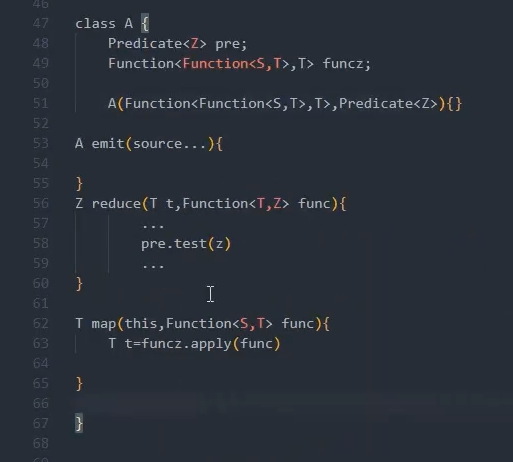

# 编程杂谈系列

## 01 - 05 编程方法杂谈


## 07 - 09 SPI以及它在 Reactor-Netty 与WebFlux 设计上的应用

SPI：service provider interface

例子：sin(x) 。 z=g(f(x))

一个简单的SPI设计：



由 Reactor-Netty 对接 Spring WebFlux 这条线引出 SPI 在代码中的实践。

目标：了解 Reactor-Netty 如何对接到 Spring WebFlux：

Reactor-Netty：

HttpServer#onStateChange => DefaultHttpServerRoutes =》 HttpRouteHandler =》

HttpPredicate

有路由接口，必然会在服务接口上call，那么会有 HttpServer、TcpServer 接口

TcpServer

HttpServer

reactor.netty.http.server.HttpServerRequest => HttpServerOperations

Spring：

对于 Spring，WebHandler接口用于处理核心业务逻辑，HttpServer接口用于对接第三方，例如 reactor-netty

WebHandler => WebHandlerDecorator =》HttpWebHandlerAdapter

HttpHandler

org.springframework.web.reactive.function.server.RouterFunctions.RouterFunctionWebHandler#handle


对接关键点：

reactor.netty.http.server.HttpServer：

```java
public abstract class HttpServer {
	/**
	 * Attach an I/O handler to react on a connected client
	 *
	 * @param handler an I/O handler that can dispose underlying connection when {@link
	 * Publisher} terminates. Only the first registered handler will subscribe to the
	 * returned {@link Publisher} while other will immediately cancel given a same
	 * {@link Connection}
	 *
	 * @return a new {@link HttpServer}
	 */
	public final HttpServer handle(BiFunction<? super HttpServerRequest, ? super
			HttpServerResponse, ? extends Publisher<Void>> handler) {
		return new HttpServerHandle(this, handler);
	}
}
```


org.springframework.http.server.reactive.ReactorHttpHandlerAdapter


reactor.netty.http.server.HttpServerRequest => org.springframework.http.server.reactive.ReactorServerHttpRequest


reactor.netty.http.server.DefaultHttpServerRoutes：

```java
final class DefaultHttpServerRoutes implements HttpServerRoutes {
	/**
	 */
	static final class HttpRouteHandler
			implements BiFunction<HttpServerRequest, HttpServerResponse, Publisher<Void>>,
			           Predicate<HttpServerRequest> {

		final Predicate<? super HttpServerRequest>          condition;
		final BiFunction<? super HttpServerRequest, ? super HttpServerResponse, ? extends Publisher<Void>>
		                                                    handler;
		final Function<? super String, Map<String, String>> resolver;

		HttpRouteHandler(Predicate<? super HttpServerRequest> condition,
				BiFunction<? super HttpServerRequest, ? super HttpServerResponse, ? extends Publisher<Void>> handler,
				@Nullable Function<? super String, Map<String, String>> resolver) {
			this.condition = Objects.requireNonNull(condition, "condition");
			this.handler = Objects.requireNonNull(handler, "handler");
			this.resolver = resolver;
		}

		@Override
		public Publisher<Void> apply(HttpServerRequest request,
				HttpServerResponse response) {
			return handler.apply(request.paramsResolver(resolver), response);
		}

		@Override
		public boolean test(HttpServerRequest o) {
			return condition.test(o);
		}
	}	
}
```

spring-web：

org.springframework.web.server.WebHandler

org.springframework.web.server.handler.WebHandlerDecorator：

org.springframework.web.server.adapter.HttpWebHandlerAdapter：

```java
public class HttpWebHandlerAdapter extends WebHandlerDecorator implements HttpHandler {
	@Override
	public Mono<Void> handle(ServerHttpRequest request, ServerHttpResponse response) {
		if (this.forwardedHeaderTransformer != null) {
			request = this.forwardedHeaderTransformer.apply(request);
		}
		ServerWebExchange exchange = createExchange(request, response);

		LogFormatUtils.traceDebug(logger, traceOn ->
				exchange.getLogPrefix() + formatRequest(exchange.getRequest()) +
						(traceOn ? ", headers=" + formatHeaders(exchange.getRequest().getHeaders()) : ""));

		return getDelegate().handle(exchange)
				.doOnSuccess(aVoid -> logResponse(exchange))
				.onErrorResume(ex -> handleUnresolvedError(exchange, ex))
				.then(Mono.defer(response::setComplete));
	}
}
```

spring webflux：业务交由WebHandler管理，对接交由HttpHandler管理。

对接Reactor-Netty：

org.springframework.http.server.reactive.ReactorHttpHandlerAdapter

```java
/**
 * Adapt {@link HttpHandler} to the Reactor Netty channel handling function.
 *
 * @author Stephane Maldini
 * @author Rossen Stoyanchev
 * @since 5.0
 */
public class ReactorHttpHandlerAdapter implements BiFunction<HttpServerRequest, HttpServerResponse, Mono<Void>> {
	private final HttpHandler httpHandler;
}
```

大概的对接路线（细节还需要进行补充）：

reactor.netty.http.server.HttpServer#handle => 

reactor.netty.http.server.HttpServerHandle#onStateChange  =>  

reactor.netty.http.server.DefaultHttpServerRoutes#apply => 

reactor.netty.http.server.DefaultHttpServerRoutes.HttpRouteHandler#apply


org.springframework.web.reactive.function.server.RouterFunctions#route => 

org.springframework.web.reactive.function.server.RouterFunctions.DefaultRouterFunction


org.springframework.http.server.reactive.ReactorHttpHandlerAdapter#apply => 

org.springframework.web.server.adapter.HttpWebHandlerAdapter#handle => 

org.springframework.boot.web.reactive.context.ReactiveWebServerApplicationContext#finishRefresh =>

org.springframework.boot.web.reactive.context.ReactiveWebServerApplicationContext.ServerManager#start =>

org.springframework.boot.web.embedded.netty.NettyWebServer#start =>

org.springframework.boot.web.embedded.netty.NettyWebServer#startHttpServer =>

reactor.netty.http.server.HttpServer#handle 


```java
public class NettyWebServer implements WebServer {
	...
	private final HttpServer httpServer;
    private final ReactorHttpHandlerAdapter handlerAdapter;
    ...
	@Override
	public void start() throws WebServerException {
		if (this.disposableServer == null) {
			try {
				this.disposableServer = startHttpServer();
			}
			catch (Exception ex) {
				ChannelBindException bindException = findBindException(ex);
				if (bindException != null) {
					throw new PortInUseException(bindException.localPort());
				}
				throw new WebServerException("Unable to start Netty", ex);
			}
			logger.info("Netty started on port(s): " + getPort());
			startDaemonAwaitThread(this.disposableServer);
		}
	}

	private DisposableServer startHttpServer() {
		HttpServer server = this.httpServer;
		if (this.routeProviders.isEmpty()) {
            # 核心点
			server = server.handle(this.handlerAdapter);
		}
		else {
			server = server.route(this::applyRouteProviders);
		}
		if (this.lifecycleTimeout != null) {
			return server.bindNow(this.lifecycleTimeout);
		}
		return server.bindNow();
	}        
}
```


一些核心类：

org.springframework.web.server.adapter.WebHttpHandlerBuilder#applicationContext 

org.springframework.web.reactive.config.WebFluxConfigurationSupport#webHandler

org.springframework.web.reactive.function.server.support.RouterFunctionMapping

存在的待解决的疑惑，RouterFunction如何接入以上的流程中，如何与DispatcherHandler进行交互？


org.springframework.web.server.ServerWebExchange：上下文

Reactor-Netty 中，服务器之间不同协议连接 =》 TcpServer => TcpServerHandler 因此也应该有 HttpServer => HttpServerHandle

“外显内胜”

## 10 Map接口中的相关和我们的函数式设计二三事


## 11 函数式设计编程思维在Spring中的应用与好处

