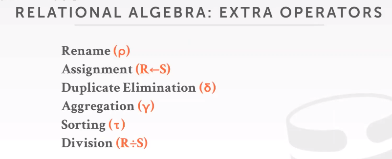
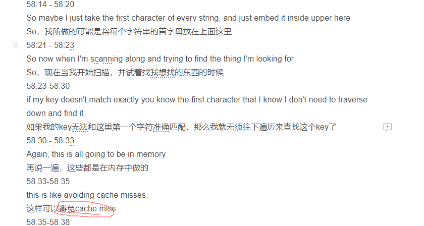

# 【2019年秋季版 CMU数据库15-445/645中文翻译版】

## 课程简介和关系模型

数据库：以某种方式进行关联的数据集合

关系型数据模型

- 关系结构
- 数据完整性约束
- 数据操作

七个核心的关键操作符：

## 数据库存储（storage）

这集视频就可以从底层设计出发，来解释为什么在不使用索引的情况下，进行查询会很慢。
 sloted page 格式
 由于存储格式以及查询语句的影响，导致需要获取整个page，而不能直接获取想要查询的数据。

 行存储与列存储的区别？

## 问题

1. 为什么能避免cache miss？来自07 Tree Index

   

   其实很简单，是我自己理解出问题了，key只保留字符串的首字母，如果key连第一个首字母都无法匹配的话，就无需往下遍历key，即无需根据node所在的地址+该数据offset值，去读磁盘，然后将数据加载到内存中（当然这些数据可能会预加载到内存中），这样cache miss（缓存未命中）的情况就能避免。