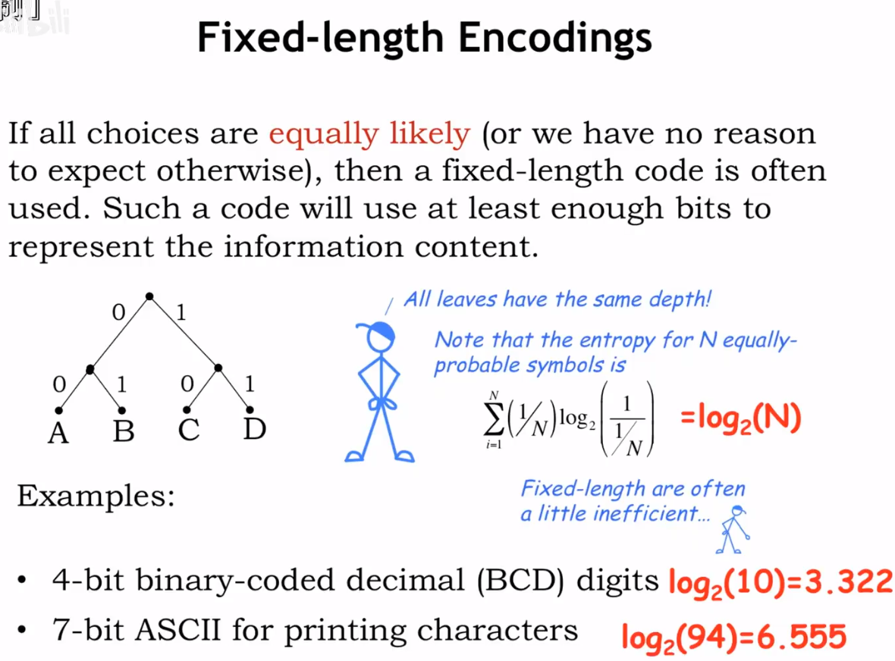

# 【MIT计算机组成原理中文翻译版】

## 1. 什么是信息


## 2. 量化信息

### 2.1  量化信息的方式


### 2.2 量化信息的例子


### 2.3 总结

数学家通过随机变量的概念来模拟不确定定；比如 N 个 不确定情况 分别用` x1,x2 ... ....Xn`；对应的概率用 `P1,P2 ... ... Pn `来表示。

香农在信息论中定义了 `I(xi) = log2(1/pi)`，其中 Xi表示其中一个情况， I(Xi) 表示该情况的信息量，测量不确定的大小，Pi 对应Xi的概率，故信息量和概率成反比。

**举个栗子：从52张扑克牌中获取心形扑克牌的概率是多少，信息量呢？**
心形扑克共有13张，故概率是13/52 ,信息量 是 log2(13/52) = 2 (bits) ,需要用2个位来编码这四种（1/1/4）可能性。

综上，更为直观的说法就是，在N可能平等的出现的情况中，假设我们只能接收其中的M种信息，则接收到我们需要是数据的概率是 M*(1/N) ，信息内容是 log2(N/M) 个bits 。


## 3. Entropy 熵

### 3.1 Entropy 是什么？


随机变量的 **entropy** 是在学习随机变量的值时所接收到的平均信息量。

熵是 所有可能发生事件的概率 * 信息内容 得到的信息量（bits） 。

**H(X)：**是一种评估编码效率的方法。


### 3.2 Entropy 有什么用？


**entropy**是我们需要传输的位数的下限，平均发送信息量低于**entropy**，即H(X)，则传输的信息不足于解决有关值的不确定性，高于**entropy**，虽然可以描述，但会造成浪费，不能最有效的利用资源。


## 4. 编码
### 4.1 what is Encoding？（编码是什么？）

编码是指bit(位)字符串和要编码的数据集的成员之间建立**明确的**映射关系。

“固定长度编码”：用于表示符号的bit(位)字符串均具有相同的长度

“可变长度编码”：使用不同长度的bit(位)字符串来编码符号，对于以不同概率出现的符号所组成的消息进行有效编码很有用。

**注意：**bit(位)字符串与数据集之间的映射关系必须是明确的，即**编码必须是明确的**


### 4.2 Encoding as Binary Tree（以二叉树形式展示编码）


如图所示：以二叉树的形式，能迅速展示出编码与字符集之间的关系，用于解码。


## 5.  定长编码
### 5.1 固定长度编码



如果尝试编码的字符以相同的概率出现，那么通常使用固定长度编码。

固定长度编码的二叉树中所有叶子节点到根节点的距离都是相同的。

固定长度编码的优点是支持随机访问（因为每个字符的编码是等长的，所以可以通过跳过指定位数，迅速找出消息的第N个字符）。


### 5.2 整型（Integer）编码

编码.png)

使用二进制编码来表示十进制的数字


### 5.3 十六进制编码


一长串的二进制字符很繁琐，且易出错，所以通常会使用十六进制来替换表示，优点：无需多次计算即可轻松恢复原来的字符串。

`"0x"`表明是16进制显示的数字。


## 6. 带符号整数2进制的补码

### 6.1 如何使用二进制表示带符号的整数？


在二进制补码中，使用高阶位作为符号位，即：

- ` 0`：代表`“+”`

- `1`：代表`"-"`

### 6.2 二进制补码概述


二进制补码最大负数：`-2^(N-1) ` =>  100....0000

二进制补码最大正数：`2^(N-1)-1`  => 011...1111

二进制补码表示范围：`-2^(N-1) ~ 2^(N-1)-1`

对于二进制补码，如果N位都为1，则是最大负数与最大正数之和，即 -1，推导过程：

```R
  100...000
+ 011...111
-----------
  111...111 =》 -1
```

如果N位都为0，则表示 0 => 000...0000，推导过程：

```R
由1 + -1 = 0 进行推导：
  000...001
+ 111...111
-------------
  000...000
```

二进制补码非常适合N位算术

### 6.3 二进制补码求解推导


二进制补码 = 二进制按位补码 + 1，即 -A = ~A + 1，推导过程：

```R
A + (-A) = 0 + (-A)
   	  -A = (-1 - A) + 1
   		 = ~A + 1
为什么(-1 - A) = ~A 呢？
-1 - A，即用1减去二进制A上的每一位，假设1-Ai=0，那么Ai=1，假设1-Ai=1，那么Ai=0，即证明结果=Ai的补码，所以(-1 - A) = ~A ，综上 A = ~A + 1
```


