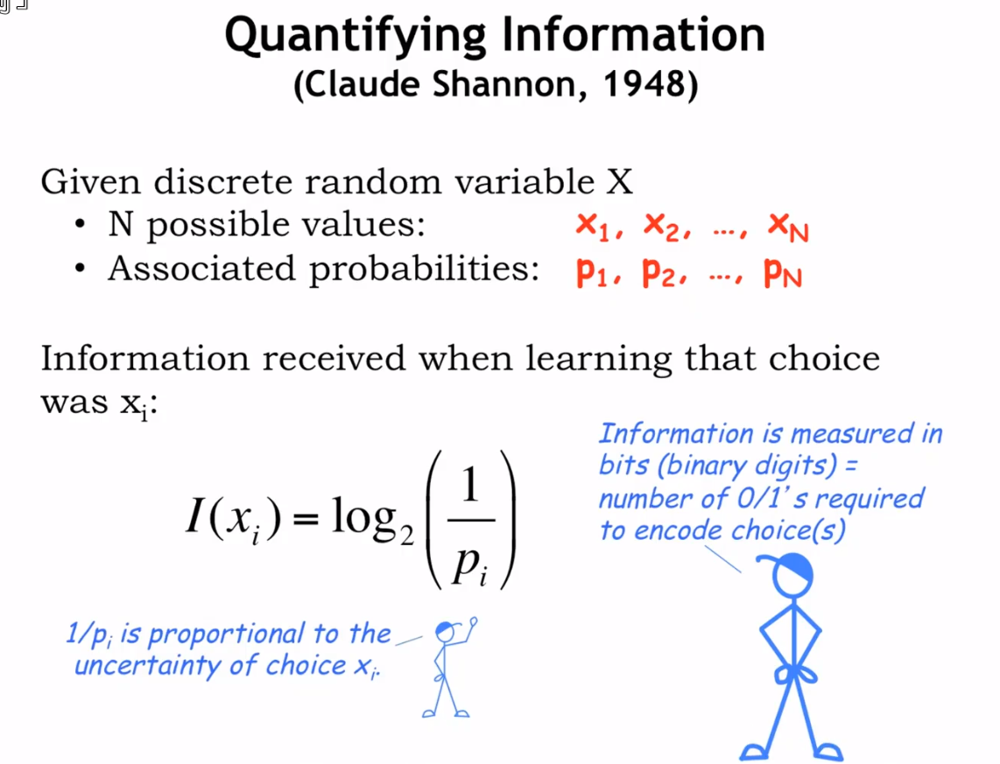

# 【MIT计算机组成原理中文翻译版】02 量化信息

## 量化信息的方式

## 量化信息的例子

## 总结

数学家通过随机变量的概念来模拟不确定定；比如 N 个 不确定情况 分别用` x1,x2 ... ....Xn`；对应的概率用 `P1,P2 ... ... Pn `来表示。

香农在信息论中定义了 `I(xi) = log2(1/pi)`，其中 Xi表示其中一个情况， I(Xi) 表示该情况的信息量，测量不确定的大小，Pi 对应Xi的概率，故信息量和概率成反比。

**举个栗子：从52张扑克牌中获取心形扑克牌的概率是多少，信息量呢？**
心形扑克共有13张，故概率是13/52 ,信息量 是 log2(13/52) = 2 (bits) ,需要用2个位来编码这四种（1/1/4）可能性。

综上，更为直观的说法就是，在N可能平等的出现的情况中，假设我们只能接收其中的M种信息，则接收到我们需要是数据的概率是 M*(1/N) ，信息内容是 log2(N/M) 个bits 。