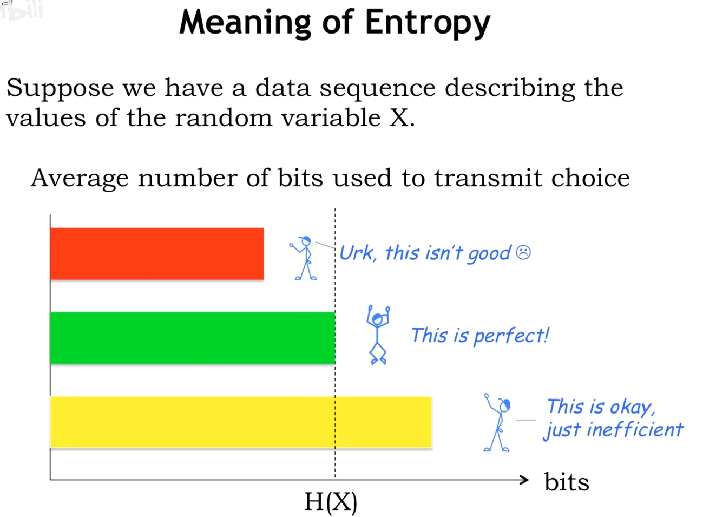

# 【MIT计算机组成原理中文翻译版】03 Entropy 熵

## Entropy 是什么？

随机变量的 **entropy** 是在学习随机变量的值时所搜收到的平均信息量。

**H(X)：**是一种评估编码效率的方法。

## Entropy 有什么用？

**entropy**是我们需要传输的位数的下限，平均发送信息量低于**entropy**，即H(X)，则传输的信息不足于解决有关值的不确定性，高于**entropy**，虽然可以描述，但会造成浪费，不能最有效的利用资源。

