# 【斯坦福编译原理】

## 01 编译器与解释器简介

### 编译器与解释器


Compile（编译器）：写好程序，通过编译器生成可执行代码；编译器无需结合数据，所以编译器是线下的（off-line）。

简单来说，编译的本质是用来生成可执行代码的预处理过程。

Interpreters（解释器）：写好程序，结合程序将数据传入解释器，程序就能立即执行。解释器是在线的（on-line），是程序运行的一部分。

>  执行和编译是两个阶段。执行属于线上的话。相对于解释器来讲。它需要结合数据进行执行。那此处编译器没有执行的步骤，所以属于线下。

解析器没有推广使用的原因：

- 执行效率低
- 自身占内存

### 编译器执行阶段


五个主要执行阶段：

1. 词法分析 
2. 语法分析
3. 语义分析：如类型和作用与规则
4. 优化：内存方面
5. 代码生成：转换成机器码或字节码或其他高级编程语言


## 02 编译器结构

### 编译阶段类比

- Lexical Analysis（词法分析） =》  1. 人类第一步尝试理解单词

  - 词法分析的目标就是将程序代码文本接照它的方式进行分词换句话说就是编译器说话时对词的区分
  - token（词法单元），if、then、else、空格、分隔符等等都是token

- Parsing（语法分析）  =》2. 紧接着理解句子的结构

  例子：

  

  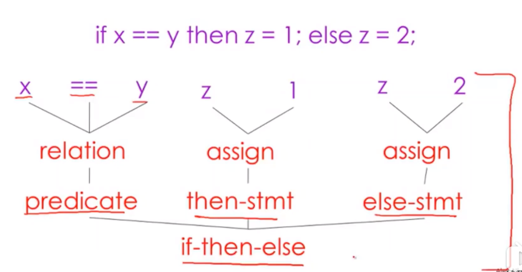

  

- Semantic Analysis（语义分析） =》 3. 进一步尝试理解这句话的意思

  - too hard，编译器只能尽可能找出句子相互矛盾的地方

  - 例子：

    

- Optimization（优化） =》 编辑，保持句子原有的语义，精简句子

  - 优化的目标

    - Run faster
    - Use less memory

  - 优化例子：

    

- Code Gen（生成代码） =>  翻译，将目标语言翻译为其他语言，比如：人工翻译可能会将英语翻译成法语一样，编译器会将高级程序转换为汇编代码

### 新旧编译器变化


## 03 编程语言的性价比

### 为什么需要那么多的编程语言？

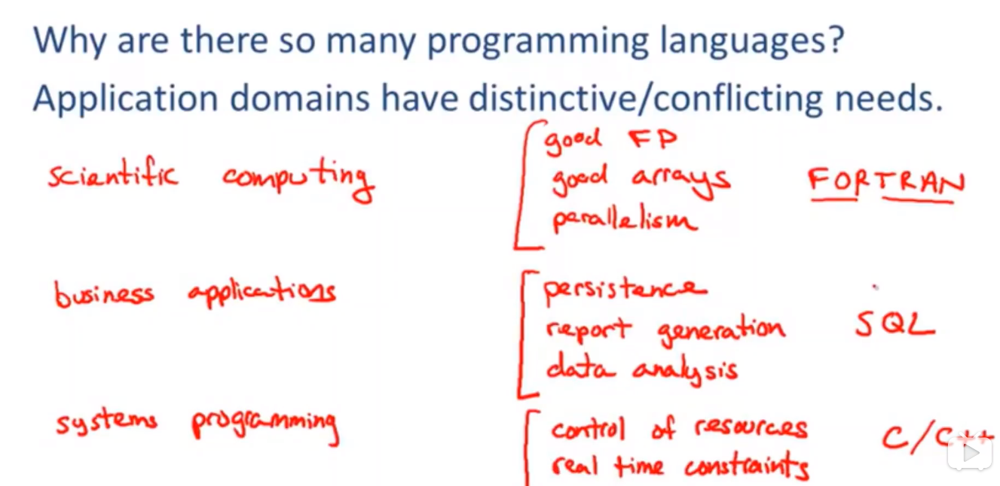

不同应用领域对于编程语言有着不同的需求。

### 为什么需要有新的编程语言出现？


1. 广泛使用的编程语言发展会比较缓慢
2. 开发一门新的编程语言成本很低，容易学习
3. 填补空白的语言，即应对新应用领域的需求

### 如何判断一门编程语言是否优秀？

用的人越多，编程语言越好？

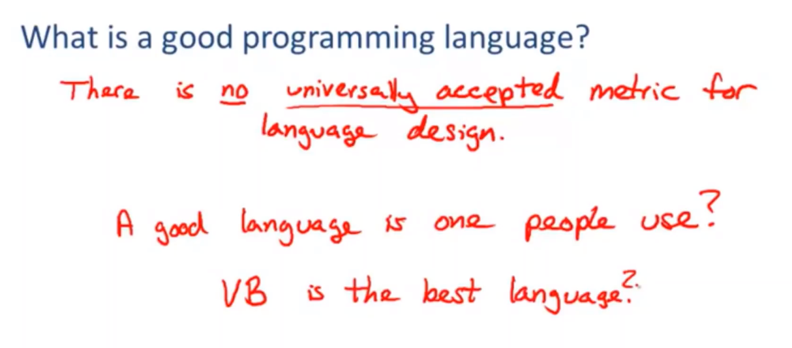


## 04 Cool 语言概述


## 05 Cool 语言概述 2


## 06 Cool 语言概述 3


## 07 词法分析 1


## 08 词法分析 2


## 09 词法分析 3 正则语言


## 10 词法分析 4 Formal Language


## 11 词法分析 5 词法规则


## 12 词法分析 6 Deducelt Demo


## 13 词法规范


## 14 有限自动机


## 15 从正则表达式到 NFA

### 构建词法分析器的流程图


实现词法规范：

1. 写出正则表达式集（词法规则）
2. 将正则表达式转化成 NFA（非确定性有限自动机）
3. NFA -> DFA（确定性有限自动机）
4. 使用一组 Lookup tables（查找表）并通过一些代码来对表进行遍历，以此实现确定性有限自动机

### 正则表达式 =》自动机 的实现例子


## 16 从 NFA 到 DFA

### ε-closure 的定义


### NFA -> DFA


- states：所有NFA可能的状态（除了空状态）
- start：在读到第一个输入的符号之前，它所处于实际状态集合就是开始状态 **ε-closure**
- final：集合X与NFA的最终状态集合相交，并且它不为空集
- 转换函数：**Y =  ε-clos(a(X))** 一个输入的字符只能对应一条执行线路，这条线路包含了一系列的多个状态 

**NFA => DFA 转换图：**


## 17 实现有限自动机


## 18 解析器介绍


## 19 上下文无关文法


## 20 推导


## 21 Ambiguity（歧义性）

### 歧义性出现的原因

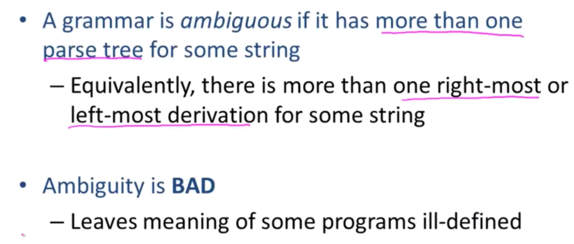

歧义性的例子：

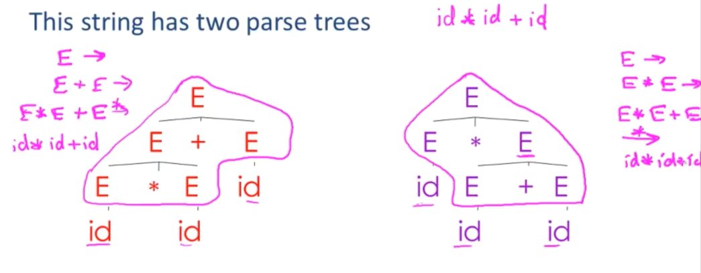

### 歧义性解决的办法
#### 重写语法
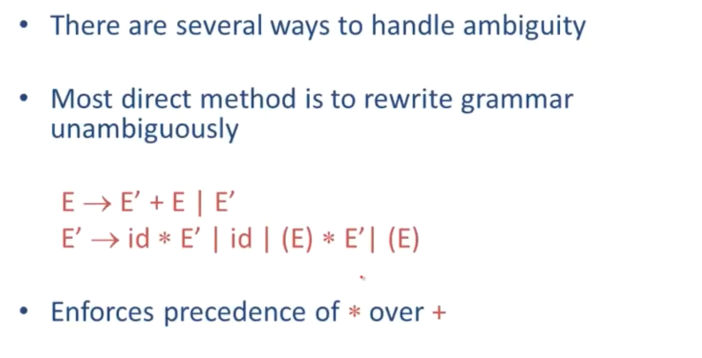

例子：

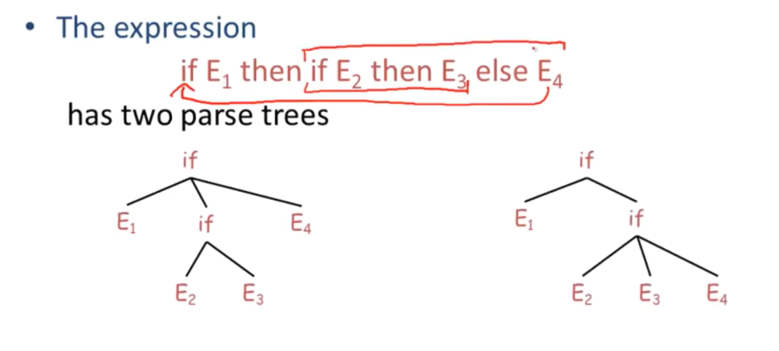

  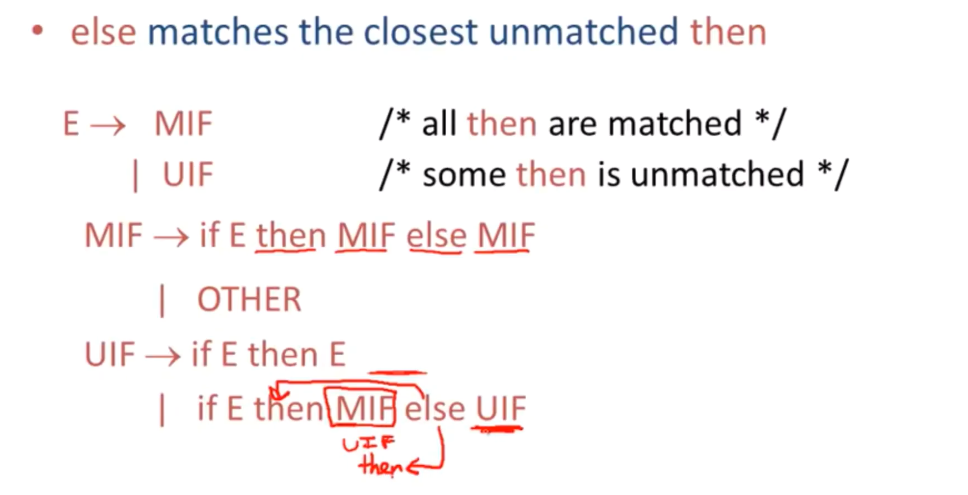

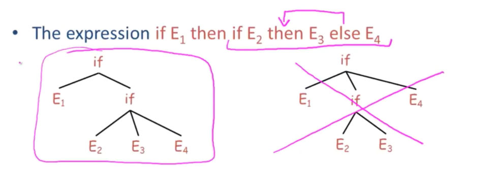

#### 使用更自然的歧义语法


例子1：


例子2：

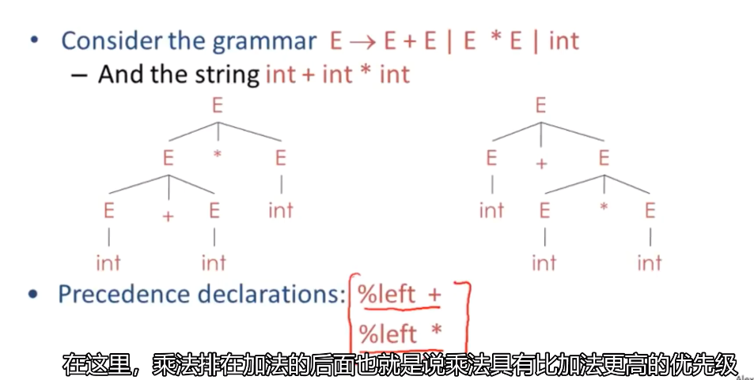

## 22 错误处理

### 编译器如何处理错误？

#### 编译器的职责

编译器的两种不同职责与例子：


#### 错误处理器的要求

错误处理器的要求：


#### 错误处理的策略

错误处理的策略：

- Panic mode：紧急模式，最简单、最常用的错误恢复方法
- Error productions：错误产生式
- Automatic local or global correction：自动局部或全局校正

##### Panic mode

Panic mode 的基本思路是当一个错误被检测时，解析器会开始抛弃token直到在这门语言中我到一个作用明确的token为止，编译器会试着自己重启。然后从那个点继续工作。


Panic mode 会丢弃第二个`+`，继续编译下去，直至遇到解析器可以识别的字符

##### Error Productions

**Error Productions：**它将程序员常犯的已知错误指定为语法中的替代产生式（编译器设计者可能知道代码中可能出现的一些常见错误。也可以使用增强语法作为在遇到这些错误时生成错误结构的产品）

##### Automatic local or global correction


从图中可以看出，不使用**Automatic local or global correction**的原因。

## 23 抽象语法树

抽象语法树（**AST**，**Abstract Syntax Tree**）是编译器中的核心数据结构，它优于以往讲的解析树。


AST 的语法：


- 定义语法：E -> int | (E) | E + E
- 给出字符串：5+（2+3）
- 进行词法分析：int5 '+' '(' int2 '+' int3 ')'
- 然后传入解析器得到一颗解析树


AST结构与好处：


**AST **将具体的语法进行了抽象，取消了具体语法的细节，只保留了足够的信息，能够很好地表示程序要做的事，并进行编译。

## 24 递归下降解析

### 递归下降解析定义

递归下降解析算法是一种自上而下，从左到右的解析算法。


### 解析例子


从根节点开始，自上而下的进行解析，从左到右一个一个去尝试匹配表达式

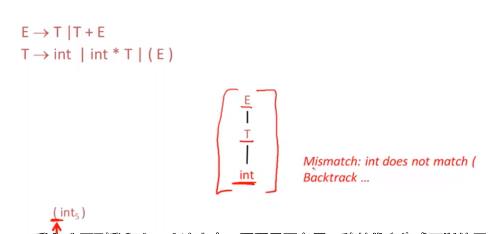


## 25 递归下降解析算法

### 前置知识点


### 定义一个用来匹配输入中所给定token的函数


1. 

2. 每个产生式都有一个对应函数，会检查这个产生式是否能和这个输入匹配上

3. 将关于这个特定非终结元素的所有产生式组合在一起，然后检查这些产生式中是否有任何一个能和输入进行匹配

   

### 方法定义


### 解析器的启动流程


- 初始化一个 next 指针，指向输入的第一个token
- 调用 E()

### 递归下降解析的例子


从（int）开始解析，步骤如上图


## 26 递归下降的局限性

### 局限性例子

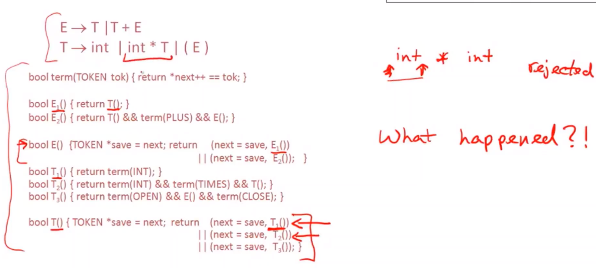

上述介绍的递归下降算法是具有局限性的，例如解析复杂度的式子：`int * int`，E() -> T() -> T1() -> trem(INT)，会发现T1返回的是`true`，由于T1() return true，那么T() 也 return true，最后E()解析完毕，返回true，但事实上指针才往前移动至`int`后面，这时候还未遇到终结元素，程序就执行完了，导致解析被拒接；局限性在于这个结构和算法中，没有办法去回滚之前的决定并尝试一个不同的产生式。

## 27 左递归(Left Recursion)

### 左递归


左递归语法是指具有非终结符的住何语法，如果是从非终结符开始，你就要做一系列非空序列重写（译者注：就是循环调用）

递归下降解析是没办法适用于任何左递归语法，因为递归下降解析想要做的是先生成输入中的第一部分，然后从左到右进行工作，但左递归语法却是按照从右到左的顺序构建字符串的。

例如：

```mathematica
S -> Sα|β  =》 S->Sα->Sαα-> Sαα...αα -> βαα..α
```

我们可以用右递归语法来替换左递归语法，以此解决这个问题。

首先添加在语法上添加符号，例如：

```mathematica
S-> βS'
S'-> αS'|ε
推导公式：
S->βS'->βαS'->βααS'->βα...αS'->βαα...α
```

右递归替代左递归的例子：


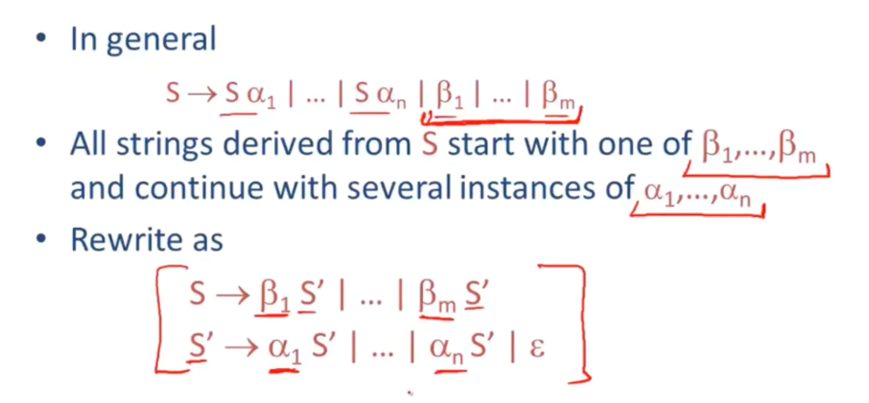


### 非直接左递归

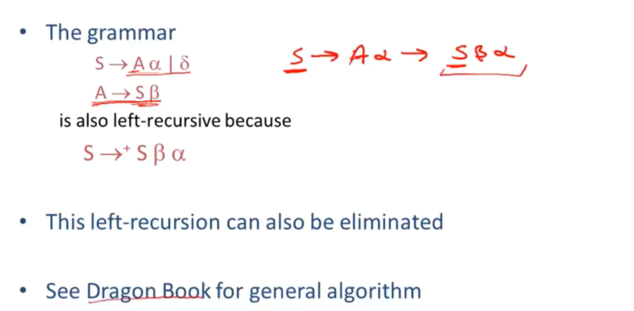

### 小结


## 28 预测解析(Predictive Parsing)

### 预测解析

.png)

预测解析**(Predictive Parsing)**，也是一个自上而下的解析器，始终能够正确地猜出该使用哪个产生式来得到一个正确的解析。

预测解析的特点：

- 会使用向前看的方式来尝试指出该使用哪个产生式
- 没有回滚操作

预测解析接受一种**LL(k)**的语法

- 第一个 **L** 代表 left to right 从左到右扫描
- 第二个 **L** 代表使用最左推导构建一个解析树
- **k** 代表有k个需要向前看的token（理论上 k 可以是任意数，实战上 k 只会为 1）

### 递归下降解析器与LL(1)解析器的区别

解析器的区别.png)

递归下降解析器

- 在递归下降解析的每一步中，可能会有很多可供选择的产生式来选行使用
- 回滚操作用来撤销错误的选择

LL(1)解析器

- 每一步只会有一个可供选择的产生式来进行使用

### 提左公因子

提左公因子背景：

 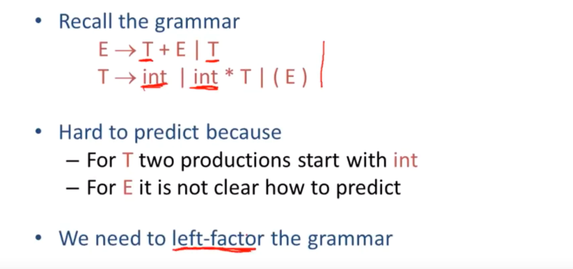


提取左公因子背后的思路就是消除一个非终结符的多个产生式的公共前缀。

提取左公因子的推导例子：


提取左公因子语法：

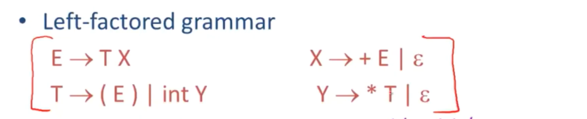

### LL(1)解析表

LL(1)解析表定义：

解析表.png)

空单元格表示错误的解析。

LL(1)解析表的例子：

解析表的例子.png)

解析表的步骤：

解析表的步骤.png)

### LL(1)解析算法

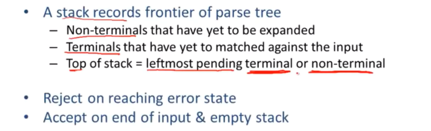

LL(1)解析算法：栈+解析表来实现

的解析算法.png)

使用解析表进行解析的例子：

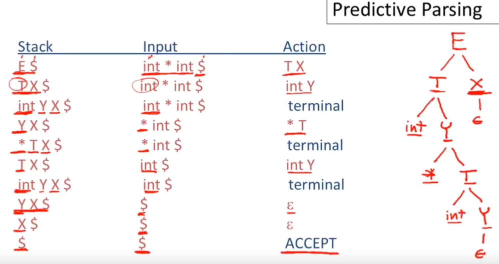


## 29 First集

 and Follow(A).png)

> 在构建解析表过程中有2个集合是需要被关注的一个是first 集，一个是follow集
> T【A,t】=a 解析表中表示存在一个非终结符号A和终结符号可以解析成a，这可以理解为生产式 A->a 中，若果输入符号是终结符号t的话，是可以被该生产式match的，而且必须是在首字符match，也就是First set；故此时t∈First(A)
> 在生产式 a->*tß中，当a在生产式右边第一个位置可以解析成 t 的话，则t 是first(a) 中的一个元素，a也许可以转为其他符号
> 如果存在这样生产式，右侧有个一个终结符号t是紧随着非终结符号A的，当且A->£ 即A解析成空字符串时(A无法直接解析成t)，该生产式可以解析成t ，则t是Follow(A) 即 t ∈ Follow(A)
>
> java-深圳-czr

### First Sets的定义

First Set 的定义：`First(X) ={t|X->*ta}U{£|X->£}`

实际上，这里的X是一个字符串。这个X可能是一个终结符也可能是一个非终结符。或者它还可能是一个语法符号字符串。

### First Sets的计算方式

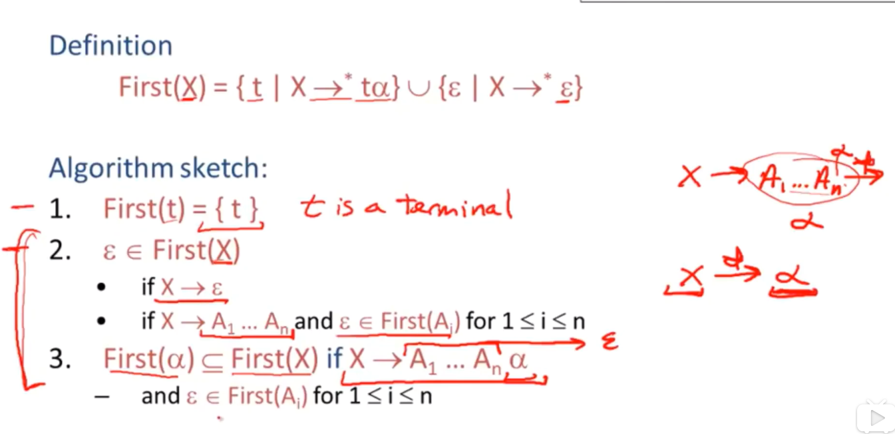

算法描述：

1. First(t) = {t}，对于所有终结符，它们的First集由该终结符的元素组成
2. £∈First(X) 
   - **if X->£**，即X能解析出£
   - **if X->A1A2…An and £∈First(Ai) for 1<=i<=n**，即X能解析出A1...An，A1...An能解析出£，注意：A1...An都是非终结符。
   - **First(a)⊆First(X) if X->A1...Ana and £∈First(Ai); for 1<=i<=n**

### 计算First Sets的例子

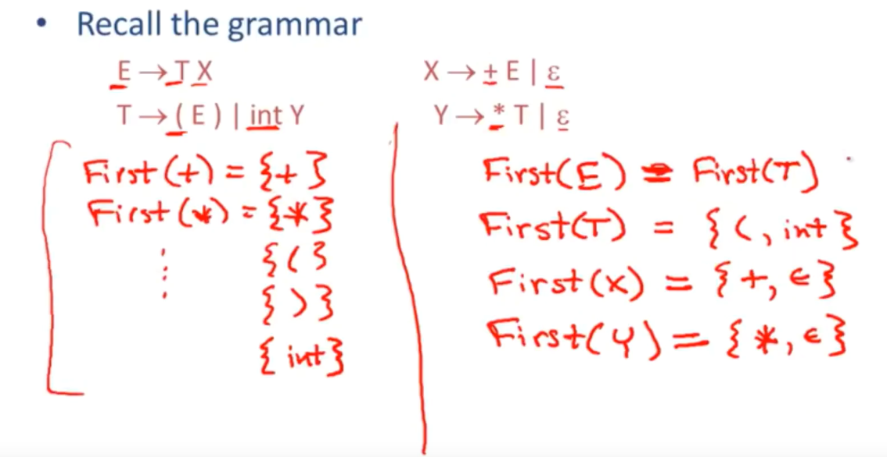

**注意：终结符的First Sets 就是它本身**

```mathematica
First(E) = First(T)的推导过程：
由First Set的定义，可得 First(T) ⊆ First(E)
First(T)={(,int}，因为T无法推导成£，即First(T)至少会提供一个终结符，所以X始终无法为First(E)提供终结符，即First(E) = First(T)
```

## 30 Follow集

### Follow Sets 定义

Follow Sets 定义：`Follow(X) = {t | S -> *βXtδ}`

实际上，Follow(X)完全不取决于符号X可以产生什么，而取决于符号X可以出现的位置，即该符号在语法中的使用位置。

比如 在`Follow(X) = {t | S -> *βXtδ}`中，t是Follow(X)中的元素。

客观事实：

- X->AB => First(B) ⊆ Follow(A)，即有这样一个基本规则。即当你有两个相邻符号的时候，第二个符号的First集中的元素是第一个符号的Follow集中的元素。

  ```mathematica
  1. X->AB->*Atβ
  2. First(B) = {t}
  3. Follow(A) = {t}
  4. First(B) ⊆ Follow(A) 
  ```
  - 如果 B ->*ε，则 Follow(X) ⊆ Follow(A)

    ```mathematica
    假设：
    S->Xt->ABt => Follow(X) ⊆ Follow(B)
    如果 B ->*ε，即S->Xt->ABt->At =>  Follow(X) ⊆ Follow(A)
    ```

- 如果S是开始符号，则 $ ∈ Follow(S)

### Follow Sets 算法概要

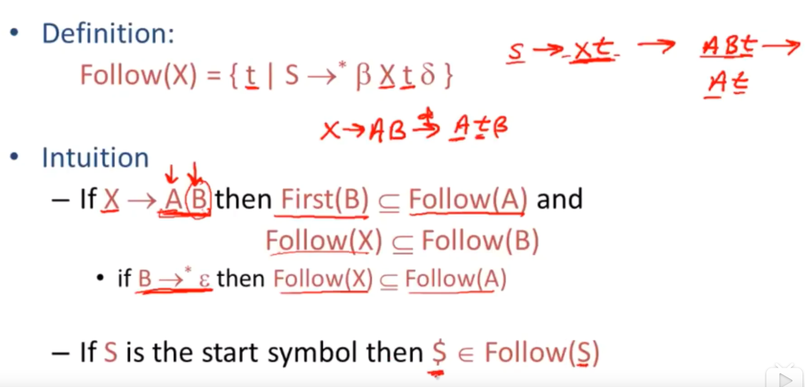

- Follow Sets 不关心`ε`

### Follow Sets 例子

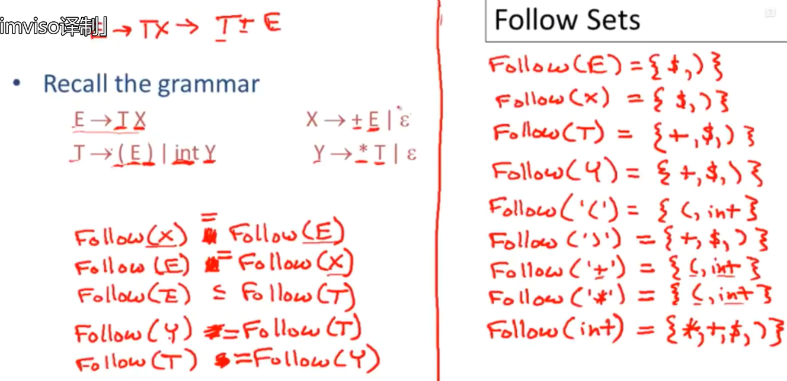


## 31 LL(1)解析表

### LL(1)解析表的定义

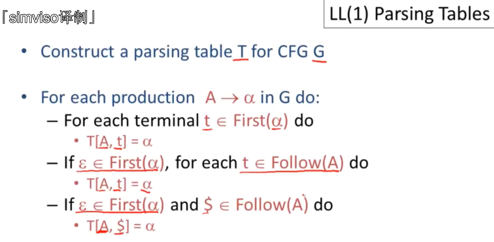

本节的目标是为上下文无关语法G构建出一个解析表T

 T[A,t]=α表示解析表中表格T[A,t]填α

表达式 A -> α 在上下文无关语法G中：

1. 每个终结符 `t∈First(α)`，则`T[A,t] = α`
2. 如果 `£∈First(α)`，对于每个`t∈Follow(A)`，则`T[A,t] = α`
3. 如果 `£∈First(α)`且`$∈First(α)`，则`T[A,$] = α`

### 表达式构建解析表的过程

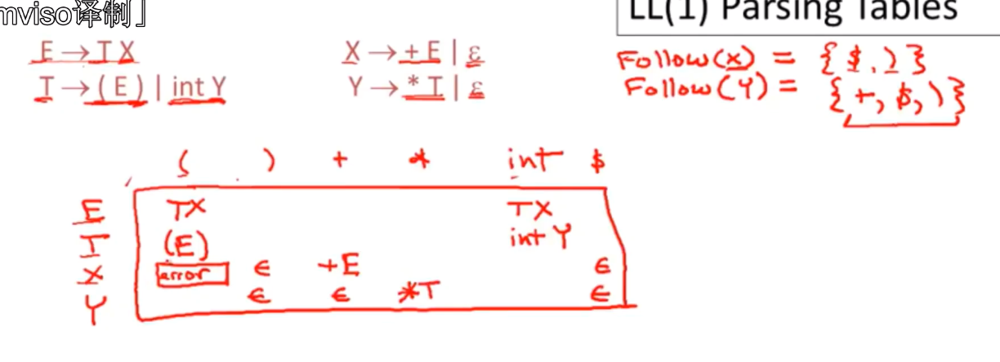

### 非LL(1)语法构建LL(1)解析表

语法构建LL(1)解析表.png)

如果在解析表中任何一个单元格被多重定义的话。那么这个语法就不是LL(1)的。

常见但不全是，不符合LL(1)语法的有：

- 任何无法被提取左公因式的语法
- 任何左递归语法
- 任何有语义混淆的语法

但即使满足以上条件，也不一定是符合LL(1)语法。

判断LL(1)语法的唯一方法就是去构建LL(1)解析表，然后检查解析表中所有单元格内的选择是否只有一种。

## 32 自下而上的解析(Bottom-Up Parsing)

### 自下而上解析的定义

自下而上解析要比确定性的自上而下解析显得更加通用

自下而上解析会进行归约。即通过反转产生式。逆向替换。将字符串归约为起始符号。

Reduction(归约)：从具体元素开始逐层替换为上一级可处理的产生式，最后聚合为一个产生式，即为归约。

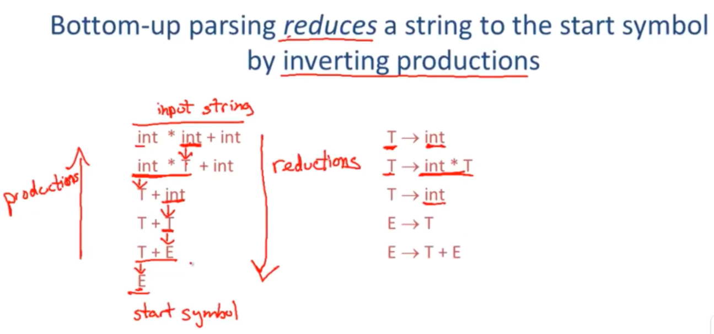


### 自下而上解析的事实

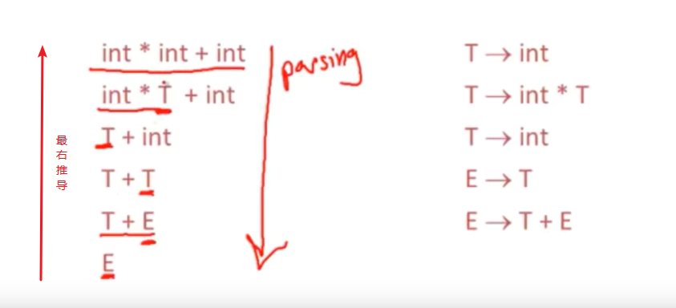

有关自下而上解析的重要事实：一个自下而上的解析将反向追踪一个最右推导（自下而上的解析是一个最右推导的过程，通过使用归约来替代产生式推导，然后以反方向的顺序进行）

自下而上解析器所做的一系列归约步骤：

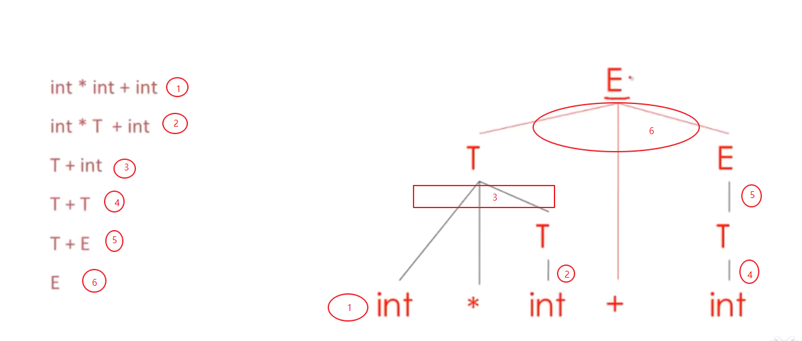

### 自上而下解析器与自下而上解析器的区别

自上而下解析器是从开始符号开始，然后通过展开当前叶子节点上的非终结符来渐生成解析树

自下而上解析是从最终解析树的所有叶子节点开始，它会根据整个输入从底部开始构建解析树，会将生成的子树放在一起来构建出完整的解析树。

### 小结

一个自下而上型解析器会以逆序追踪一个最右推导，它通过将小型解析树结合在起以此来构建更大的解析树，它以自下而上的顺序进行构建而不是从开始符号自上而下进行展开来构建解析树，它从解析树的叶子节点开始向上构建到根节点。


## 33 移位归约解析(Shift-Reduce Parsing)

移位归约解析是自下而上解析器所使用的主要策略。

### | 的定义

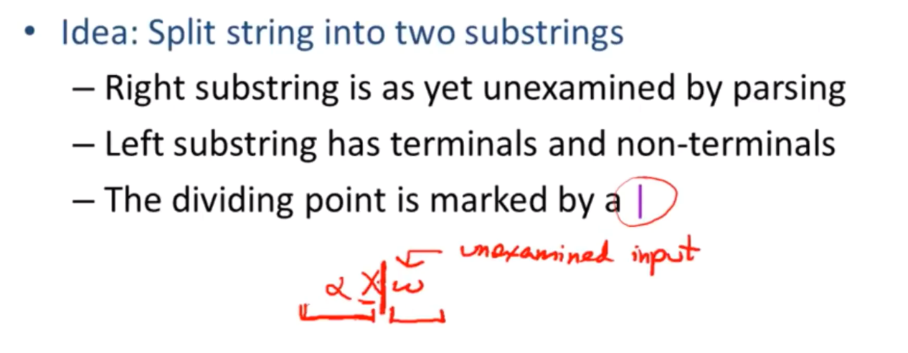

- 竖线右侧的内容是还未经过解析器检查的
- 竖线左侧的内容可以是终结符也可以是非终结符
- 以`|`作为区分点

### 移位操作和归约操作

实现自下而上解析，只需两种操作，即移位操作和归约操作。

#### 移位操作

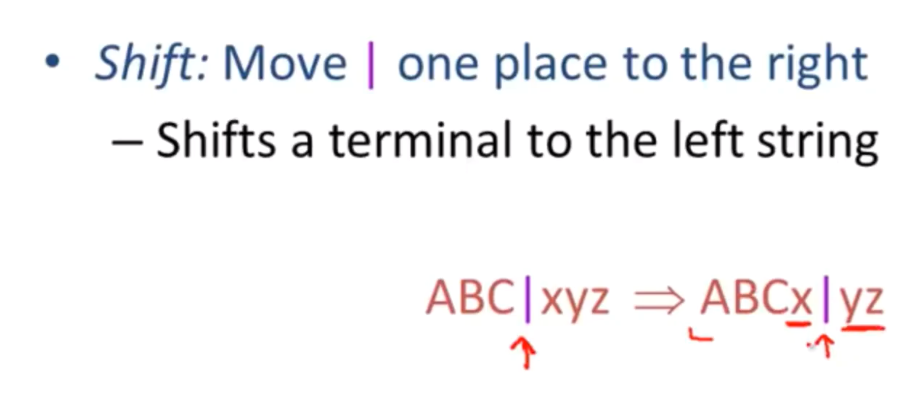

一次移位操作就代表了从输入中读取一个token。可以解释为将竖线向右移动一个位置。

#### 归约操作

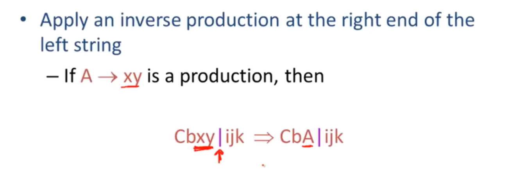

归约操作是对竖线左侧字符串的右端表尾逆向使用产生式。

### 移位归约解析例子

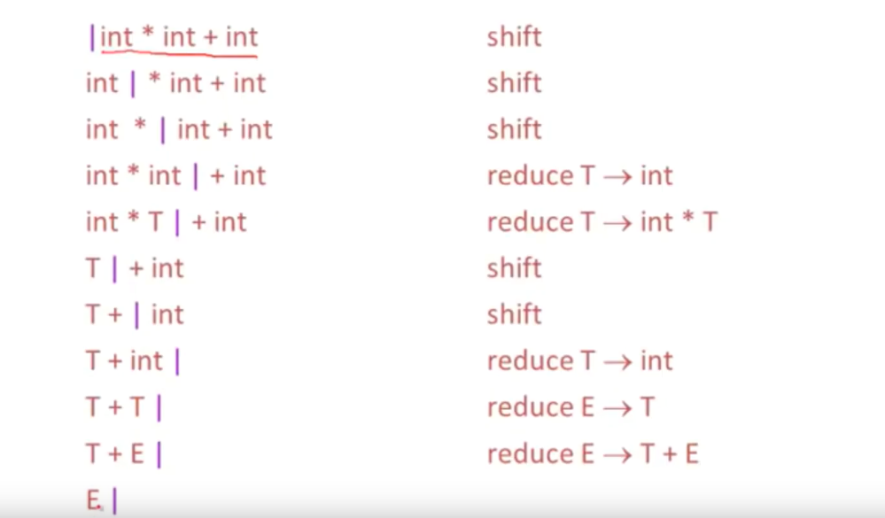

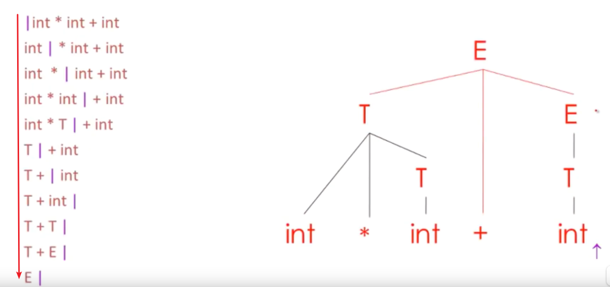

### 移位归约解析实现

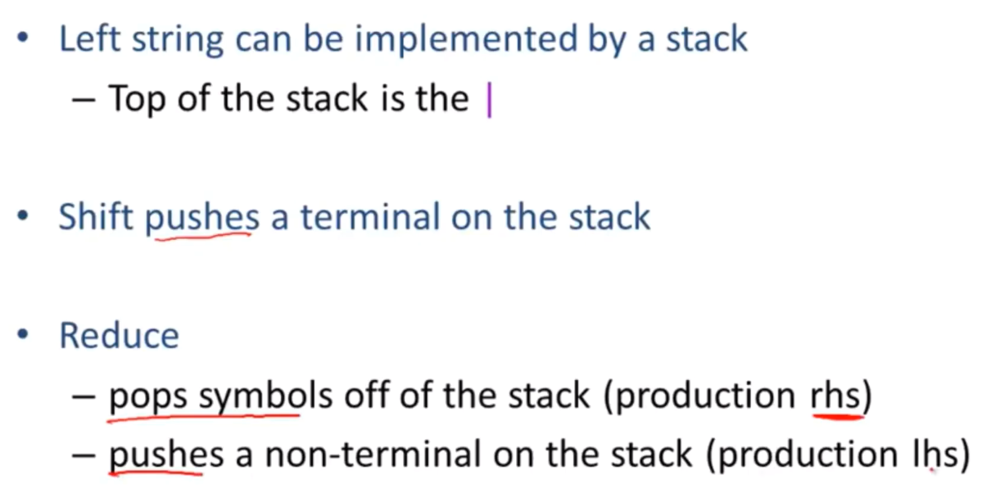

- 竖线左侧的字符串能够由一个栈来实现
  - 栈顶元素是`|`
- 移位操作将终结符压入栈中，即会从输入中读取一个token，并将其压入栈内。
- 归约操作
  - 将0个或多个字符从栈内弹出，即产生式右手边的字符
  - 解析器会把一个非终结符（即根据弹出的字符，反向最右推导，最后得出的非终结符）压入栈内，这个非终结符是产生式左侧的符号。


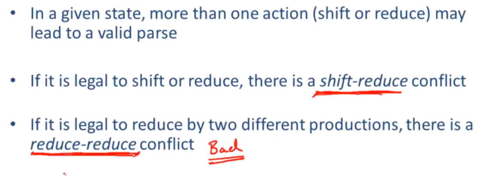

- 在一个给定状态下。经过多次移位或者归约。我们可能会得到一个有效解析。

- 如果解析器既可以读取输入中的一个token，然后将它压入栈内，也可以执行一个归约操作，那么会有 shift-reduce 冲突。

- 如果归约操作由两种不同的产生式都可以做到并是合法的，那么会有reduce-reduce的冲突。

  

## 34 句柄（Handles）

该如何判断什么时候进行移位或者归约？

场景1：

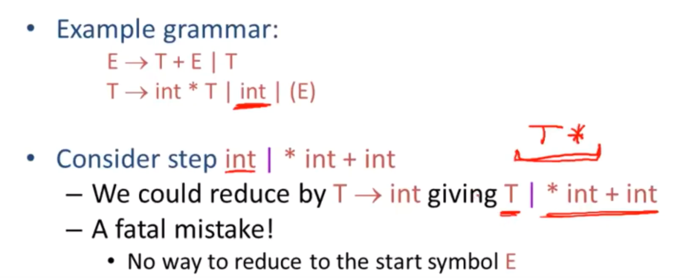

这场景很好的解答了我的疑惑，就是为什么第一个int不直接转换为T。

### 句柄定义

句柄就是一个归约点。可以允许解析器通过进一步的归约操作回到开始符号位置（译者注：注意，句柄就是包含了一个可归约的操作路径，不要被国内现有的抽象解读诱导）

假设最右推导算法：`S -> *αXω -> αβω `，归约操作：`αβω -> *αXω -> S`，那么`αβ`是`αβω `的句柄。

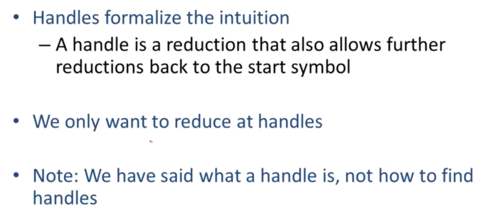

如果不在句柄处进行归约，即使这个地方看起来是产生式右手边元素，解析器可能会卡主。

重要事实#2：

在shirt-reduce解析中，句柄只会出现在栈顶。

非正式证明：

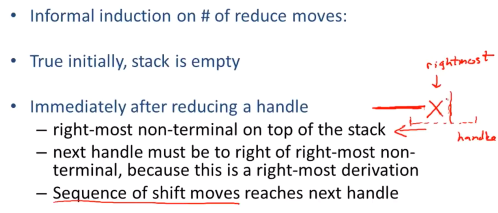


有关句柄的一些定论：

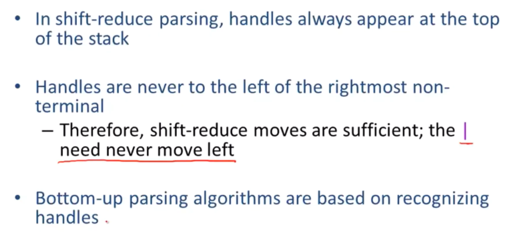

- 在 shift-reduce 解析中，句柄总是出现在栈顶
- 句柄从不出现在最右非终结符的左边，因此只有 shift-reduce 的操作就足够了；竖线永远不会向左移动。
- 自下而上解析算法是基于识别句柄进行的

## 35 句柄识别

heuristic(启发器)：始终能够正确识别到句柄

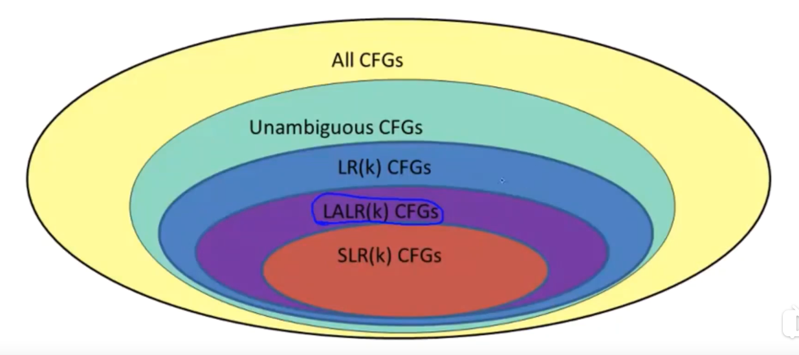

LR(k) CFGs：最普遍的确定性语法族之一

- L：代表从左到右扫描
- R：代表最右推导
- k：代表需要向前看k个数量的token

LALR(k) CFGs：大部分自下而上型工具使用的语法

SLR(k) CFGs：LALR(k)语法的简化版

可行前缀：是一个字符串。它不会延伸到句柄的右端，是句柄的前缀。

只要解析器在栈上有可行前缀的话，就不会检测到解析错误。

### 自下而上解析的事实三

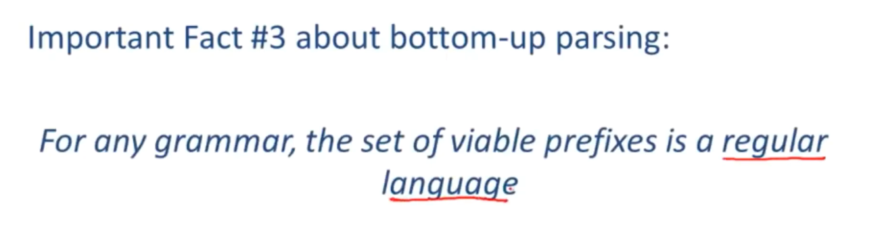

**事实三：对于任何语言来说，可行前缀集就是一个正则语言**

> 在任何一个成功的解析中。栈上元素始终必须是产生式右手边的前缀。

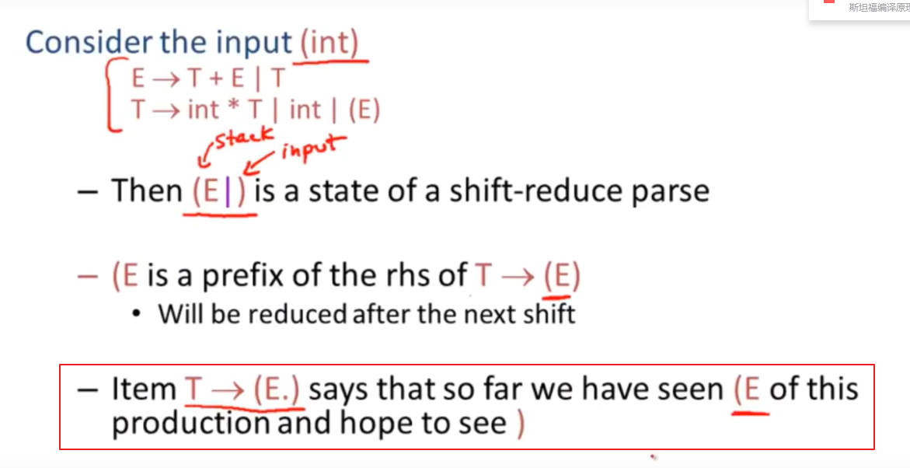

> item记录了目前我们处理产生式的进度

## 36 识别可行前缀

### 状态转换规则

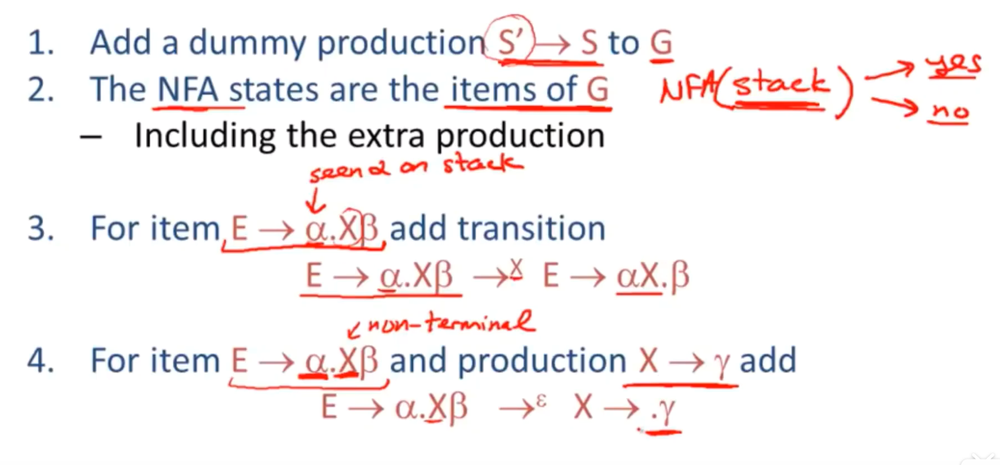

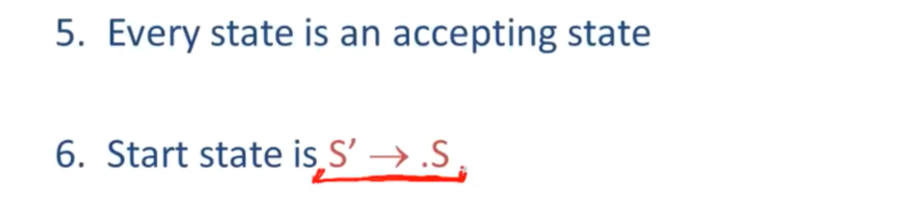

规则5：意味着如果自动机成功的处理了整个栈，那么这就是一个可行的栈。要注意下。对于每个可能的符号而言。不是每个状态都会有相应的状态转换（知秋注：可能该符号就压根儿找不到可适配的产生式）这里可能会造成大量的栈被拒绝，因为自动机会卡住。

规则6：添加伪产生式的原因：方便命名开始状态（译者注：即对每一个小的语法规则进行命名）。

### 例子

表达式：

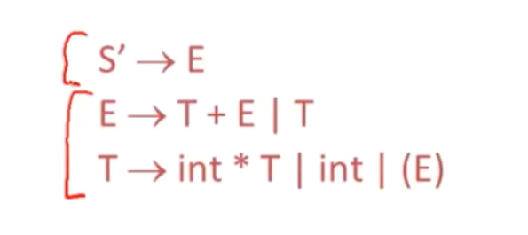

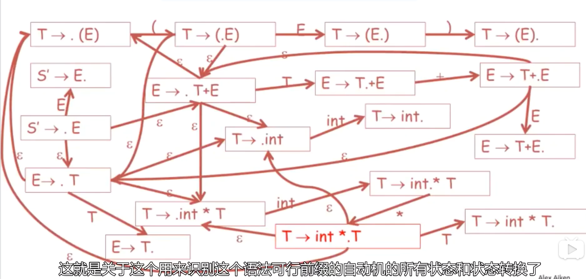


## 37 有效 item（Valid Items）

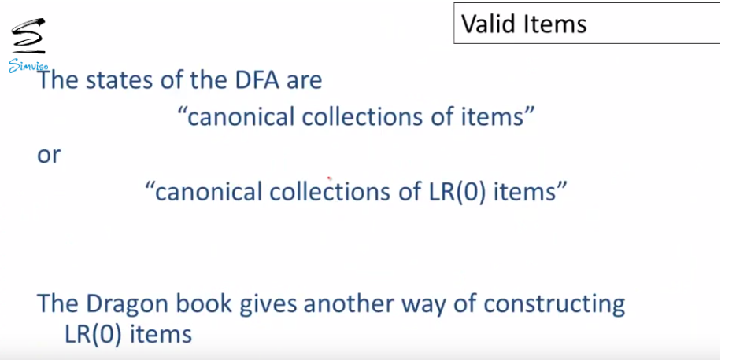

这种确定性自动机状态称为item的各种规范集合或LR(0) items的规范集合，如果你看过龙书的话，它会给你另一种构建LR(0) items的方式，而不是我这种。


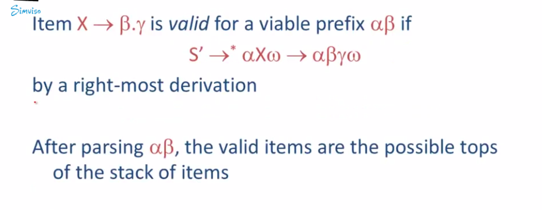

对于一个可行前缀αβ来讲，我们会说这样一个给定的item ：X->β.γ是有效的：即如果满足以下条件，则从起始符号开始，这是我们额外的起始符号（S'），通过一系列最右推导步骤，我们能得到一个配置αXω，通过一系列最右推导步骤，我们能得到一个配置αXω，这也就是说，当解析完α后，在α后紧接着就看到了β，β在栈上，那这些可以解析到栈顶的items就是有效items，那这个item可能就是这个非确定性自动机的确定状态。


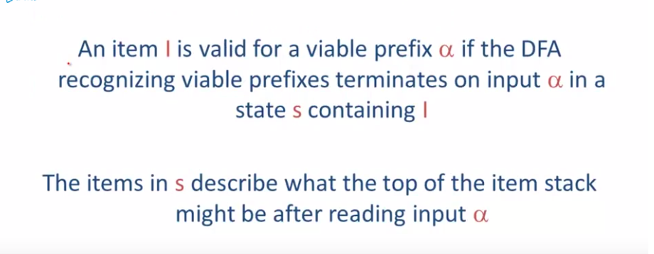

换一种更简单的方式来说就是，对于给定的可行前缀α，在DFA读取到这个前缀后，会有一个确切有效的item来解析辨别，即该item在这个DFA管理的最终状态中。当你在栈内看到α后，这就是用来描述状态的items。

## 38 SLR解析（简单LR解析）

## 39 SLR解析案例

