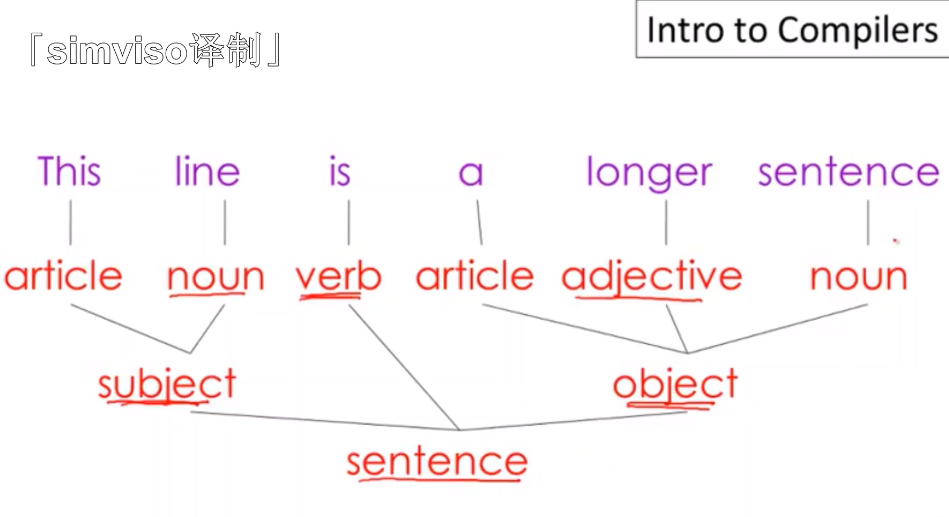
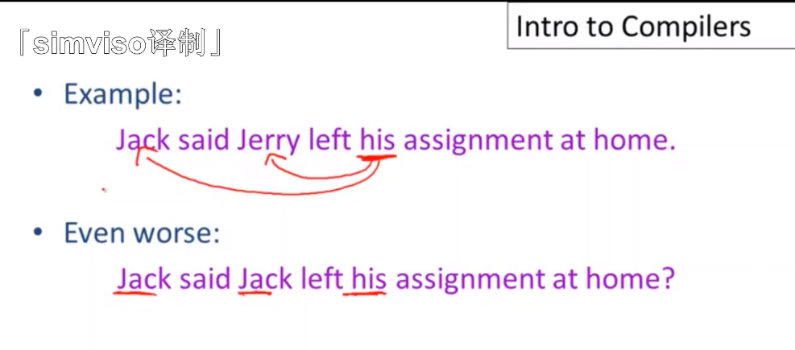
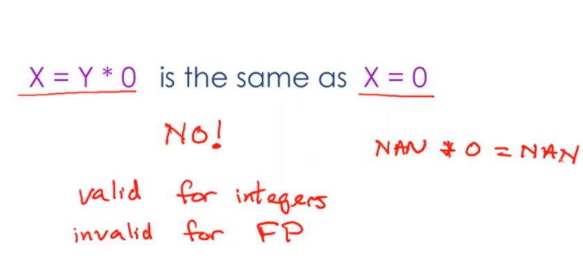
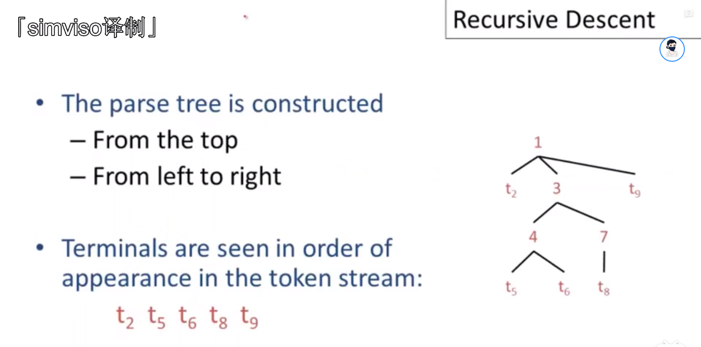
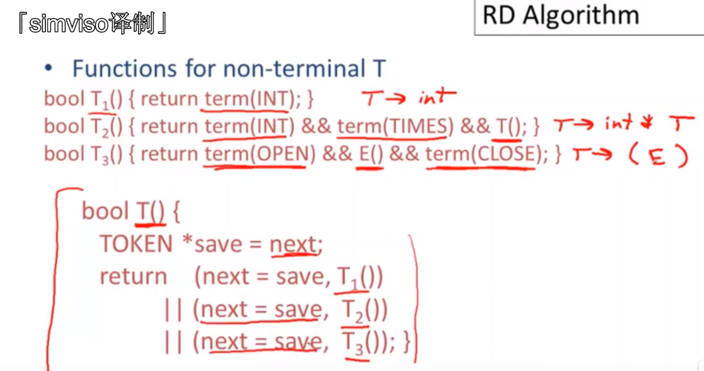
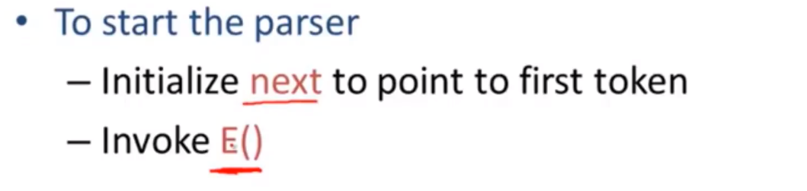
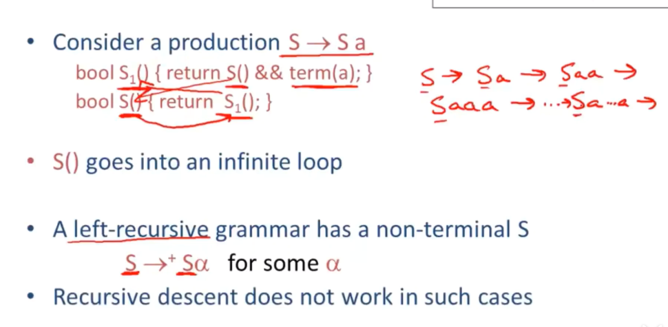

# 【斯坦福编译原理】

## 01 编译器与解释器简介

### 编译器与解释器


Compile（编译器）：写好程序，通过编译器生成可执行代码；编译器无需结合数据，所以编译器是线下的（off-line）。

简单来说，编译的本质是用来生成可执行代码的预处理过程。

Interpreters（解释器）：写好程序，结合程序将数据传入解释器，程序就能立即执行。解释器是在线的（on-line），是程序运行的一部分。

>  执行和编译是两个阶段。执行属于线上的话。相对于解释器来讲。它需要结合数据进行执行。那此处编译器没有执行的步骤，所以属于线下。

解析器没有推广使用的原因：

- 执行效率低
- 自身占内存

### 编译器执行阶段


五个主要执行阶段：

1. 词法分析 
2. 语法分析
3. 语义分析：如类型和作用与规则
4. 优化：内存方面
5. 代码生成：转换成机器码或字节码或其他高级编程语言


## 02 编译器结构

### 编译阶段类比

- Lexical Analysis（词法分析） =》  1. 人类第一步尝试理解单词

  - 词法分析的目标就是将程序代码文本接照它的方式进行分词换句话说就是编译器说话时对词的区分
  - token（词法单元），if、then、else、空格、分隔符等等都是token

- Parsing（语法分析）  =》2. 紧接着理解句子的结构

  例子：

  

  

  

- Semantic Analysis（语义分析） =》 3. 进一步尝试理解这句话的意思

  - too hard，编译器只能尽可能找出句子相互矛盾的地方

  - 例子：

    

- Optimization（优化） =》 编辑，保持句子原有的语义，精简句子

  - 优化的目标

    - Run faster
    - Use less memory

  - 优化例子：

    

- Code Gen（生成代码） =>  翻译，将目标语言翻译为其他语言，比如：人工翻译可能会将英语翻译成法语一样，编译器会将高级程序转换为汇编代码

### 新旧编译器变化


## 03 编程语言的性价比

### 为什么需要那么多的编程语言？


不同应用领域对于编程语言有着不同的需求。

### 为什么需要有新的编程语言出现？


1. 广泛使用的编程语言发展会比较缓慢
2. 开发一门新的编程语言成本很低，容易学习
3. 填补空白的语言，即应对新应用领域的需求

### 如何判断一门编程语言是否优秀？

用的人越多，编程语言越好？


## 04 Cool 语言概述


## 05 Cool 语言概述 2


## 06 Cool 语言概述 3


## 07 词法分析 1


## 08 词法分析 2


## 09 词法分析 3 正则语言


## 10 词法分析 4 Formal Language


## 11 词法分析 5 词法规则


## 12 词法分析 6 Deducelt Demo


## 13 词法规范


## 14 有限自动机


## 15 从正则表达式到 NFA


## 16 从 NFA 到 DFA


## 17 实现有限自动机


## 18 解析器介绍


## 19 上下文无关文法


## 20 推导


## 21 Ambiguity（歧义性）

### 歧义性出现的原因


歧义性的例子：


### 歧义性解决的办法
#### 重写语法


例子：


  


#### 使用更自然的歧义语法


例子1：


例子2：


## 22 错误处理

### 编译器如何处理错误？

#### 编译器的职责

编译器的两种不同职责与例子：


#### 错误处理器的要求

错误处理器的要求：


#### 错误处理的策略

错误处理的策略：

- Panic mode：紧急模式，最简单、最常用的错误恢复方法
- Error productions：错误产生式
- Automatic local or global correction：自动局部或全局校正

##### Panic mode

Panic mode 的基本思路是当一个错误被检测时，解析器会开始抛弃token直到在这门语言中我到一个作用明确的token为止，编译器会试着自己重启。然后从那个点继续工作。


Panic mode 会丢弃第二个`+`，继续编译下去，直至遇到解析器可以识别的字符

##### Error Productions

**Error Productions：**它将程序员常犯的已知错误指定为语法中的替代产生式（编译器设计者可能知道代码中可能出现的一些常见错误。也可以使用增强语法作为在遇到这些错误时生成错误结构的产品）

##### Automatic local or global correction


从图中可以看出，不使用**Automatic local or global correction**的原因。

## 23 抽象语法树

抽象语法树（**AST**，**Abstract Syntax Tree**）是编译器中的核心数据结构，它优于以往讲的解析树。


AST 的语法：


- 定义语法：E -> int | (E) | E + E
- 给出字符串：5+（2+3）
- 进行词法分析：int5 '+' '(' int2 '+' int3 ')'
- 然后传入解析器得到一颗解析树


AST结构与好处：


**AST **将具体的语法进行了抽象，取消了具体语法的细节，只保留了足够的信息，能够很好地表示程序要做的事，并进行编译。

## 24 递归下降解析

### 递归下降解析定义

递归下降解析算法是一种自上而下，从左到右的解析算法。




### 解析例子


从根节点开始，自上而下的进行解析，从左到右一个一个去尝试匹配表达式


## 25 递归下降解析算法

### 前置知识点


### 定义一个用来匹配输入中所给定token的函数


1. 

2. 每个产生式都有一个对应函数，会检查这个产生式是否能和这个输入匹配上

3. 将关于这个特定非终结元素的所有产生式组合在一起，然后检查这些产生式中是否有任何一个能和输入进行匹配

   

### 方法定义




### 解析器的启动流程



- 初始化一个 next 指针，指向输入的第一个token
- 调用 E()

### 递归下降解析的例子


从（int）开始解析，步骤如上图


## 26 递归下降的局限性

### 局限性例子


上述介绍的递归下降算法是具有局限性的，例如解析复杂度的式子：`int * int`，E() -> T() -> T1() -> trem(INT)，会发现T1返回的是`true`，由于T1() return true，那么T() 也 return true，最后E()解析完毕，返回true，但事实上指针才往前移动至`int`后面，这时候还未遇到终结元素，程序就执行完了，导致解析被拒接；局限性在于这个结构和算法中，没有办法去回滚之前的决定并尝试一个不同的产生式。

## 27 左递归(Left Recursion)

### 左递归



左递归语法是指具有非终结符的住何语法，如果是从非终结符开始，你就要做一系列非空序列重写（译者注：就是循环调用）

递归下降解析是没办法适用于任何左递归语法，因为递归下降解析想要做的是先生成输入中的第一部分，然后从左到右进行工作，但左递归语法却是按照从右到左的顺序构建字符串的。

例如：

```mathematica
S -> Sα|β  =》 S->Sα->Sαα-> Sαα...αα -> βαα..α
```

我们可以用右递归语法来替换左递归语法，以此解决这个问题。

首先添加在语法上添加符号，例如：

```mathematica
S-> βS'
S'-> αS'|ε
推导公式：
S->βS'->βαS'->βααS'->βα...αS'->βαα...α
```

右递归替代左递归的例子：


### 非直接左递归


### 小结

