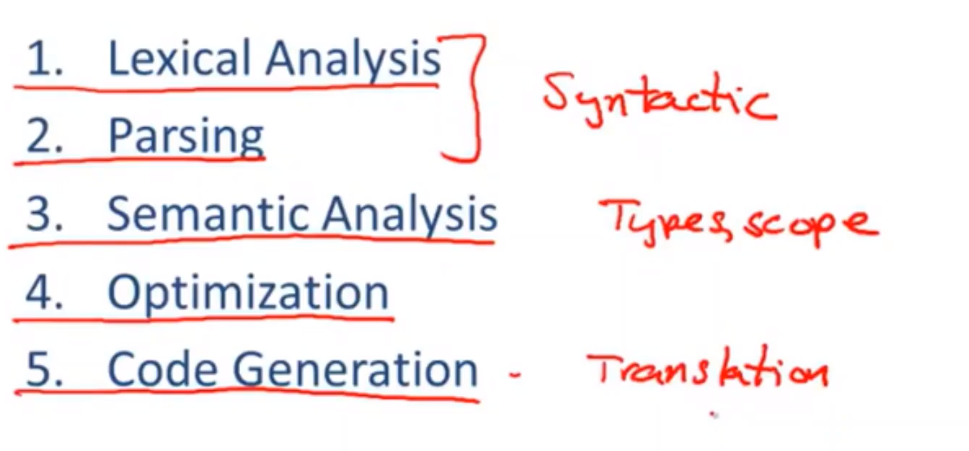

# 【斯坦福编译原理】 01 编译器与解释器简介

## 编译器与解释器

Compile（编译器）：写好程序，通过编译器生成可执行代码；编译器无需结合数据，所以编译器是线下的（off-line）。

简单来说，编译的本质是用来生成可执行代码的预处理过程。

Interpreters（解释器）：写好程序，结合程序将数据传入解释器，程序就能立即执行。解释器是在线的（on-line），是程序运行的一部分。

>  执行和编译是两个阶段。执行属于线上的话。相对于解释器来讲。它需要结合数据进行执行。那此处编译器没有执行的步骤，所以属于线下。

解析器没有推广使用的原因：

- 执行效率低
- 自身占内存

## 编译器执行阶段

五个主要执行阶段：

1. 词法分析 
2. 语法分析
3. 语义分析：如类型和作用与规则
4. 优化：内存方面
5. 代码生成：转换成机器码或字节码或其他高级编程语言