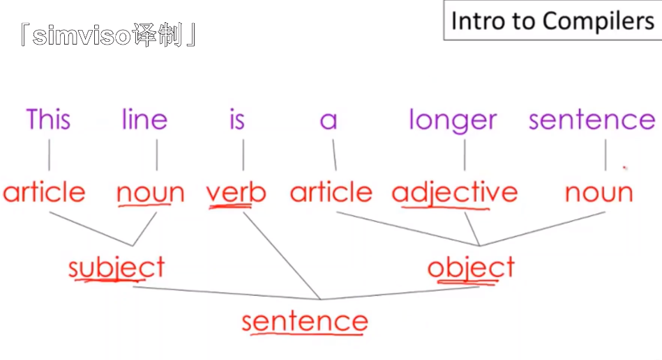
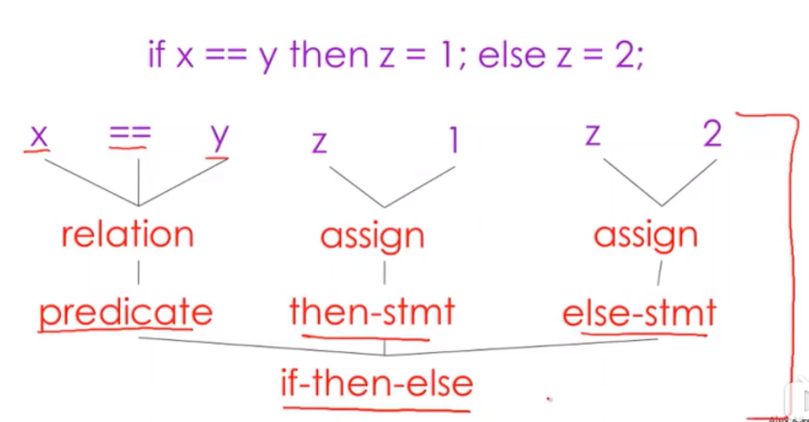
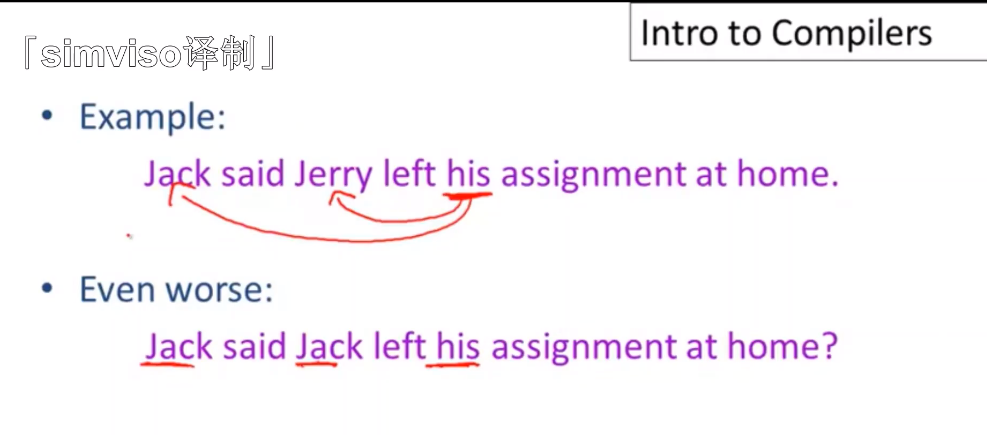
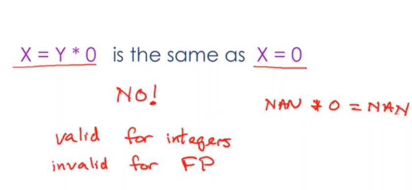
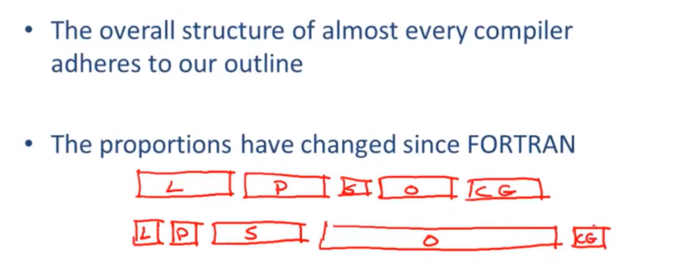

# 【斯坦福编译原理】02 编译器结构

## 编译阶段类比

- Lexical Analysis（词法分析） =》  1. 人类第一步尝试理解单词

  - 词法分析的目标就是将程序代码文本接照它的方式进行分词换句话说就是编译器说话时对词的区分
  - token（词法单元），if、then、else、空格、分隔符等等都是token

- Parsing（语法分析）  =》2. 紧接着理解句子的结构

  例子：

  

  

  

- Semantic Analysis（语义分析） =》 3. 进一步尝试理解这句话的意思

  - too hard，编译器只能尽可能找出句子相互矛盾的地方

  - 例子：

    

- Optimization（优化） =》 编辑，保持句子原有的语义，精简句子

  - 优化的目标

    - Run faster
    - Use less memory

  - 优化例子：

    

- Code Gen（生成代码） =>  翻译，将目标语言翻译为其他语言，比如：人工翻译可能会将英语翻译成法语一样，编译器会将高级程序转换为汇编代码

## 新旧编译器变化

