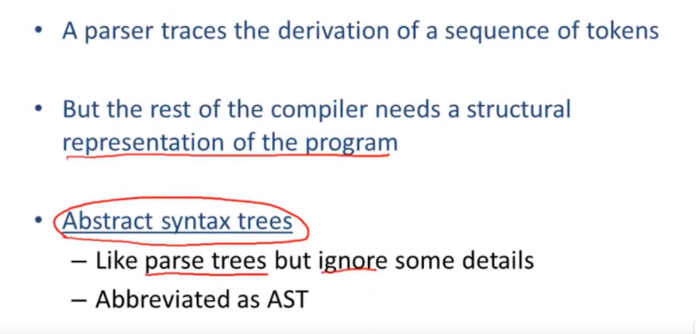
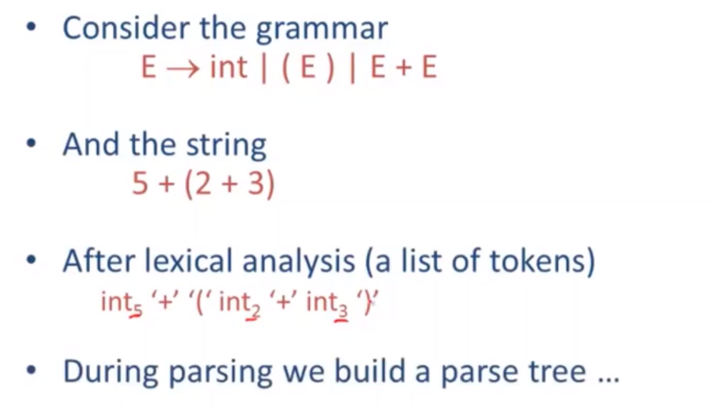
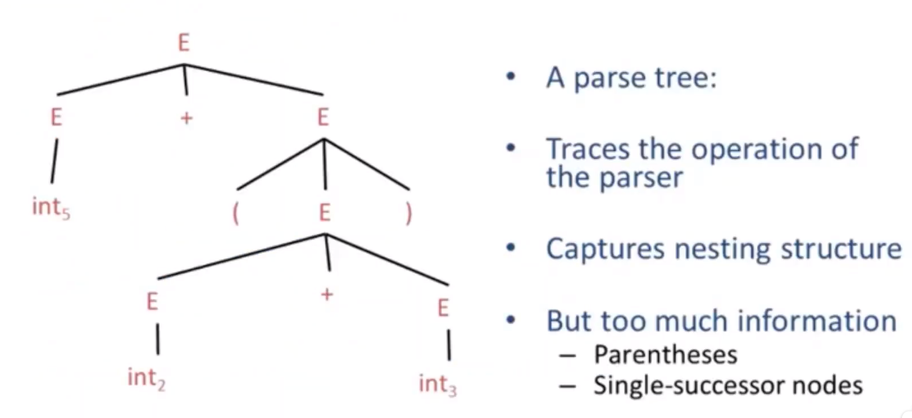

# 【斯坦福编译原理】23 抽象语法树

抽象语法树（**AST**，**Abstract Syntax Tree**）是编译器中的核心数据结构，它优于以往讲的解析树。

AST 的语法：

- 定义语法：E -> int | (E) | E + E
- 给出字符串：5+（2+3）
- 进行词法分析：int5 '+' '(' int2 '+' int3 ')'
- 然后传入解析器得到一颗解析树

AST结构与好处：

**AST **将具体的语法进行了抽象，取消了具体语法的细节，只保留了足够的信息，能够很好地表示程序要做的事，并进行编译。