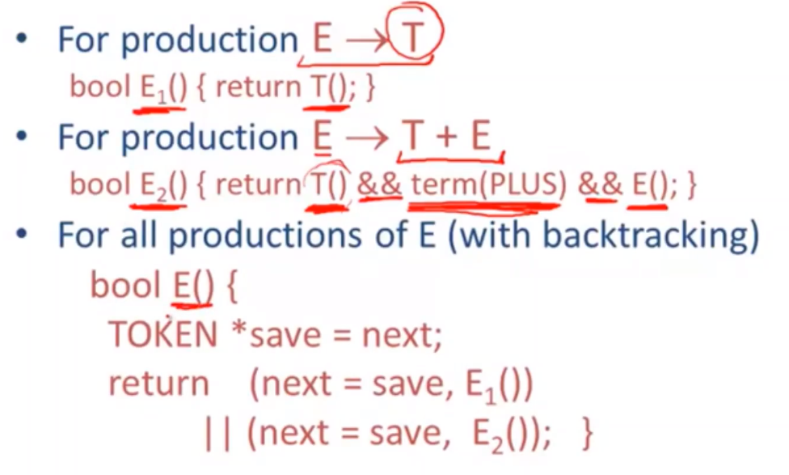
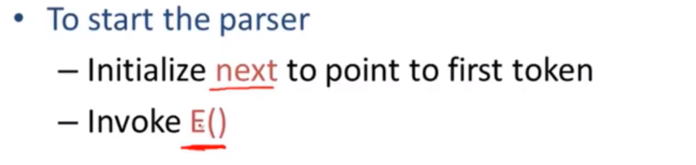
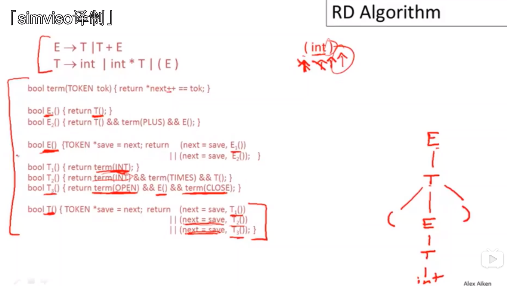

# 【斯坦福编译原理】25 递归下降解析算法

## 前置知识点

## 定义一个用来匹配输入中所给定token的函数

1. 

2. 每个产生式都有一个对应函数，会检查这个产生式是否能和这个输入匹配上

3. 将关于这个特定非终结元素的所有产生式组合在一起，然后检查这些产生式中是否有任何一个能和输入进行匹配

   

## 方法定义

## 解析器的启动流程

- 初始化一个 next 指针，指向输入的第一个token
- 调用 E()

## 递归下降解析的例子

从（int）开始解析，步骤如上图

